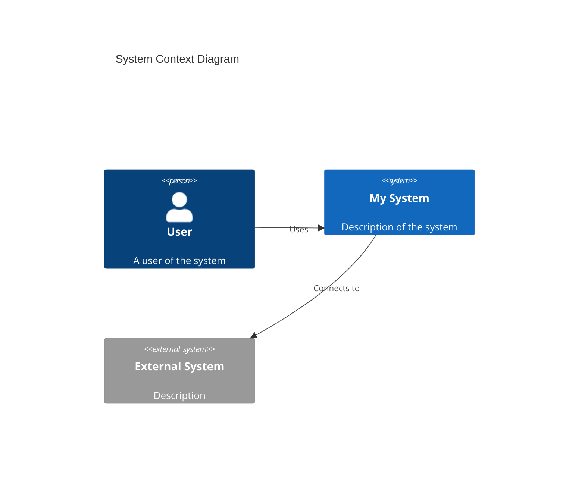

# アーキテクチャ可視化 (Architecture Visualization)

システムの現状（Current State）を正確に把握し、全体像を見失わないようにするためのプロセスです。コードベースの変更に合わせて定期的に更新します。

### Step 0: 現状の把握 (Observe)

1.  **コードベースの調査:**
    *   `list_directory(dir_path="src/")` や `read_file` を使用して、現在のプロジェクト構造、モジュール構成を確認する。
    *   主要なエントリポイント（`main.py`など）や設定ファイル（`pyproject.toml`など）を確認し、依存ライブラリやフレームワークを特定する。

2.  **既存ドキュメントの確認:**
    *   `read_file(file_path="docs/architecture/system-context.md")` 等を読み込み、現在のドキュメントがコードの実態と乖離していないか確認する。

### Step 1: 図解の更新 (Orient)

現状のコードベースに基づき、アーキテクチャ図を更新または新規作成します。

1.  **システムコンテキスト図 (C1) の検討:**
    *   システムの境界、外部システム（API、DB）、ユーザーとの関係に変更がないか確認する。
    *   変更があれば、Mermaid記法で図を更新する。

2.  **コンテナ図/コンポーネント図 (C2/C3) の検討:**
    *   主要なコンテナ（Webアプリ、API、DBなど）やコンポーネント（Controller, Service, Repositoryなど）の構成に変更がないか確認する。
    *   クラス構造や依存関係の変化を図に反映させる。

3.  **非機能要件の記録:**
    *   セキュリティ設定、パフォーマンス上の制約、デプロイ構成などの変更点を整理する。

### Step 2: ドキュメントの更新 (Act)

更新した図解や情報をドキュメントに反映させます。

1.  **ドキュメントの更新:**
    *   `write_file` または `replace` を使用して、`docs/architecture/` 配下のドキュメントを更新する。
    *   **ポイント:**
        *   図と説明文の整合性を取る。
        *   変更の理由（Why）を記録に残す（またはADRへのリンクを貼る）。

2.  **完了確認:**
    *   更新後のドキュメントを読み返し、現状のシステムを正しく表現できているか確認する。

### テンプレート: システムコンテキスト (docs/architecture/system-context.md)

```markdown
# システムコンテキスト

## 概要
(システムの目的と範囲)

## コンテキスト図 (Context Diagram)


## 主要な要素
- **User:** ...
- **My System:** ...
- **External System:** ...
```
