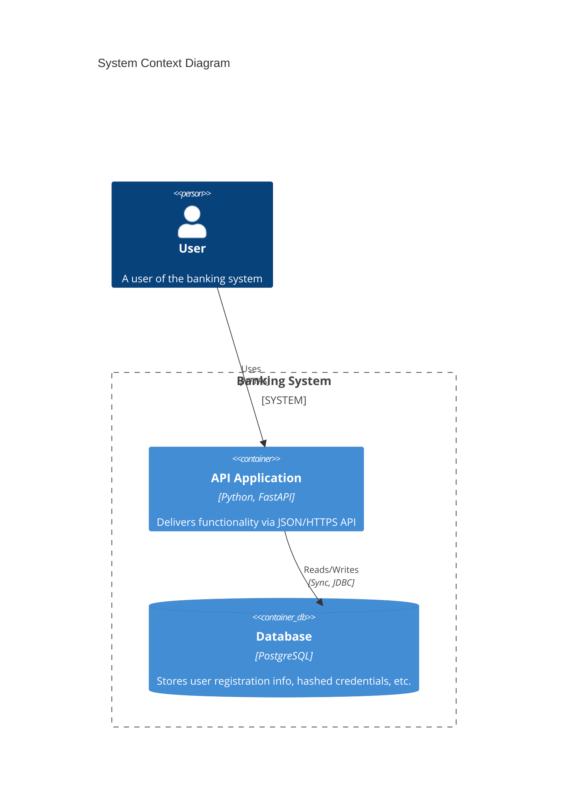

# スキル: アーキテクチャ可視化 (Architecture Visualization)

**システムの現状（Current State）を正確に把握し、全体像を見失わないようにするためのプロセスです。** コードベースの変更に合わせて定期的に更新し、開発者のメンタルモデルと実際のコードを一致させます。

このドキュメントは、TECHNICAL_DESIGNER が `~/.gemini/GEMINI.md` の「プロジェクト進行フレームワーク（State Machine）」を実行する際に参照するデータソースです。

---

## 1. Planning Phase Inputs (for State 1)

計画策定時に、以下の情報を「能動的偵察 (Active Reconnaissance)」によって収集し、Todoリストの具体化に利用してください。

### 1.1 能動的偵察 (Active Reconnaissance)
以下のコマンドを用いて、ドキュメントと実態の乖離を検出します。

*   **構造スキャン:**
    *   `list_directory("src/")` でトップレベルパッケージを確認。
    *   `glob("src/**/*.py")` で全モジュールをリストアップし、ファイルの増減を把握する。
*   **実行環境分析:**
    *   `read_file("docker-compose.yml")` を読み、定義されているサービス（コンテナ）のリストを作成する。
    *   `read_file("pyproject.toml")` を読み、外部ライブラリ（特にAWS SDKやDBドライバなど、インフラに関わるもの）の変更を確認する。
*   **既存図の確認:**
    *   `read_file("docs/architecture/c4-model.md")` (または `system-context.md`) を読み込み、現在の図解定義を確認する。

### 1.2 作業ブランチの計画
*   **Action:** `~/.gemini/GEMINI.md` の **「1. Gitによるバージョン管理」** に従い、作業用ブランチを作成するタスクをTodoの先頭に追加する。
    *   *Naming:* `docs/arch-update-{YYYYMMDD}`

### 1.3 リスク評価 (Specific Context)
Todo作成時に、以下の観点でリスクを評価する。

*   **誤解の拡散:** 「事実と異なる図を描くこと」は最大の害悪である。不確かな部分は「要確認」と明記する方針とする。
*   **複雑性:** 全てを描こうとして図がスパゲッティ化していないか？ C4モデルの「Level 2 (Container)」と「Level 3 (Component)」を適切に分離する計画を立てる。

---

## 2. Execution Phase Actions (for State 2)

Todoを実行する際、以下のステップで可視化を進めます。

### 2.1 ギャップ分析 (Hypothesis - Step 1: Gap Analysis)
「ドキュメント（To-Be）」と「コード実態（As-Is）」の差異を明確にします。

**Output Template (Markdown - Gap Analysis):**
```markdown
## アーキテクチャ・ギャップ分析
| 対象 | ドキュメント記述 | コード実態 | アクション |
| :--- | :--- | :--- | :--- |
| `Redis` | 記載なし | `docker-compose.yml` に `redis:alpine` が追加され、`src/infra/cache.py` から参照されている。 | Container図に追加する。 |
| `AuthService` | `UserService` に依存 | コード上は `AuthService` が `UserRepository` を直接呼んでいる（違反）。 | 図は現状通り（違反状態）を描き、Issueでリファクタリングを提案する。 |
```

### 2.2 構造定義 (Hypothesis - Step 2: Drafting)
C4モデルの各レベルに合わせて要素を定義します。

#### Level 2: Container Diagram (System Context)
実行単位（プロセス/コンテナ）を定義します。

**Output Template (Definition List):**
*   **API Server:** Python/FastAPI. ユーザーからのHTTPリクエストを処理。
*   **Worker:** Python/Celery. 非同期タスク（メール送信）を処理。
*   **Database:** PostgreSQL. 永続化データストア。

#### Level 3: Component Diagram
主要な論理コンポーネント（Controller, Service, Repository）を定義します。

**Output Template (Definition List):**
*   **PaymentController:** `src/interface/api/payment.py`. HTTPエンドポイント。
*   **PaymentService:** `src/usecase/payment_service.py`. ビジネスロジック。
*   **PaymentRepository:** `src/infra/db/payment_repo.py`. DBアクセス。

### 2.3 図解作成 (Mermaid Visualization)
定義した構造をMermaid記法で記述します。

**Output Template (Mermaid):**


### 2.4 自律的解決ループ (Autonomy Loop)
コードから設計意図が読み取れない場合のフローです。以下のチェックリストを用いて、確信が得られるまでサイクルを回してください。

1.  **Code Archaeology:** `git blame` でそのコードを書いたコミットを探し、コミットメッセージや紐づくPRを読む。
2.  **Hypothesis & Validation:**
    *   [ ] コミットメッセージから意図（パフォーマンス改善、バグ修正など）が読み取れるか？
    *   [ ] そのコードは現在も実際に使用されているか？（Dead Codeではないか？）
    *   **判定:** 意図が不明な場合、Step 1 に戻って別の関連ファイル（呼び出し元など）を調査する。

3.  **Conservative Update:**
    *   どうしても意図が不明な場合、無理に「あるべき姿」に補正せず、「コードにある通り」の依存関係を図示する。
4.  **Annotation:**
    *   図の中に `Note: この依存関係は循環参照の疑いあり` といった注釈を入れる。

---

## 3. Closing Phase Criteria (for State 3)

タスク完了時に、以下の完全性チェックを実行してください。**一つの懸念も残らない状態になるまで、修正と再チェックを繰り返します。**

### 3.1 最終監査 (Final Audit)
更新したドキュメント (`docs/architecture/xxx.md`) に対して、以下の「無慈悲な監査」を行います。

*   **[現物一致]**
    *   [ ] 図にある全てのコンポーネントが、ファイルシステム上に実在するか？
    *   [ ] 逆に、主要なファイル（Serviceクラス等）が図から漏れていないか？
*   **[正確性]**
    *   [ ] 矢印の向きは、コード上の `import` や呼び出し関係と完全に一致しているか？
    *   [ ] 「推測」で描いた線が含まれていないか？（含まれる場合はNoteがあるか）
*   **[可読性]**
    *   [ ] クラス図レベルの過剰な詳細情報で、全体像がボケていないか？
    *   [ ] 凡例（Legend）があり、第三者が記号の意味を理解できるか？

**判定:** チェックリストに一つでも「No」がある、または少しでも「懸念」が残る場合は、**必ずドキュメントを修正し、再度この監査を実行してください。**

### 3.2 成果物の定着

`~/.gemini/GEMINI.md` の **「プルリクエストの管理 (PR Protocol)」** に完全に従い、PRを作成します。
