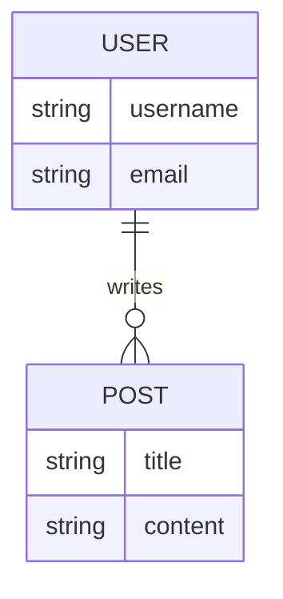
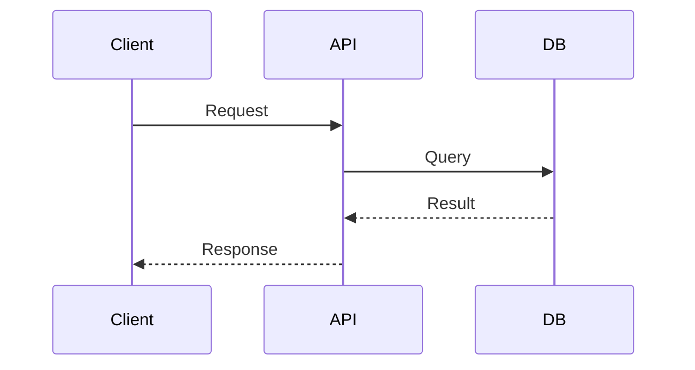

# 詳細仕様策定 (Specification Definition)

SYSTEM_ARCHITECTが策定した抽象的な意思決定（ADR/Design Doc）を、開発者が迷いなく実装できる具体的な「実行可能な設計図」に落とし込むプロセスです。

### Step 0: インプットの確認と分析 (Observe)

1.  **担当Issueの確認:**
    *   `issue_read(method="get", issue_number=XXX)` を実行し、担当Issueの要件、背景、および親Issue/子Issueの情報を正確に把握する。
    *   `issue_read(method="get_sub_issues", issue_number=XXX)` で依存するタスクが全て完了（CLOSED）していることを確認する。完了していない場合は作業を開始せず報告する。

2.  **決定事項と先行成果物の精読:**
    *   `read_file(file_path="reqs/design/_approved/adr-XXX.md")` (またはDesign Doc) を読み込み、設計の目的、スコープ、ユビキタス言語、制約、検証基準を完全に把握する。
    *   先行タスク（子Issue）で作成された成果物（ドキュメントやコード）がファイルシステム上に実在することを `list_directory` や `read_file` で検証する。

3.  **既存アーキテクチャ・関連ドキュメントの横断調査:**
    *   `glob(pattern="docs/specs/**/*.md")` で関連する既存の仕様書を特定し、命名規則、データ構造、通信パターンの一貫性を調査する。
    *   `read_file(file_path="docs/architecture/system-context.md")` や既存の `reqs/design/_approved/` 内の関連する決定事項を読み込み、システム全体の設計原則（クリーンアーキテクチャのレイヤー定義、エラーハンドリング方針等）を再確認する。
    *   `search_file_content` を用い、`src/` 内の既存実装パターン（ベースクラス、共通ユーティリティ、インターフェース定義）を調査し、再利用可能な要素を特定する。

    **分析結果アウトプット例（作業ログとして出力）**
    ```markdown
    ## 既存資産・整合性分析レポート
    - **関連仕様書:** `docs/specs/user-auth-api.md` (命名規則チェック: OK)
    - **アーキテクチャ:** `adr-005` (Clean Architecture) に準拠する必要あり。
    - **実装パターン:** `src/shared/base_controller.py` を再利用可能。
    ```

4.  **成果物の定義 (Analysis-Driven Definition):**
    *   Step 3 の分析結果に基づき、**「新規作成が必要なドキュメント」** と **「更新が必要な既存ドキュメント」** を整理し、作成するファイルパスを決定する。
    *   **選定基準:**
        *   既存の仕様（API定義やDBスキーマ）への変更がある場合は、新規ファイルではなく既存ファイルの更新を優先する。
        *   複雑な新規ロジックやデータ構造が導入される場合は、詳細仕様書（`docs/specs/`）を新規作成する。
        *   アーキテクチャ全体に波及する変更（共通コンポーネントの追加等）がある場合は、アーキテクチャ図（`docs/architecture/`）の更新も成果物に含める。

### Step 1: 設計案の具体化と整合性検証 (Orient)

インプット情報を元に、具体的な実装レベルの設計を行い、整合性を検証します。

1.  **整合性とインパクトの分析:**
    *   **概念的整合性:** 今回の詳細設計案が、既存の「ユビキタス言語」や「アーキテクチャ特性（パフォーマンス、セキュリティ等）」に悪影響を与えないか検証する。
    *   **インパクト分析:** 既存のAPIエンドポイント、DBテーブル、共通モジュールへの変更が必要な場合、その影響範囲を特定し、リグレッションリスクや段階的な移行の必要性を評価する。

    **アウトプット例**
    ```markdown
    - **概念:** `User` は「認証ユーザー」、`Recipient` は「配送先」として区別する。
    - **インパクト:** `OrderService` にメソッド追加が必要だが、既存フローへの影響はなし。
    ```

2.  **コンポーネント・クラス設計:**
    *   必要なクラス、モジュール、関数を洗い出す。
    *   既存のベースクラスやインターフェースをどのように継承・実装するかを定義する。

    **アウトプット例**
    ```markdown
    - **Controller:** `RecipientController` (継承: `BaseController`)
    - **Service:** `RecipientService`
    - **Repository:** `RecipientRepository` (実装: `SQLAlchemyRepository`)
    ```

3.  **データモデル設計:**
    *   データベースのテーブル構造（ER図）、カラム定義、データ型、制約を設計する。
    *   既存テーブルへのカラム追加やリレーション変更がある場合、移行（Migration）の安全性も考慮する。
    *   APIのリクエスト/レスポンスボディのJSONスキーマを設計する。

    **アウトプット例**
    ```markdown
    - **Table:** `recipients` (新規) - `id`, `user_id`(FK), `address`
    - **移行:** 新規作成のため安全。
    ```

4.  **インタラクション設計:**
    *   コンポーネント間の連携やデータフローをシーケンス図（Mermaid記法）で表現する。
    *   既存の通信パターンやエラーハンドリングガイドラインに従っていることを確認する。

    **アウトプット例**
    ```markdown
    - **Flow:** Client -> Controller -> Service -> Repository -> EventDispatcher
    ```

5.  **トレードオフの最終検討:**
    *   「既存パターンへの準拠」と「今回の要件への最適化」の間のトレードオフを検討し、採用した設計の理由（Why）を明確にする。

    **アウトプット例**
    ```markdown
    - **決定:** 住所バリデーションは簡易正規表現とする。
    - **理由:** 外部API利用はコスト高かつMVPでは不要なため (YAGNI)。
    ```

### Step 2: 仕様書の作成 (Act)

決定した設計内容をドキュメントとして記述します。

1.  **ドキュメントの作成:**
    *   `write_file(file_path="docs/specs/xxx.md")` を実行し、仕様書を作成する。
    *   **記述のポイント:**
        *   **明確性:** 曖昧な表現を避け、具体的な値や型、挙動を記述する。
        *   **視覚化:** Mermaid記法を活用し、図解を多用する。
        *   **追跡可能性:** 元となったADR/Design Docへのリンクを明記する。

2.  **レビューと修正:**
    *   作成したドキュメントを自己レビューし、誤字脱字や論理的な矛盾がないか確認する。
    *   必要に応じて `replace` ツールで修正する。

3.  **完了通知:**
    *   関連するIssueやPRにコメントし、仕様書の作成完了を報告する。
    *   次の担当者（PRODUCT_MANAGERや開発者）に実装タスクの開始を促す。

### テンプレート: 仕様書 (docs/specs/xxx.md)

```markdown
# [機能名] 詳細仕様書

## 概要
(機能の概要と目的)

## 関連ドキュメント
- ADR: [リンク]
- Design Doc: [リンク]

## データモデル (Data Model)

### DB Schema (Mermaid ER Diagram)


### テーブル定義
| テーブル名 | カラム名 | 型 | 制約 | 説明 |
| :--- | :--- | :--- | :--- | :--- |
| users | id | UUID | PK | ユーザーID |
| ... | ... | ... | ... | ... |

## API 仕様 (API Specification)

### [GET] /api/v1/resource
- **概要:** リソース一覧を取得する
- **Request:**
    - Query Params: ...
- **Response:**
    - 200 OK:
    ```json
    { ... }
    ```

## シーケンス図 (Sequence Diagram)


## 補足・制約事項
(実装上の注意点など)
```