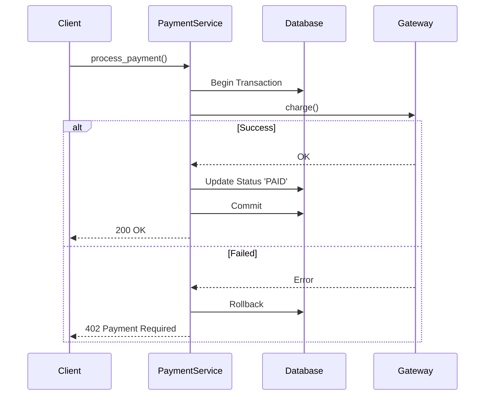

# スキル: 詳細仕様策定 (Technical Spec)

**SYSTEM_ARCHITECTが策定した抽象的な意思決定（ADR/Design Doc）を、開発者が迷いなく実装できる具体的な「実行可能な設計図」に落とし込むプロセスです。**

このドキュメントは、TECHNICAL_DESIGNER が `~/.gemini/GEMINI.md` の「プロジェクト進行フレームワーク（State Machine）」を実行する際に参照するデータソースです。

---

## 1. Planning Phase Inputs (for State 1)

計画策定時に、以下の情報を「能動的偵察 (Active Reconnaissance)」によって収集し、Todoリストの具体化に利用してください。

### 1.1 能動的偵察 (Active Reconnaissance)
以下のコマンドと視点を用いて、仕様策定に必要な「未確定要素」を洗い出します。

*   **Issue分析:**
    *   `issue_read` を実行し、Acceptance Criteria（受け入れ基準）を特定する。
    *   *Check:* 「何ができたら完了か」が不明瞭な場合、仮説を立ててTodoに「完了定義の合意」を追加する。
*   **SSOTの精読とギャップ特定:**
    *   `read_file("reqs/design/_approved/adr-XXX.md")` を実行。
    *   *Focus:* アーキテクチャで「決定されたこと（制約）」と「決定されていないこと（実装詳細）」の境界線を明確にする。
    *   *Output Example in Memory:* `[Analysis] ADR-005ではDB製品はPostgreSQLと決まっているが、テーブル設計は未定。`
*   **既存パターンの調査:**
    *   `glob("docs/specs/**/*.md")` で既存仕様書を探し、フォーマットを統一する。
    *   `search_code(pattern="class Base.*Controller")` 等で、継承すべき基底クラスや利用すべき共通ライブラリ（Logger, ExceptionHandler）を特定する。

### 1.2 作業ブランチの計画
*   **Action:** `~/.gemini/GEMINI.md` の **「1. Gitによるバージョン管理」** に従い、作業用ブランチを作成するタスクをTodoの先頭に追加する。
    *   *Naming:* `feature/spec-issue-{Issue番号}`

### 1.3 リスク評価 (Specific Context)
Todo作成時に、以下の観点でリスクを評価し、対策タスクを追加する。

*   **実装可能性:** 「このライブラリで本当にその要件を満たせるか？」 -> *Task:* `[ ] プロトタイプコードによるライブラリ動作検証`
*   **データ整合性:** 「DBスキーマ変更で既存データが壊れないか？」 -> *Task:* `[ ] マイグレーション手順とロールバック計画の策定`
*   **影響範囲:** 「API変更でフロントエンドが壊れないか？」 -> *Task:* `[ ] 影響を受けるクライアントコードの特定`

---

## 2. Execution Phase Actions (for State 2)

Todoを実行する際、以下のステップで具体化を進めます。各ステップで「思考の過程」をログに残してください。

### 2.1 設計案の具体化 (Hypothesis - Step 1: Drafting)
インプット情報を元に、以下の項目について具体的な実装設計案を立案します。

#### A. コンポーネント詳細設計
クラスやモジュールの責務とシグネチャを定義します。

**Output Template (Markdown):**
```markdown
### コンポーネント設計案
- **Class:** `PaymentService` (src/usecase/payment_service.py)
    - **責務:** 決済処理のオーケストレーション。外部API呼び出しとDBトランザクション管理。
    - **依存:** `IPaymentGateway`, `PaymentRepository`
    - **Methods:**
        - `process_payment(order_id: UUID, amount: Decimal) -> PaymentResult`
            - *Pre-condition:* Orderステータスが 'PENDING' であること。
            - *Post-condition:* 決済成功時、Orderステータスを 'PAID' に更新。
            - *Exception:* `InsufficientFundsError` は `402 Payment Required` にマッピング。
```

#### B. データモデル設計
永続化層の設計を行います。

**Output Template (Markdown):**
```markdown
### データモデル設計案
- **Table:** `payments`
    - **Columns:**
        - `id`: UUID (PK)
        - `amount`: Decimal(10, 2) (Not Null)
        - `status`: Varchar(20) (Enum: PENDING, SUCCESS, FAILED)
        - `created_at`: Timestamp (Default: Now)
    - **Indexes:** `idx_payments_order_id` (検索用)
    - **Migration:** 安全性のため `AddField` のみ実施。破壊的変更なし。
```

#### C. インタラクション設計 (Sequence Diagram)
処理の流れとトランザクション境界を可視化します。

**Output Template (Mermaid):**


### 2.2 整合性とインパクトの分析 (Integrity - Step 2: Validation)
作成した設計案を検証し、結果を記録します。

*   **アーキテクチャ検証:** `docs/system-context.md` の制約（例：レイヤー依存ルール）を守っているか？
    *   *Check:* Service層からController層をimportしていないか？
*   **トレードオフ分析:**
    *   *Thinking Process:* 「パフォーマンス優先でキャッシュを使うか、整合性優先で都度DB参照するか？」
    *   *Decision:* 「今回は決済に関わるため、整合性を最優先しキャッシュは使用しない（ADR-002準拠）」

### 2.3 自律的解決ループ (Autonomy Loop)
不明点がある場合の行動フローです。以下のチェックリストを用いて、確信が得られるまでサイクルを回してください。

1.  **Search First:** `grep` や `git log` で類似の過去事例を探す。
2.  **Hypothesize:** 「おそらくこうすべき」という仮説を立てる。
3.  **Validate (Prototyping):** 仮説に基づいたプロトタイプコード（`temp_script.py`など）を書いて動作確認する。
4.  **Confidence Check:**
    *   [ ] 動作結果は仮説と完全に一致したか？
    *   [ ] エッジケース（境界値、異常系）でも破綻しないか？
    *   [ ] 既存機能への副作用はないと言い切れるか？
    *   **判定:** 一つでもチェックがつかない場合、仮説を修正して Step 2 に戻る。

5.  **Decide or Ask:**
    *   全てのチェックを通過した場合のみ、決定事項として仕様書に書く。
    *   ADRと矛盾するレベルの変更が必要なら、理由と案を添えてIssueコメントで質問する。

### 2.4 ドキュメント作成 (Documentation)
検証済みの内容を正式なドキュメント (`docs/specs/xxx.md`) に落とし込みます。
既存の `docs/template/spec-template.md` がある場合は必ずそれを使用してください。

---

## 3. Closing Phase Criteria (for State 3)

タスク完了時に、以下の完全性チェックを実行してください。**一つの懸念も残らない状態になるまで、修正と再チェックを繰り返します。**

### 3.1 最終監査 (Final Audit)
成果物 (`docs/specs/xxx.md`) に対して、以下の「無慈悲な監査」を行います。

*   **[実装可能性]**
    *   [ ] 型定義は全て具体的か？（`dict` や `Any` が残っていないか）
    *   [ ] 必須パラメータとオプショナルパラメータが明確に区別されているか？
    *   [ ] エラー時のHTTPステータスコードとレスポンスボディが定義されているか？
*   **[トレーサビリティ]**
    *   [ ] どのADRに基づいているかリンクがあるか？
    *   [ ] IssueのAcceptance Criteriaを全て満たしているか？
*   **[整合性]**
    *   [ ] `docs/system-context.md` のユビキタス言語と用語が完全に一致しているか？
    *   [ ] 既存のアーキテクチャレイヤールール（依存方向など）に違反していないか？

**判定:** チェックリストに一つでも「No」がある、または少しでも「懸念」が残る場合は、**必ずドキュメントを修正し、再度この監査を実行してください。**

### 3.2 成果物の定着

`~/.gemini/GEMINI.md` の **「プルリクエストの管理 (PR Protocol)」** に完全に従い、PRを作成します。


*   **PR Title Rule:** `docs(specs): <issue-title> (#<issue-id>)`

*   **PR Body:** `GEMINI.md` の規約（関連Issue、変更の概要、変更の目的、検証方法）に準拠して記述する。
