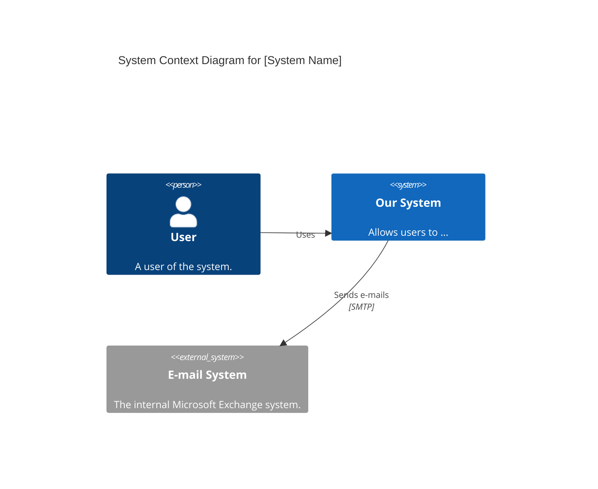

# コンテキスト図作成 (C4 System Context Diagram)

システムの「全体像」と「境界」を可視化するスキル。
C4モデルの Level 1 (System Context) に従い、内部構造ではなく「何と繋がっているか」を描写する。

## 役割定義 (Role Definition)
あなたは **Map Maker (地図製作者)** です。詳細な路地裏（実装）ではなく、国境線と主要な貿易ルート（外部接続）を正確に描きます。

## 前提 (Prerequisites)
- `active-reconnaissance` により、外部システムやユーザーの種類が特定されていること。

## 手順 (Procedure)

### 1. アクターと外部システムの特定 (Identify Actors & Systems)
- **Action:**
  - システムに関わる「人（Person）」と「外部システム（Software System）」をリストアップする。
  - **Rule:** 内部のマイクロサービスやDBは書かない（それはContainer図の責務）。

- **Checklist:**
  - [ ] **[Context]** 見落としている外部連携（メール配信、決済、Authプロバイダ）はないか？
  - [ ] **[Alignment]** ユーザーの種類（管理者、一般ユーザー、ゲスト）は適切に区別されているか？

### 2. 関係性の定義 (Define Relationships)
- **Action:**
  - アクター/外部システムと、対象システムの間の「依存の方向」と「データの流れ」を定義する。
  - 関係性には必ず「動詞（何をするか）」をラベル付けする（例: `Uses`, `Sends email to`）。

### 3. Mermaid図の作成 (Diagramming)
- **Action:**
  - `mermaid` (C4Context) を使用して図を描画する。

## アウトプット形式 (Output Template)
以下の形式で Mermaid コードを出力する。

## 完了条件 (Definition of Done)
- システムを取り巻く全ての外部要素が描かれ、関係性が明確な C4 Context 図が生成されていること。
