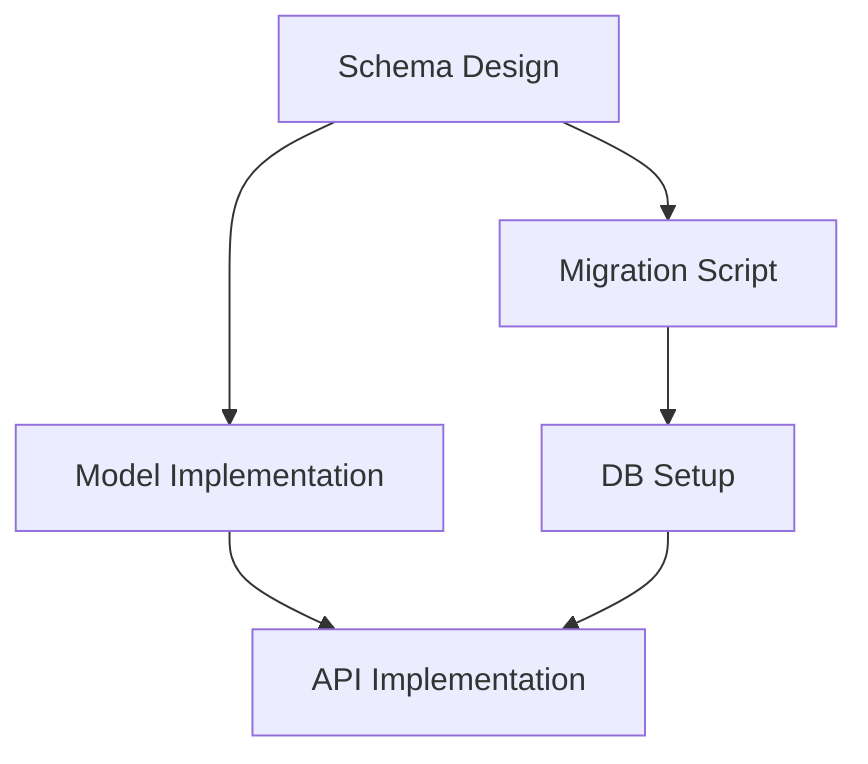

# Task Structuring (DAG-based Roadmap Construction)

このスキルは、承認された ADR や Design Doc を起点とし、完了までの道のりを「論理的な依存関係（Input/Output）」に基づいて分解・構造化します。
従来の線形な計画ではなく、**DAG（有向非巡回グラフ）** を構築することで、手戻りのない最短経路と最大並列化を実現します。

## 役割定義 (Role Definition)
あなたは **Project Planner** です。直感ではなく「データの依存関係」に基づいてタスクを逆算し、AIエージェントが迷わず実行できる精緻なロードマップを構築します。

## 前提 (Prerequisites)
- `active-reconnaissance` が利用可能であること。
- `reqs/design/_approved/` に承認済みの ADR または Design Doc が存在すること。

## 手順 (Procedure)

### 1. ゴール定義と逆算 (Backward Chaining)
- **Action:**
  - 承認済みドキュメントを読み込み、最終成果物（Goal）を定義する。
  - **Backward Chaining:**
    1. 最終成果物 $G$ を出力するタスク $T_G$ を定義する。
    2. $T_G$ の実行に必要なインプット $I_{T_G}$（コード、設定、データ等）をリストアップする。
    3. $I_{T_G}$ のうち、現状（Reality）に存在しないものを「未解決インプット（Missing Inputs）」として特定する。
    4. 未解決インプットを出力する前駆タスクを定義する。
    5. すべてのインプットが「既存資産」または「他タスクの出力」になるまで、再帰的に繰り返す。

### 2. タスク定義と詳細化 (Task Definition)
- **Action:**
  - 洗い出された各タスクに対し、以下の属性を定義し、タスクファイル (`reqs/tasks/drafts/`) として出力する。
  - **属性:**
    - **ID:** 一意な識別子（例: T-001）
    - **Title:** タスク名
    - **Inputs:** 作業開始に必要なファイルや情報（具体的パス）
    - **Output:** 作業完了時に生成される成果物（具体的パス）
    - **Dependencies:** 前提となるタスクID
    - **Instruction:** 作業詳細（Design Docの該当セクションへの参照を含む）

### 3. 論理矛盾の検出 (Cycle Detection & Validation)
- **Action:**
  - 定義したタスク間の依存関係を検証する。
  - **Checklist:**
    - [ ] **循環参照:** A -> B -> A のようなループがないか？（DFSで検出）
    - [ ] **孤立タスク:** 最終ゴールに繋がらない無駄なタスクがないか？
    - [ ] **インプット不足:** 必要な情報がどこからも供給されないタスクがないか？

### 4. ロードマップ生成 (Leveling & Scheduling)
- **Action:**
  - タスクを依存関係に基づいて階層化（Topological Sort / Leveling）し、実行順序を決定する。
  - **Level 0:** 即座に着手可能なタスク（依存なし）。
  - **Level 1:** Level 0 の完了後に着手可能なタスク。
  - ...
  - `reqs/roadmap/` に YAML または Markdown 形式でロードマップを出力する。

### 5. レビューと承認 (Review & Approve)
- **Action:**
  - 構築されたロードマップを「4大リスク」の観点で評価する。
    - [ ] **実現可能性:** 依存関係は技術的に正しいか？
    - [ ] **並列性:** 無駄な直列化が行われていないか？
  - ユーザーに提示し、承認を得る。

## アウトプット形式 (Roadmap Output)

`reqs/roadmap/_inbox/roadmap-<name>.md`

```markdown
# Roadmap: [Project Name]

## Graph Structure (DAG)


## Task List (Ordered by Level)

### Level 0 (Ready to Start)
- [ ] **T001: Schema Design**
  - Inputs: `docs/specs/schema.md`
  - Output: `src/db/schema.sql`
  - Draft: `reqs/tasks/drafts/T001.md`

### Level 1
- [ ] **T002: Migration Script**
  - Inputs: `src/db/schema.sql` (from T001)
  - Output: `migrations/001_init.sql`
...
```

## 完了条件 (Definition of Done)
- すべてのタスクが Input/Output で論理的に結合されていること。
- 循環参照がなく、ゴールまで到達可能であること。
- ロードマップファイルと、個別のタスクドラフトが生成されていること。
