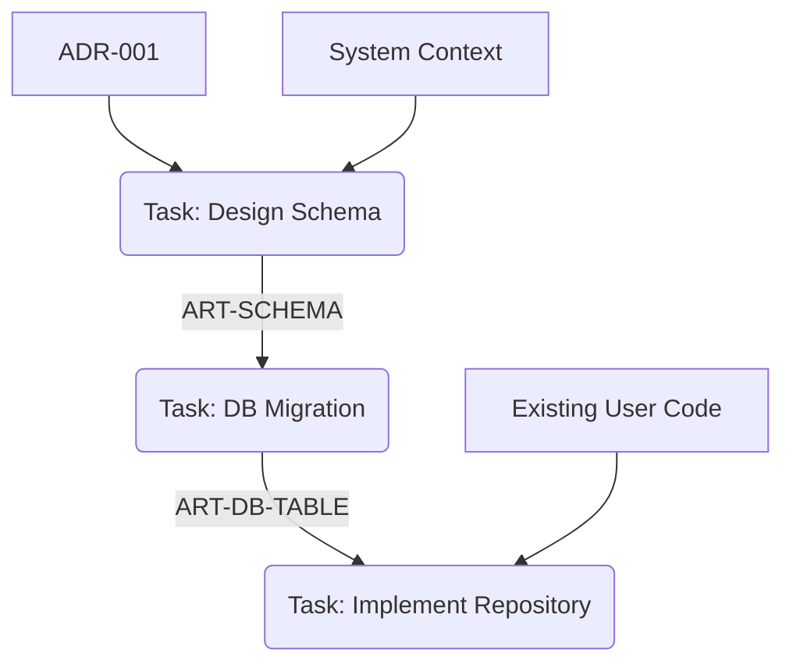

# Task Structuring (Graph-based Roadmap Construction)

このスキルは、承認された ADR/Design Doc を起点として、最終ゴールから逆算的（バックキャスト）にタスクを分解し、完全な依存関係グラフ（DAG）を構築します。
「何となくタスクを並べる」のではなく、**「成果物のインプット/アウトプットの連鎖」** として計画を定義します。

## 役割定義 (Role Definition)
あなたは **Graph Planner** です。ゴールから出発点（既存資産）までの経路を論理的に繋ぎ、未解決の依存関係（Missing Link）を一つ残らず解消します。

## 前提 (Prerequisites)
- `active-reconnaissance` が利用可能であること。
- `reqs/design/_approved/` に承認済みの ADR または Design Doc が存在すること。
- `docs/system-context.md` および既存コードベースが参照可能であること。

## 概念モデル (Conceptual Model)

1.  **成果物 (Artifact):**
    - タスクの入出力単位。ファイル名ではなく **論理ID** で管理する（例: `ART-USER-SCHEMA`）。
    - **構成:**
        - **Code Artifact:** 実装コード + テストコード（ペアで1つの成果物）
        - **Doc Artifact:** 要件定義（テスト相当） + UML/詳細設計（実装相当）
2.  **タスク (Task):**
    - 複数の成果物をインプットとし、**単一の論理成果物** を生成する作業単位。
3.  **グラフ (DAG):**
    - ノード: タスク, エッジ: 成果物の依存関係。
    - **完了条件:** 全てのタスクのインプットが「既存のドキュメント/コード」または「他タスクの成果物」に結びついていること。

## 手順 (Procedure)

### 1. ゴール定義と成果物ID化 (Goal Definition)
- **Action:**
  - 承認済みドキュメント（ADR/Design Doc）を読み込み、最終的に達成すべき状態を **成果物ID** として定義する。
  - 例: `ART-GOAL-PAYMENT-FEATURE`

### 2. グラフ構築: バックワード・チェイニング (Graph Construction)
- **Action:**
  - ゴールから遡って、依存関係が解決するまで再帰的にタスクを定義する。
  - **Loop Process:**
    1. **未解決の成果物** をピックアップする。
    2. それを生成するための **タスク** を定義する。
    3. そのタスクを実行するために必要な **インプット成果物** を洗い出す。
    4. インプットが「既存資産（System Context, Code, Approved Docs）」にあるか確認する。
        - **Yes:** 依存解決（既存ノードへ接続）。
        - **No:** 新たな「未解決の成果物」としてリストに追加し、1に戻る。

### 3. タスク詳細化とグラフ補正 (Detailing & Refinement)
- **Action:**
  - 構築されたグラフ（骨子）に対し、各タスクの具体的な中身を記述する（`todo-management` 的な分解）。
  - **Refinement Loop:**
    - タスクの手順を詳細化する過程で、「実はこの情報（インプット）も必要だ」「この成果物は分割すべきだ」といった発見があれば、即座に **Step 2 (Graph Construction)** に戻ってグラフを更新する。
    - これを、全てのタスク詳細とグラフ構造が矛盾なく整合するまで繰り返す。

### 4. ロードマップ出力 (Output Generation)
- **Action:**
  - 完成したグラフをトポロジカルソートし、実行可能な順序でロードマップファイル (`reqs/roadmap/`) を生成する。
  - 同時に、各タスクの詳細定義をドラフトファイル (`reqs/tasks/drafts/`) として出力する。

## アウトプット形式 (Roadmap Output)

`reqs/roadmap/_inbox/roadmap-<name>.md`

```markdown
# Roadmap: [Project Name]

## Artifact Graph (DAG)


## Task Execution Order

### Phase 1: Foundation
- [ ] **T-001: [Task Name]**
  - **Goal:** [生成される成果物ID]
  - **Inputs:**
    - `docs/system-context.md`
    - `ART-XXX` (from T-000)
  - **Draft:** `reqs/tasks/drafts/T-001.md`

...
```

## 完了条件 (Definition of Done)
- ロードマップ上の全てのタスクの出発点が、最終的に「既存の文書・コード」に辿り着いていること（浮いたタスクがない）。
- タスク詳細（Draft）記述により、インプット不足がないことが検証済みであること。