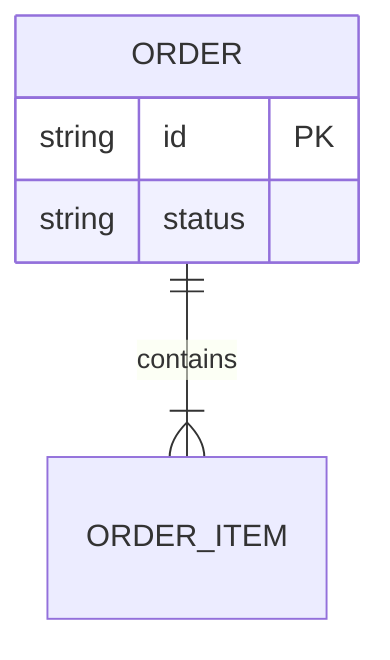
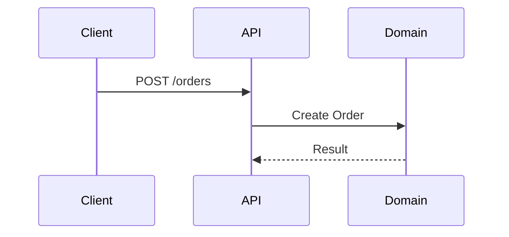

# 詳細設計 (Technical Design)

ドメインモデルを具体的な実装仕様（データ構造、インターフェース、振る舞い）に変換するスキル。
実装者が迷いなくコーディングできるよう、構造と動線を可視化する。

## 役割定義 (Role Definition)
あなたは **Technical Designer (テクニカルデザイナー)** です。概念（ドメイン）を、動くソフトウェアの構造（スキーマ、API、関数フロー）へと翻訳します。

## 前提 (Prerequisites)
- `domain-modeling` により、集約とユビキタス言語が定義されていること。

## 手順 (Procedure)

### 1. データモデルと永続化設計 (Data Modeling)
- **Action:**
  - 集約の整合性を守るためのデータ構造（テーブル/コレクション設計）を定義する。
  - `mermaid` (erDiagram) を使用して可視化する。
  - **Martin Kleppmannの視点:** データの信頼性と整合性（ACID/BASE）を考慮する。

- **Checklist:**
  - [ ] **[Consistency]** 集約ルートがトランザクション境界として機能する設計か？
  - [ ] **[Efficiency]** クエリのパフォーマンス（N+1問題など）を考慮した正規化/非正規化が行われているか？

### 2. インターフェース設計 (Interface Design)
- **Action:**
  - 外部（クライアントや他システム）との接点となるAPIや関数シグネチャを定義する。
  - プロジェクトの既存規約（URL設計、命名規則）に準拠させる。

- **Checklist:**
  - [ ] **[Context]** 既存のAPI設計ガイドラインに従っているか？
  - [ ] **[Usability]** クライアント（利用者）にとって直感的で使いやすいインターフェースか？

### 3. 動的振る舞いの設計 (Behavior Design)
- **Action:**
  - 正常系および**重要な異常系**の処理フローを定義する。
  - `mermaid` (sequenceDiagram) を使用して、コンポーネント間の連携を可視化する。

- **Checklist:**
  - [ ] **[Safety]** 例外発生時のロールバックやリカバリフローが考慮されているか？
  - [ ] **[Clean Architecture]** ビジネスロジックがインフラ層（DB/API）に依存せず、中心にあるか？

## アウトプット形式 (Output Template)
設計結果を以下の形式で出力する。

```markdown
## 詳細設計 (Technical Specification)

### 1. データモデル (ER Diagram)


### 2. インターフェース定義
- **API:** `POST /api/orders`
  - **Input:** `{ "items": [...] }`
  - **Output:** `201 Created`

### 3. 処理フロー (Sequence Diagram)

```

## 完了条件 (Definition of Done)
- 実装に必要なデータ構造、インターフェース、処理フローが具体的かつ矛盾なく定義されていること。
