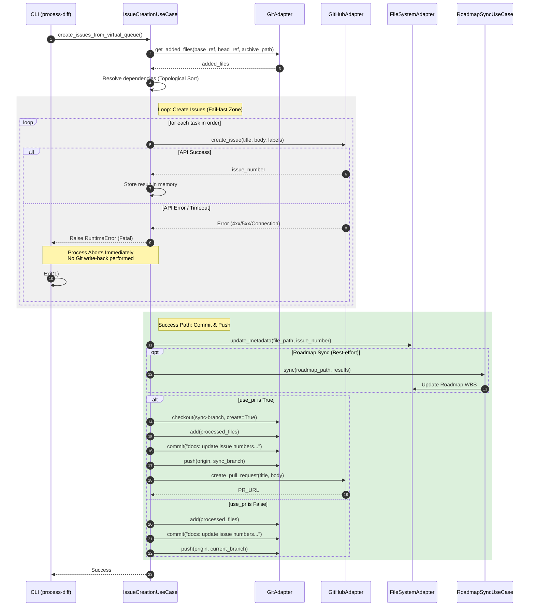

# Atomic Creation Sequence (ADR-003)

## Scenario Overview
ADR-003 で定義された「原子的な起票 (Atomic Execution)」と「Fail-fast」のロジックを示すシーケンスです。
- **Goal:** 仮想キュー内の全タスクを GitHub Issue として起票し、全件成功時のみメタデータとロードマップを更新・コミットする。
- **Trigger:** `archive/` へのファイル移動を含む PR のマージ（GitHub Actions `push` イベント）。
- **Type:** Batch / Automation

## Contracts (Pre/Post)
- **Pre-conditions (前提):**
    - `reqs/tasks/archive/` に新規追加された未採番の `.md` ファイルが存在する。
- **Post-conditions (保証):**
    - **Success:** 全ての新規タスクが Issue 化され、ファイルに Issue 番号が書き戻され、変更がコミット・プッシュされる。ロードマップ更新はベストエフォート（非致命）で行われる。
    - **Failure:** 1件でも起票に失敗した場合、Git リポジトリへの書き込み（Metadata/Roadmap）は一切行われず、SSOT の整合性が保護される。

## Related Structures
*   `IssueCreationUseCase` (see [`arch-structure-003-vqueue.md`](./arch-structure-003-vqueue.md))
*   `WorkflowUseCase` (see [`arch-structure-003-vqueue.md`](./arch-structure-003-vqueue.md))
*   `Adapters` (see [`arch-structure-003-vqueue.md`](./arch-structure-003-vqueue.md))

## Diagram (Sequence)

## Reliability & Failure Handling
- **Consistency Model:** Atomic (All-or-Nothing for Git write-back).
- **Failure Scenarios:**
    - **GitHub API Error:** `IssueCreationUseCase` が例外を捕捉し、上位（CLI）へ伝播させます。このとき、ループは中断され、その後の `update_metadata` や `GitAdapter.commit` は実行されません。
    - **Roadmap Sync Failure:** ロードマップの同期失敗は非致命（warning）として扱われ、メインの起票プロセスは継続されます。
    - **Network Failure:** Git 操作（push）や GitHub 操作中にネットワークが切断された場合、プロセスはエラー終了します。GitHub-hosted runner ではジョブ終了時にワークスペースが破棄されますが、`runs-on: self-hosted` の場合はローカルワークスペースが残り得るため、必要に応じてローカル変更のクリーンアップ（破棄やリトライ手順）が必要になります。
    - **Logic Error (Circular Dependency):** 依存関係に循環がある場合、`TopologicalSorter` が `CycleError` を投げ、起票プロセスを開始する前に停止します。

## Annotations (Why Fail-fast?)
- **SSOT Protection:** Git リポジトリのファイルが「Issue番号なし」のまま Issue が作成されると、次回実行時に二重起票が発生します。しかし、「Issue番号を書き込んだが Push に失敗した」場合よりも、「GitHub上には Issue があるが Git は未更新」という状態の方が、人間によるリカバリ（孤立 Issue の削除）が容易であり、Git 履歴の純粋性を守ることができます。
