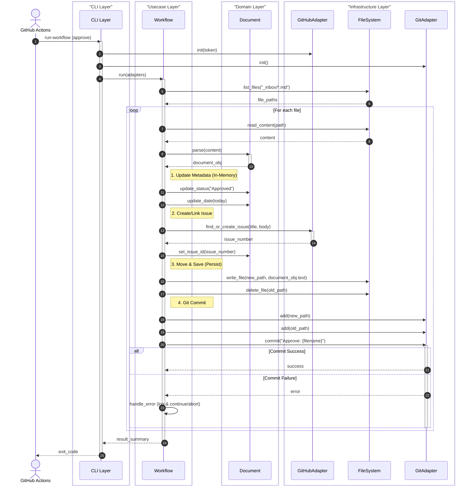

# Document Approval Flow Sequence

## Scenario Overview
- **Goal:** 自動化されたフローにより、設計ドキュメントの承認（メタデータ更新、移動）、トラッキングIssueの起票、およびGitコミットを行う。
- **Trigger:** GitHub Actions (Merge to main or Manual Dispatch) -> `issue-kit` CLI execution.
- **Type:** Batch / Sync (CLI実行中は同期的)

## Contracts (Pre/Post)
- **Pre-conditions (前提):**
    - `reqs/design/_inbox/` に承認対象のマークダウンファイルが存在する。
    - GitHub Actions ランナー上で `gh` コマンドまたは `GITHUB_TOKEN` が利用可能である。
- **Post-conditions (保証):**
    - 対象ファイルが `reqs/design/_approved/` に移動されている。
    - ファイル内の `Status` が `Approved` に、`Date` が実行日に更新されている。
    - GitHub Issue が起票（または特定）され、そのIDがファイルに記載されている。
    - 変更がGitコミットされている（Pushは呼び出し元が行う想定、またはAdapterが行う）。

## Related Structures
*   `src/issue_creator_kit/cli.py`
*   `src/issue_creator_kit/usecase/approval_workflow.py`
*   `src/issue_creator_kit/infrastructure/git_adapter.py`
*   `src/issue_creator_kit/infrastructure/github_adapter.py`

## Diagram (Sequence)

## Reliability & Failure Handling
- **Consistency Model:** Eventual Consistency (File system updates -> Git commit -> Push)
- **Failure Scenarios:**
    - *GitHub API Error:* Issue起票に失敗した場合、ファイルの移動・更新（`write_file`）を行わず、エラーログを出力して次のファイルの処理へ移行する。これにより、メタデータとIssueの不整合を防ぐ (Fail-Fast)。
    - *Git Commit Error:* ローカルでのコミットに失敗した場合、後続のPushも失敗するため、CLIは非ゼロの終了コードを返却し、CIを失敗させる。