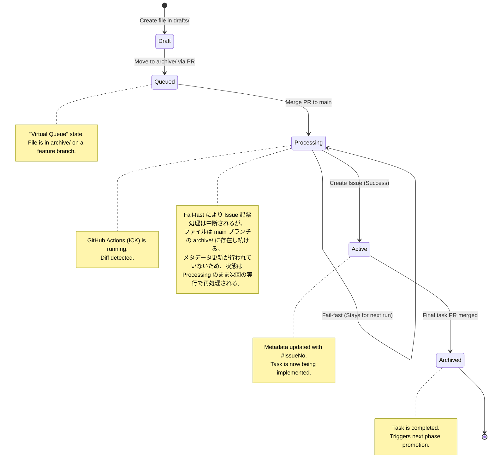

# Task Document Lifecycle (ADR-003)

## Subject Definition
ADR-003 で導入された「仮想キュー」と「自己推進型ワークフロー」に基づく、タスクドキュメント（Markdown ファイル）のライフサイクルを定義します。
- **Target Object:** Task Document (`reqs/tasks/**/*.md`)
- **Persistence:** Git Repository (Physical file path and Frontmatter metadata)
- **Concurrency Strategy:** Git Branching & PR Review (Human/AI in the loop)

## Diagram (State)

## State Definitions & Transitions

| State | Definition (Physical Path / Metadata) | Trigger (Transition) | Side Effects |
| :--- | :--- | :--- | :--- |
| `Draft` | `reqs/tasks/drafts/` に存在。Issue番号なし。 | ファイル作成 / 初期化。 | なし。 |
| `Queued` | フィーチャーブランチの `archive/` に存在し、`main` へのマージPRがOpenな状態。 | `drafts/` から `archive/` へ移動する PR を作成。 | レビュアーによる内容確認の開始。 |
| `Processing` | `main` ブランチの `archive/` に Issue番号なしで存在。 | PR マージ。GitHub Actions (`process-diff`) 起動。 | 依存関係の解決、GitHub API へのリクエスト。 |
| `Active` | `reqs/tasks/archive/` に存在。Issue番号あり。 | `GitHubAdapter.create_issue` 成功と、ファイルへの書き戻し完了。 | ロードマップ（WBS）のリンク同期。 |
| `Archived` | `reqs/tasks/archive/` に存在。Issue 完了（Closed）状態。 | 対象 Issue を「完了」とする PR の `main` マージ。 | `next_phase_path` に基づく次フェーズ連鎖のトリガー。 |

## Invariants (不変条件)
*   `Active` 状態のファイルは、必ず `issue: #XXX` という形式の有効な GitHub Issue 番号をメタデータに持たなければならない。
*   `archive/` ディレクトリ内のファイルは、`main` ブランチにおいて一度 `Active` になると、原則として `Draft` に戻ることはない。
*   タスクの依存関係 (`depends_on`) は、常に `Active` または `Archived` 状態のタスク、あるいは同一バッチ内のタスクを指していなければならない。

## Annotations
- **Virtual Queue (Queued):** 物理的なディレクトリ移動は PR 作成時に行われるが、論理的に「起票待ち」となるのは、その変更が `main` に反映される直前の状態（PRがOpen）を指す。
- **Processing Fail-fast:** 起票中にエラーが発生した場合、メタデータの更新が行われないため、ファイルは `Processing` 状態（Issue 未採番）のまま留まる。これにより、再実行時に二重起票を防止しつつ処理を継続できる。
