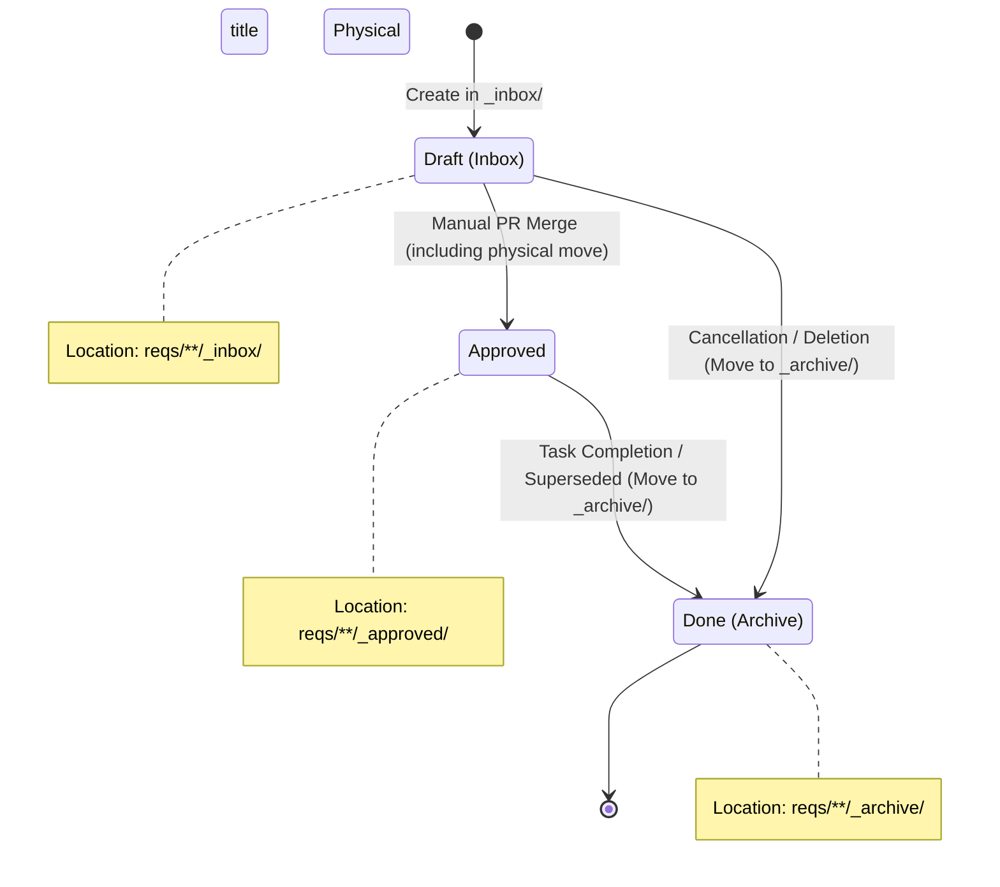

# Physical State Lifecycle (ADR-008)

## Subject Definition
- **Target Objects:** ADR (Architecture Decision Record), Design Doc, Task (Issue Draft)
- **Persistence:** File System (`reqs/`), GitHub Issues
- **Concurrency Strategy:** Git Merge (Physical directory movement)
- **Truth Source:** The physical location in the file system is the Single Source of Truth (SSOT).

## Diagram (State Transition)

## State Definitions & Transitions

| Physical State | Meaning | Transition Trigger | Side Effects |
| :--- | :--- | :--- | :--- |
| `Draft (Inbox)` | 起草・レビュー中。提案段階の設計またはタスク。 | ファイルの新規作成、または `_inbox/` への配置。 | なし。 |
| `Approved` | 承認済み。システムの正解（SSOT）または実行待ちのタスク。 | `_inbox/` から `_approved/` への物理移動を含む PR マージ。 | スキャナーによる検知。タスクの場合は起票対象となる。 |
| `Done (Archive)` | 完了またはアーカイブ。実装完了、廃止、またはキャンセルされたもの。 | `_archive/` への物理移動（タスク完了、廃止、破棄）。 | スキャナーが「完了済み」としてマーク。 |

## Mapping by Object Type

### ADR / Design Doc
- **Draft**: `reqs/design/_inbox/` に配置。
- **Approved**: 物理移動（`_inbox/` -> `_approved/`）を含む Pull Request のマージ。
- **Done**: 後続ADRによる上書き（Superseded）や廃止時、`reqs/design/_archive/` へ物理移動。

### Task (Issue Draft)
- **Draft**: `reqs/tasks/<ADR-ID>/` 直下（例: `reqs/tasks/adr-008/`）に配置。
- **Approved**: 物理移動（`_approved/` 配下への配置）を含む Pull Request のマージ。
- **Done**: GitHub Issue のクローズやキャンセル時、`reqs/tasks/_archive/` へ物理移動。

## Invariants (不変条件)
*   **Physical Truth:** ファイルの物理的な位置がその状態を決定する。メタデータ（`status`）と不整合がある場合、物理的な位置が優先される。
*   **Manual Gate:** `Draft` から `Approved` への遷移は、必ず人間によるコードレビューと「物理移動を含む」PR マージを介さなければならない。
*   **Domain Guardrails:** 全てのファイルは `id` (例: ADR: `adr-008-physical-state-lifecycle`, Task: `task-008-01`) を持ち、ディレクトリ位置に応じたバリデーション（ID形式、依存関係の循環チェック等）をパスしなければならない。
*   **Atomic Move:** 状態の遷移は、ファイルシステムの `mv` 操作（または Git による移動）として表現される。