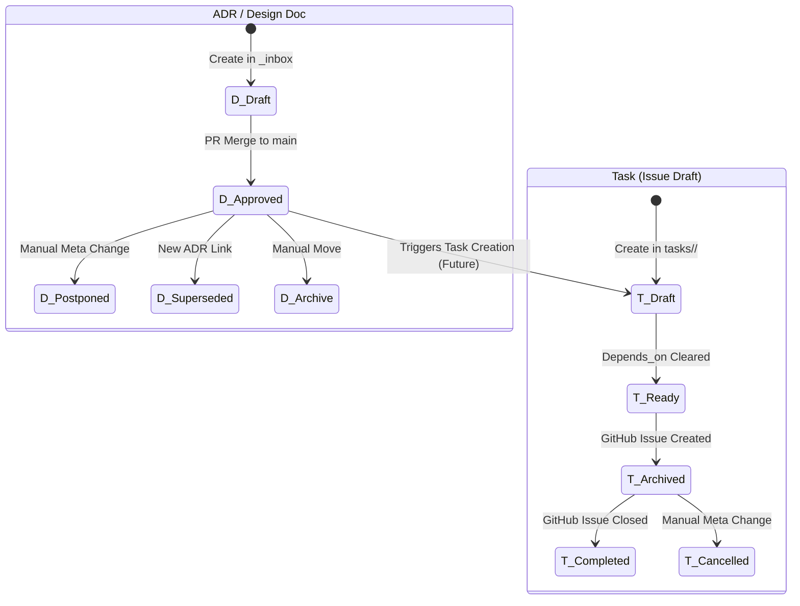

# ADR-007 Metadata Lifecycle

## Subject Definition
- **Target Object:** ADR, Design Doc, Task (Issue Draft)
- **Persistence:** YAML Frontmatter in Markdown files + GitHub Issue Status
- **Concurrency Strategy:** Git Pull & Rebase (Distributed Optimistic Locking)

## Diagram (State)

## State Definitions & Transitions (Task)

| State | Definition | Trigger (Transition) | Side Effects |
| :--- | :--- | :--- | :--- |
| `Draft` | 起草中、または依存関係未解消。 | 初期作成。 | N/A |
| `Ready` | 実行可能（依存タスク完了）。 | `issue_creator_kit` による依存解析。 | N/A |
| `Archived` | GitHub Issue 起票済み。 | `process-diff` による起票成功。 | ファイルを `tasks/_archive/` へ移動。 |
| `Completed` | 実装完了。 | GitHub Issue がマージ/クローズ。 | 次の依存タスクを `Ready` へ。 |
| `Cancelled` | 手動でキャンセルされた状態。 | メタデータの手動変更。 | N/A |

## Invariants (不変条件)
*   **Unique ID:** `id` メタデータは、ドメイン内（ADR単位）で一貫して一意でなければならない。
*   **Archive Integrity:** `_archive` に移動されたタスクファイルは、必ず `issue_id` メタデータを保持していなければならない。
*   **One-way Flow:** 原則として、`Archived` から `Draft` への逆遷移は行わない。
