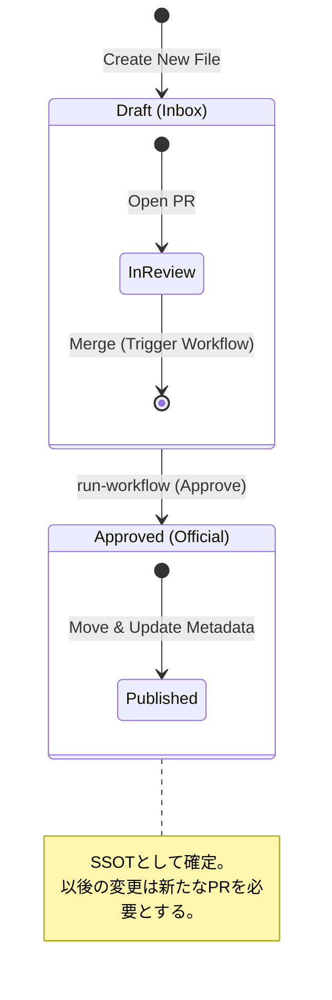

# Design Document Lifecycle

## Subject Definition
- **Target Object:** Design Document (ADR / Design Doc)
- **Persistence:** File System (`reqs/design/`) & Markdown Metadata (Frontmatter)
- **Concurrency Strategy:** Pessimistic Locking (via Git Branch Protection & PR Merge Queue)

## Diagram (State)

## State Definitions & Transitions

| State | Definition | Trigger (Transition) | Side Effects |
| :--- | :--- | :--- | :--- |
| **Draft** | 提案中の状態。`reqs/design/_inbox/` に配置されている。 | `git commit` (Feature Branch) | 特になし。 |
| **In Review** | プルリクエストにてレビュー中の状態。物理配置は `_inbox/` のまま。 | GitHub PR 作成 | レビューコメント、CIによるLintチェック。 |
| **Approved** | 正式に承認された状態。`reqs/design/_approved/` に配置される。 | PR Merge & `issue-creator-kit run-workflow` 実行 | 1. `Status: Approved` 更新 2. `Date` 更新 3. ファイル移動 4. Issue起票 & ID追記 |

## Invariants (不変条件)
*   **Approved Immutability (of Path):** 一度 `_approved` に移動したドキュメントが、自動処理によって `_inbox` に戻ることはない（手動修正を除く）。
*   **Metadata Consistency:** `_approved` 配下のファイルは、必ず `Status: Approved` でなければならない。
*   **Traceability:** `_approved` 配下のファイルには、必ず対応する GitHub Issue ID が記載されていなければならない。
