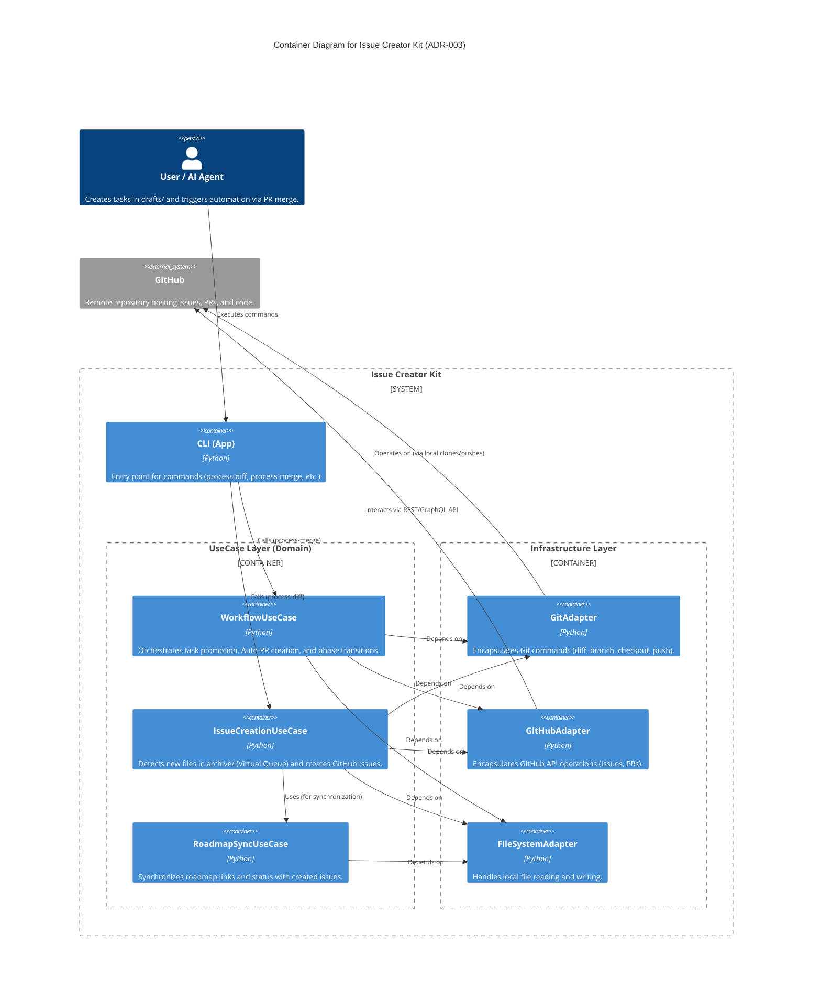

# Virtual Queue & Adapters Structure (ADR-003)

## Context
ADR-003 で導入された「仮想キュー（Virtual Queue）」方式と「フェーズ連鎖（Auto-PR）」を実現するためのコンポーネント構造です。
- **Bounded Context:** Task Lifecycle Management
- **System Purpose:** Git 差分ベースのタスク検知と、GitHub Issue 起票およびロードマップ更新の自動化。

## Diagram (C4 Container)

## Element Definitions (SSOT)

### WorkflowUseCase
- **Type:** `Component`
- **Code Mapping:** `src/issue_creator_kit/usecase/workflow.py`
- **Role (Domain-Centric):** フェーズ完了の合図（PRマージ）を受け取り、次フェーズの Draft を Archive へ移動させるための Auto-PR を作成・制御する。
- **Layer (Clean Arch):** Use Cases
- **Dependencies:**
  - **Upstream:** `CLI`
  - **Downstream:** `GitAdapter`, `GitHubAdapter`, `FileSystemAdapter`
- **Tech Stack:** Python
- **Data Reliability:** Async (GitHub API calls), Retry Policy needed for API rate limits.
- **Trade-off:** 物理的なキュー（フォルダ）を廃止し、PR の状態（マージ）を「完了」の信頼できるイベントソースとして利用する。

### IssueCreationUseCase
- **Type:** `Component`
- **Code Mapping:** `src/issue_creator_kit/usecase/creation.py`
- **Role (Domain-Centric):** `git diff` により `archive/` に新しく追加された未採番ファイルを検知（仮想キュー）し、GitHub Issue を一括起票する。
- **Layer (Clean Arch):** Use Cases
- **Dependencies:**
  - **Upstream:** `CLI`
  - **Downstream:** `RoadmapSyncUseCase`, `GitAdapter`, `GitHubAdapter`, `FileSystemAdapter`
- **Tech Stack:** Python
- **Data Reliability:** 原子性を担保するため、全件起票が成功するまで Git への書き戻しを行わない（Fail-fast）。
- **Trade-off:** 重複起票のリスクを許容し、Git の不整合（SSOTの破壊）を防止することを優先する。

### RoadmapSyncUseCase
- **Type:** `Component`
- **Code Mapping:** `src/issue_creator_kit/usecase/roadmap_sync.py`
- **Role (Domain-Centric):** 起票されたタスクの Issue 番号とステータスを、ロードマップ（Markdown）内の WBS テーブルに動的に反映する。
- **Layer (Clean Arch):** Use Cases
- **Dependencies:**
  - **Upstream:** `IssueCreationUseCase`
  - **Downstream:** `FileSystemAdapter`
- **Tech Stack:** Python (Regex processing)
- **Data Reliability:** Sync (Local file rewrite).
- **Trade-off:** 機械的な Markdown 書き換えによる人間との競合リスクがあるが、SSOT 維持の自動化を優先する。

### Adapters (Infrastructure)
- **Type:** `Boundary`
- **Code Mapping:** `src/issue_creator_kit/infrastructure/`
- **Role (Domain-Centric):** Git, GitHub API, ファイルシステムなどの外部システムとの詳細な対話を隠蔽し、ドメイン層を技術的詳細から保護する。
- **Layer (Clean Arch):** Infrastructure
- **Dependencies:**
  - **Upstream:** `WorkflowUseCase`, `IssueCreationUseCase`, `RoadmapSyncUseCase`
  - **Downstream:** `GitHub (External)`
- **Tech Stack:** Python, Git CLI, GitHub API
- **Data Reliability:** 外部 API の不安定さを考慮したエラーハンドリングが必要。
