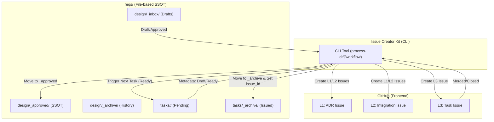

# ADR-007 Metadata-Driven Structure

## Context
- **Bounded Context:** Lifecycle & Task Management
- **System Purpose:** ADR-003 での物理階層による管理の限界を克服し、メタデータ（YAML Frontmatter）によってドキュメントとタスクのライフサイクルを自律的に管理するフラットな構造を実現する。

## Diagram (C4 Container)

## Element Definitions (SSOT)

### File-based SSOT (reqs/)
- **Type:** `Boundary`
- **Code Mapping:** `reqs/`
- **Role (Domain-Centric):** 全ての設計意図（ADR）と作業予約（Task Draft）の永続化層。
- **Layer (Clean Arch):** Infrastructure (External State)
- **Trade-off:** 物理階層をフラットにすることで、認知負荷を下げつつ、メタデータによる複雑な依存管理を許容する。

### Metadata-Driven CLI
- **Type:** `Component`
- **Code Mapping:** `src/issue_creator_kit/`
- **Role (Domain-Centric):** ファイルのメタデータを解析し、GitHub Issue の状態と同期させる「ライフサイクル・オーケストレーター」。
- **Layer (Clean Arch):** Use Cases
- **Tech Stack:** Python 3.13, GitHub API (PyGithub/gh cli)

### 3-Layer Hybrid Management
- **Type:** `Boundary`
- **Role (Domain-Centric):** 
    - **L1 (ADR):** 戦略的目標。
    - **L2 (Phase):** 戦術的マイルストーン。
    - **L3 (Task):** 実装アクション。
- **Data Reliability:** 結果整合性。GitHub Issue の起票が成功した後に、ローカルファイルをアーカイブ（移動）することで、不整合を防ぐ。
