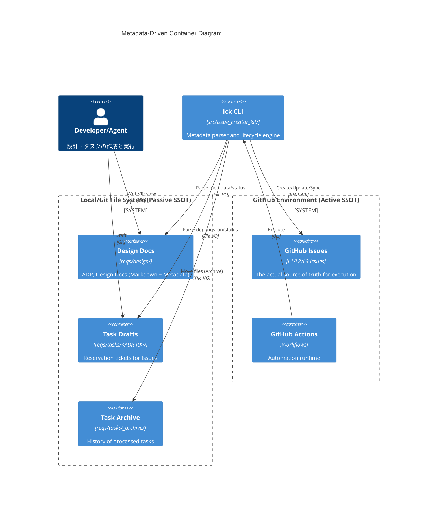
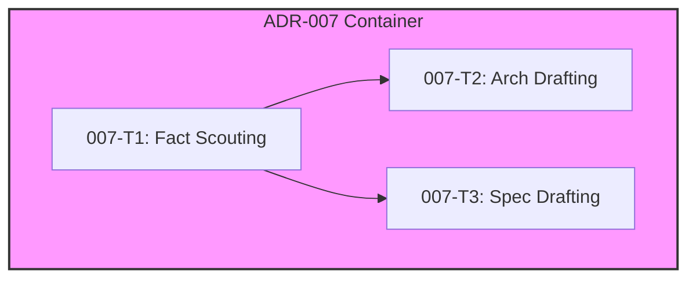
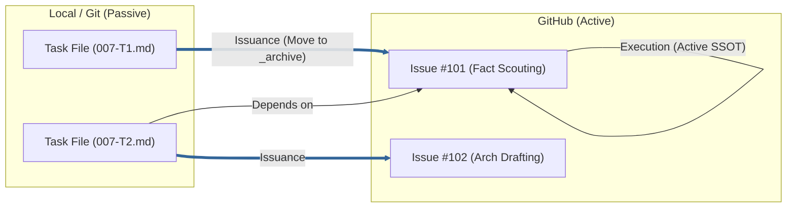
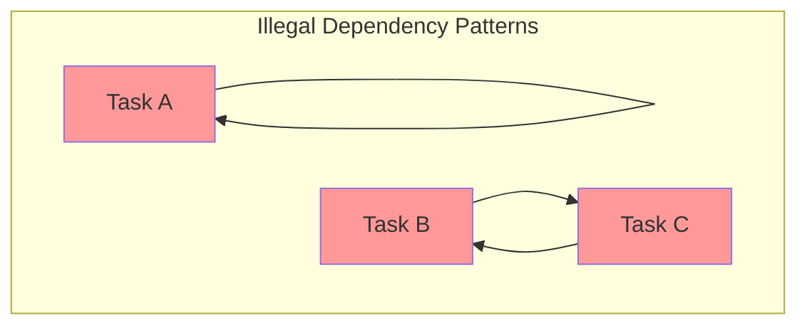

# Metadata-Driven Architecture Structure (ADR-007)

## Context
- **Bounded Context:** Task Lifecycle Management
- **System Purpose:** ADR-007 で導入された「メタデータ駆動型ライフサイクル」を実現するための、フラットなファイル構造と論理的な依存関係（DAG）の定義。物理的な階層構造を排除し、認知負荷を最小化しつつ、自動化ツールによる精密な制御を可能にする。

## Diagram (C4 Container & DAG)

### Logical Dependency (DAG) Conceptual View

## Invisible SSOT: File vs Issue Mapping

本プロジェクトの核心的な設計思想である「不可視のファイルベースSSOT」を以下の図で定義します。

- **Local Files:** 「予約票（Reservation Ticket）」および「履歴の控え」として機能。

- **GitHub Issues:** 実作業における「唯一の正解（Active SSOT）」。

## Element Definitions (SSOT)

### reqs/design/ (Design Storage)

- **Type:** `Container`

- **Code Mapping:** `reqs/design/`

- **Role (Domain-Centric):** システムの意思決定（ADR）と詳細設計（Design Doc）を永続化する「設計の正解」。

- **Layer (Clean Arch):** `Domain (Policy)`

- **Dependencies:**

  - **Upstream:** `Architect (Human)`, `ick CLI`

  - **Downstream:** `reqs/tasks/`

- **Tech Stack:** Markdown, YAML Frontmatter

- **Data Reliability:** Sync (Git managed). Status field manages lifecycle (`Draft`, `Approved`).

- **Trade-off:** 物理フォルダを `_inbox`, `_approved`, `_archive` の3つに限定することで、検索性を高める代わりに、詳細なカテゴリ分けはメタデータ（`tags` 等）に委ねている。

### reqs/tasks/ (Task Reservoir)

- **Type:** `Container`

- **Code Mapping:** `reqs/tasks/`

- **Role (Domain-Centric):** 起票待ちのタスク案（予約票）および起票済みタスクの控え。

- **Layer (Clean Arch):** `Use Cases (Execution Plan)`

- **Dependencies:**

  - **Upstream:** `reqs/design/`

  - **Downstream:** `GitHub Issues`

- **Tech Stack:** Markdown, YAML Frontmatter

- **Data Reliability:** `ick CLI` による移動（Atomic Move）により、重複起票を防止。

- **Trade-off:** 物理ファイルをアーカイブとして残すことで、GitHub がダウンしても設計意図とタスクの履歴を Git 上で追跡可能にしている。

### ick CLI (Lifecycle Engine)

- **Type:** `Container`

- **Code Mapping:** `src/issue_creator_kit/`

- **Role (Domain-Centric):** メタデータを解析し、有向非巡回グラフ（DAG）に基づいてタスクの起票・移動・同期を統制する。

- **Layer (Clean Arch):** `Interface Adapters`

- **Dependencies:**

  - **Upstream:** `GitHub Actions`

  - **Downstream:** `FileSystem`, `GitHub API`

- **Tech Stack:** Python, `uv`, `PyYAML`

- **Data Reliability:** 冪等性を担保。起票成功時のみ物理ファイルを `_archive/` へ移動させる。

## Metadata Field Definitions & Guardrails (ADR-008)

本セクションでは、ドキュメントの整合性を担保するための「ドメイン・ガードレール（バリデーション規則）」を定義します。これらの規則は、`src/issue_creator_kit/domain/models/` (現状は `document.py` 内の `Metadata` モデル) において Pydantic Validator として実装されます。

### Field Validation Rules

| Field | Description | Type | Validation Rules (Guardrails) |
| :--- | :--- | :--- | :--- |
| `id` | ユニーク識別子 | String | Regex: `adr-\d{3}-.*` (ADR) or `task-\d{3}-\d{2,}` (Task) |
| `status` | ライフサイクル状態 | Enum | ADR: `Draft`, `Approved`, `Postponed`, `Superseded` / Task: `Draft`, `Ready`, `Issued`, `Completed`, `Cancelled` |
| `depends_on` | 依存先IDリスト | String (List) | Graph Integrity: 対象IDの存在確認、自己参照禁止、循環参照禁止 (No Cycles) |
| `issue_id` | GitHub Issue番号 | Integer | Conditional: `status` が `Issued` または `Completed` の場合に必須 |

### Graph Integrity (DAG Validation)

`depends_on` フィールドによる依存関係は、常に有向非巡回グラフ (DAG) を形成しなければなりません。バリデーションエンジンは、以下のパターンを「ガードレール違反」として拒絶します。

- **Self-Reference:** ファイル A が自分自身の ID を `depends_on` に含めること。

- **Circular Dependency:** A -> B -> A のように、依存関係がループすること。

- **Orphan Reference:** 存在しない ID を `depends_on` に含めること（スキャン範囲内での解決が必要）。
