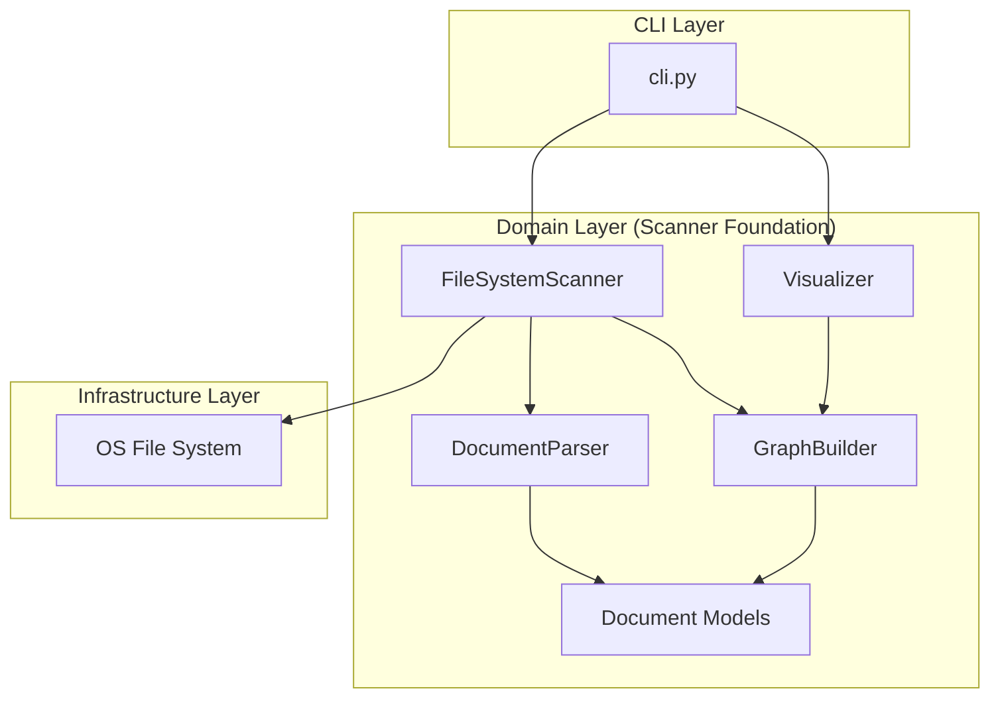
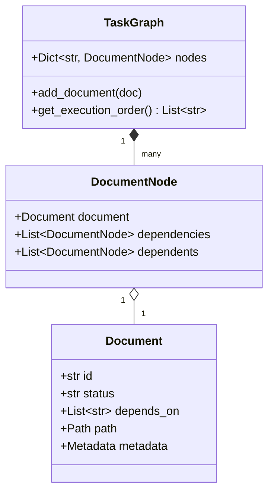
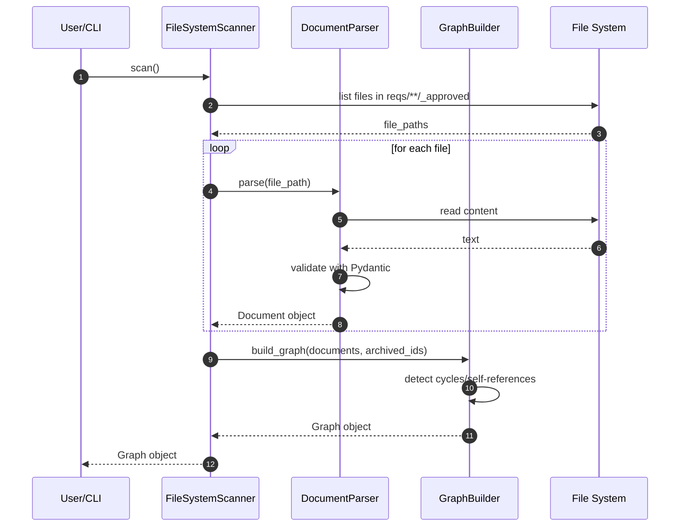

# Scanner Foundation Structure (ADR-008)

## Context

- **Bounded Context:** Scanner & Dependency Management.
- **System Purpose:** Robustly detect unprocessed tasks/ADRs from the physical file system and construct a dependency graph (DAG) for safe execution and visualization.
- **Background:** Deprecates ADR-003's Git-diff based detection in favor of a Physical State Scanner to eliminate missed processing and complex sync logic.

## Diagram (Component View)

## Diagram (Data/Class View)

## Element Definitions (SSOT)

### FileSystemScanner

- **Type:** `Component`
- **Code Mapping:** `src/issue_creator_kit/domain/services/scanner.py` (Planned)
- **Role (Domain-Centric):** 物理ファイルシステム上の `reqs/` ディレクトリを走査し、処理対象（`_approved/` にあり `_archive/` にないもの）を抽出する。
- **Layer (Clean Arch):** Use Cases / Domain Services
- **Dependencies:**
  - **Upstream:** `cli.py`
  - **Downstream:** `OS File System`, `DocumentParser`, `GraphBuilder`
- **Tech Stack:** Python 3.13, `pathlib`
- **Data Reliability:** Sync. Physical file state is the SSOT.

### DocumentParser

- **Type:** `Component`
- **Code Mapping:** `src/issue_creator_kit/domain/services/parser.py` (Planned)
- **Role (Domain-Centric):** Markdown ファイルのメタデータを解析し、Pydantic モデルに変換する。
- **Layer (Clean Arch):** Entities / Domain Models
- **Dependencies:**
  - **Upstream:** `FileSystemScanner`
  - **Downstream:** `Document Models`
- **Tech Stack:** Pydantic v2
- **Data Reliability:** Fail-fast on validation (Domain Guardrails).

### GraphBuilder

- **Type:** `Component`
- **Code Mapping:** `src/issue_creator_kit/domain/services/builder.py` (Planned)
- **Role (Domain-Centric):** `depends_on` メタデータに基づき、ドキュメント間の依存関係をグラフ（DAG）として構築する。
- **Layer (Clean Arch):** Domain Services
- **Dependencies:**
  - **Upstream:** `FileSystemScanner`, `Visualizer`
  - **Downstream:** `Document Models`
- **Tech Stack:** Python 3.12
- **Data Reliability:** 循環参照や自己参照を検知しエラーとする。

### Visualizer

- **Type:** `Component`
- **Code Mapping:** `src/issue_creator_kit/domain/services/visualizer.py` (Planned)
- **Role (Domain-Centric):** 構築された DAG から Mermaid 形式のテキストを生成する。
- **Layer (Clean Arch):** Interface Adapters / Domain Services
- **Dependencies:**
  - **Upstream:** `cli.py`
  - **Downstream:** `GraphBuilder`
- **Tech Stack:** Python 3.12 (Mermaid String generation)
- **Data Reliability:** N/A (Read-only visualization)

## Quality Policy

### Domain Guardrails (Validation)

- **Validation timing:** All files are validated at the Domain layer during the `parse` phase.
- **Strict ID checks:** IDs must follow the patterns `adr-\d{3}-.*` or `task-\d{3}-\d{2,}`.
- **Dependency Integrity:** The `GraphBuilder` must verify that all `depends_on` IDs exist within the current scan context or are already in `_archive/`.

### Error Handling

- **Non-recoverable errors:** Validation errors (schema mismatch, duplicate IDs) and logical errors (dependency cycles) are treated as fatal. The system must stop execution and report the exact file and cause.
- **Dry-run safety:** The `--dry-run` flag ensures that the scanner logic executes fully without triggering any Infrastructure-level side effects (like GitHub Issue creation).

### Data Reliability

- **SSOT:** The Physical File System is the primary source of truth. The scanner must not rely on Git metadata (like `mtime` or `diff-tree`).
- **Idempotency:** Re-running the scanner on the same file system state must yield identical Graph objects.

### Scalability & Performance

- **Parallelism:** 大規模なファイルセット（1000ファイル超）を扱う場合、`asyncio` による非同期 I/O およびパースの並列化を検討する。
- **Memory Footprint:** グラフ構築時はメタデータのみをメモリに保持し、本文などの大きなデータは必要時以外ロードしない。

---

# Scanner Foundation Process (Behavior)

## Scenario Overview

- **Goal:** ファイルシステムから未処理のタスクを検出し、依存関係を考慮したグラフを構築して表示する。
- **Trigger:** `issue-kit process --dry-run` または `issue-kit visualize`
- **Type:** Sync (Batch-like execution)

## Contracts (Pre/Post)

- **Pre-conditions (前提):**
  - `reqs/` ディレクトリ配下に Markdown ファイルが存在すること。
- **Post-conditions (保証):**
  - `_archive/` に存在しない `_approved/` 配下の全ファイルが走査対象に含まれること。
  - 依存関係に不整合（循環参照等）がある場合は、副作用（起票等）を起こさずに異常終了すること。

## Diagram (Sequence)

## Reliability & Failure Handling

- **Consistency Model:** Strong Consistency (Physical file state is the source of truth).
- **Failure Scenarios:**
  - _Validation Error:_ 不正なメタデータや循環参照を検知した場合、即座に例外を送出し、処理を中断する（Fail-fast）。
  - _File Access Error:_ 権限不足等でファイルが読めない場合、エラーを報告し中断する。
