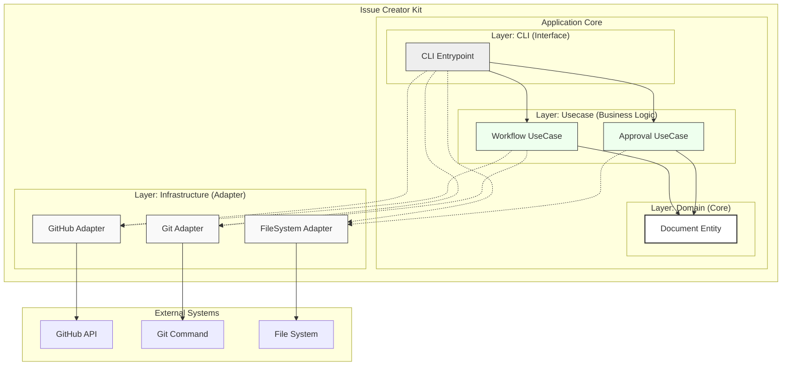

# Issue Creator Kit Structure

## Context
- **Bounded Context:** Document Lifecycle Management
- **System Purpose:** 設計ドキュメント（ADR/Design Doc）のライフサイクル（承認・タスク化）を自動化し、SSOTとしての信頼性を担保する。

## Diagram (C4 Component - Clean Architecture Lite)

## Element Definitions (SSOT)

### CLI Entrypoint
- **Type:** Component
- **Code Mapping:** `src/issue_creator_kit/cli.py`
- **Role (Domain-Centric):** ユーザー（GitHub Actions）からの実行指示を受け取り、必要なAdapterを選択してUseCaseを起動する。
- **Layer (Clean Arch):** Interface (Controller)
- **Dependencies:**
    - **Downstream:** UseCase, Infrastructure (for DI)
- **Tech Stack:** Python, Click/Argparse
- **Data Reliability:** Stateless

### Workflow / Approval UseCase
- **Type:** Component
- **Code Mapping:** `src/issue_creator_kit/usecase/*.py`
- **Role (Domain-Centric):** ドキュメント承認プロセスやIssue起票フローの進行制御（オーケストレーション）を行う。
- **Layer (Clean Arch):** Use Cases
- **Dependencies:**
    - **Upstream:** CLI
    - **Downstream:** Domain, Infrastructure (Interface)
- **Tech Stack:** Python (Pure Logic)
- **Trade-off:** テスト容易性を優先し、外部システムへの依存を排除（DI前提）。

### Document Entity
- **Type:** Component
- **Code Mapping:** `src/issue_creator_kit/domain/document.py`
- **Role (Domain-Centric):** ドキュメントの解析、メタデータ（Status, Date）の更新ロジック、パス操作のルールを持つ。
- **Layer (Clean Arch):** Entities (Domain)
- **Dependencies:**
    - **Upstream:** UseCase
    - **Downstream:** None
- **Tech Stack:** Python (Pure Data Class)

### Infrastructure Adapters
- **Type:** Component
- **Code Mapping:** `src/issue_creator_kit/infrastructure/*.py`
- **Role (Domain-Centric):** 外部世界（GitHub, Git, ファイルシステム）との具体的な通信・操作を実行する。
- **Layer (Clean Arch):** Infrastructure
- **Dependencies:**
    - **Upstream:** CLI (Instantiation), UseCase (Call)
    - **Downstream:** External Systems
- **Tech Stack:** PyGithub, Subprocess
- **Data Reliability:** Fail-Fast (APIエラー時は即座に例外送出)