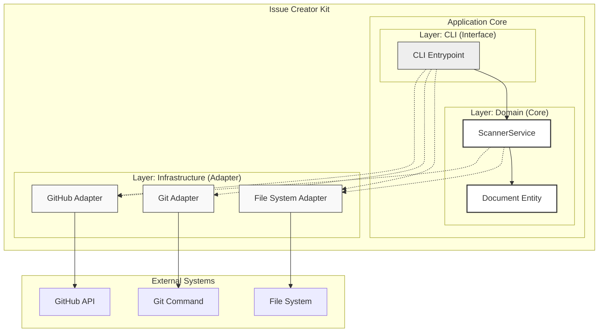

# Issue Creator Kit Structure

## Context
- **Bounded Context:** Document Lifecycle Management
- **System Purpose:** 設計ドキュメント（ADR/Design Doc）のライフサイクル（承認・タスク化）を自動化し、SSOTとしての信頼性を担保する。

## Diagram (Component Diagram - Clean Architecture Lite)

## Element Definitions (SSOT)

### CLI Entrypoint
- **Type:** Component
- **Code Mapping:** `src/issue_creator_kit/cli.py`
- **Role (Domain-Centric):** ユーザー（GitHub Actions）からの実行指示（`visualize` 等）を受け取り、必要なAdapterを選択して ScannerService を起動する。
- **Layer (Clean Arch):** Interface (Controller)
- **Dependencies:**
    - **Downstream:** ScannerService, Infrastructure (for DI)
- **Tech Stack:** Python, Click/Argparse
- **Data Reliability:** Stateless

### ScannerService
- **Type:** Component
- **Code Mapping:** `src/issue_creator_kit/domain/services/scanner.py`
- **Role (Domain-Centric):** 物理ファイルシステムの走査（FileSystemScanner）、Markdown解析（TaskParser）、依存関係グラフ（DAG）の構築（GraphBuilder）、および可視化（Visualizer）を統括する。
- **Layer (Clean Arch):** Domain Services
- **Dependencies:**
    - **Upstream:** CLI
    - **Downstream:** Domain Entity, Infrastructure (Adapters)
- **Tech Stack:** Python 3.12, Pydantic v2
- **Data Reliability:** Strong Consistency (物理ファイルの状態を正とする)。

### Document Entity
- **Type:** Component
- **Code Mapping:** `src/issue_creator_kit/domain/document.py`
- **Role (Domain-Centric):** ドキュメントの構造（メタデータと本文）を表現し、テキストとの相互変換（解析・シリアライズ）ロジックを持つ。
- **Layer (Clean Arch):** Entities (Domain)
- **Dependencies:**
    - **Upstream:** ScannerService
    - **Downstream:** None
- **Tech Stack:** Python, PyYAML

### Infrastructure Adapters
- **Type:** Component
- **Code Mapping:** `src/issue_creator_kit/infrastructure/*.py`
- **Role (Domain-Centric):** 外部世界（GitHub, Git, ファイルシステム）との具体的な通信・操作を実行する。
- **Layer (Clean Arch):** Infrastructure
- **Dependencies:**
    - **Upstream:** CLI (Instantiation), ScannerService (Call)
    - **Downstream:** External Systems
- **Tech Stack:** requests, Subprocess
- **Data Reliability:** Fail-Fast (APIエラー時は即座に例外送出)