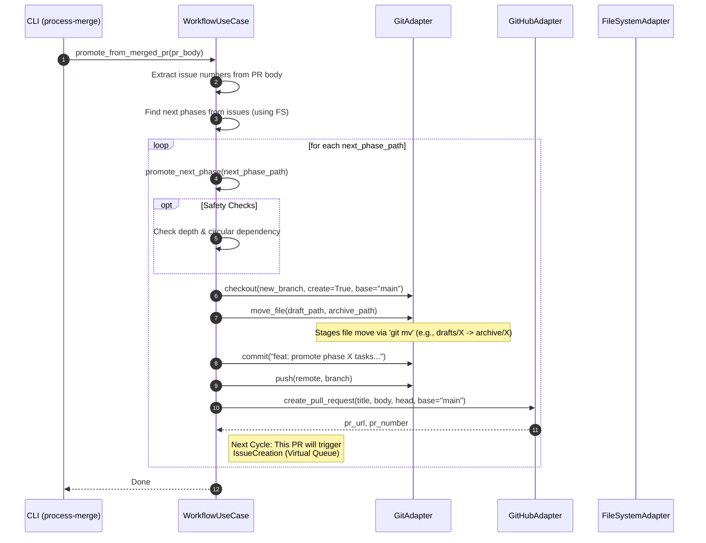

# Auto-PR (Phase Chain) Sequence (ADR-003)

> **DEPRECATED: This document is based on ADR-003 and has been superseded by the new architecture defined in ADR-007.**
> Please refer to the new architecture documents, such as [`arch-structure-007-metadata.md`](../arch-structure-007-metadata.md) and [`arch-state-007-lifecycle.md`](../arch-state-007-lifecycle.md).

## Scenario Overview
ADR-003 で定義された「フェーズ連鎖 (Phase Chain)」メカニズム、すなわち「最終タスク完了 -> 次フェーズ Draft の Archive 移動 -> PR 作成」の流れを可視化します。
- **Goal:** フェーズ完了を検知し、次フェーズのタスクを自動的に仮想キューへ投入（PR作成）することで、プロジェクトを自律的に進行させる。
- **Trigger:** 特定フェーズの最終タスクを含む PR が `main` にマージされたイベント（GitHub Actions `push` イベント）。
- **Type:** Automation / Orchestration

## Contracts (Pre/Post)
- **Pre-conditions (前提):**
    - マージされたPRが閉じるIssueに対応するタスクファイル（`archive/`内に存在）に`next_phase_path`が定義されている。
    - 次フェーズのドキュメントが `reqs/tasks/drafts/` 下に準備されている。
- **Post-conditions (保証):**
    - `main` ブランチから新しい Foundation Branch が作成される。
    - ファイルが `drafts/` から `archive/` へ物理的に移動される。
    - 移動後の変更を含むプルリクエストが `main` に向けて自動作成される。

## Related Structures
*   `WorkflowUseCase` (see `./arch-structure-003-vqueue.md`)
*   `GitAdapter` (see `./arch-structure-003-vqueue.md`)
*   `GitHubAdapter` (see `./arch-structure-003-vqueue.md`)

## Diagram (Sequence)

## Reliability & Failure Handling
- **Consistency Model:** Eventual Consistency (PR merge triggers the next step).
- **Safety Mechanisms:**
    - **Infinite Loop Protection:** `MAX_PHASE_CHAIN_DEPTH` (default 10) により、設定ミスによる無限 PR 生成を防止します。
    - **Circular Dependency Detection:** 同一セッション内での同一パスへの遷移を検知・スキップします。
    - **Idempotency:** 遷移先ブランチが既に存在する場合、安全に処理をスキップ（またはログ出力）し、重複 PR 作成を防止します。
- **Failure Scenarios:**
    - **Move Failure:** `drafts/` パスが存在しない場合、プロセスはエラーを出力して停止し、不完全な PR が作成されるのを防ぎます。
    - **Git Push Failure:** 認証エラーやネットワーク障害時は PR 作成まで至らず、人間による再実行が可能です。

## Implementation Details
- **Branch Naming:** `feature/{phase_name}-foundation` の形式で作成されます。
- **Base Branch:** 常に `main` ブランチを基点として次フェーズの準備が行われます。
- **Next Step:** このプロセスによって作成された PR がマージされることで、`IssueCreationUseCase` (Virtual Queue) が起動し、実際の GitHub Issue が起票されます。
