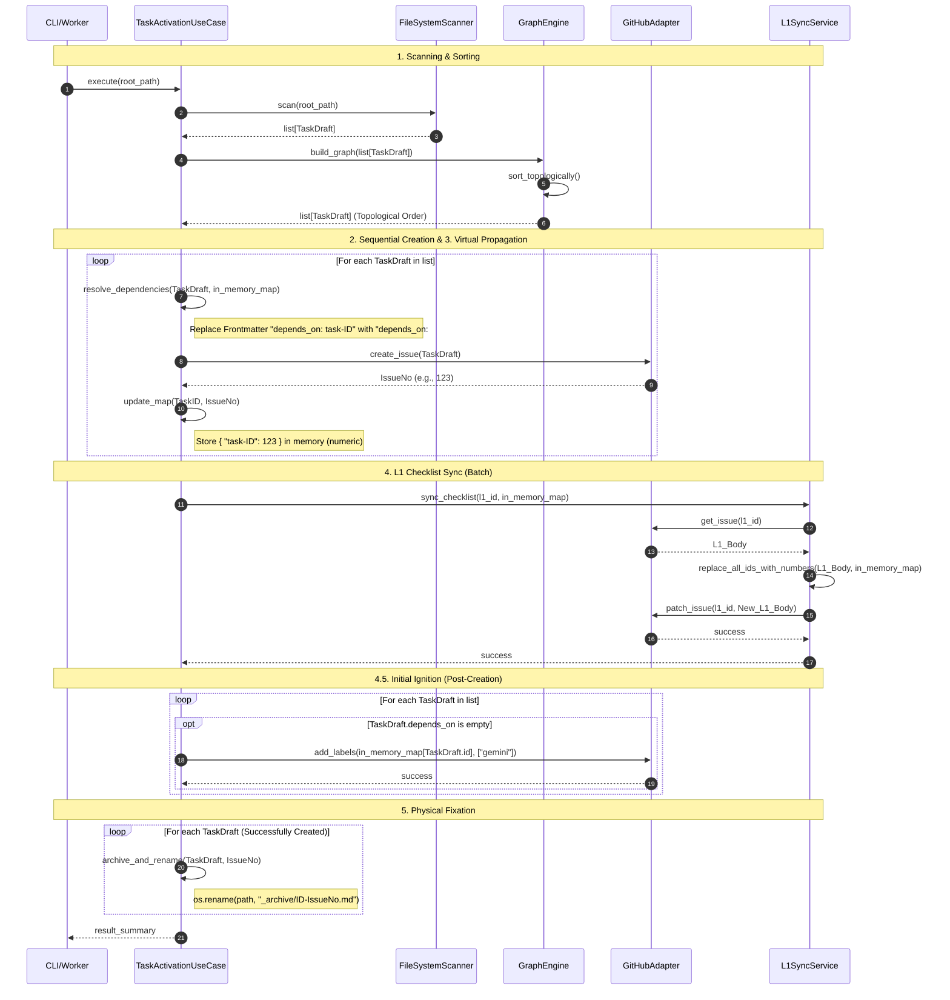

# Task Activation Sequence

## Scenario Overview

- **Goal**: ADRドラフト（L1）に紐づく実装タスク（L2/L3）を、依存関係を維持しつつ非破壊的に自動起票し、親Issueのチェックリストを同期し、証跡を固定する。
- **Trigger**: CLI コマンド（`issue-kit activate` 等）の実行。
- **Type**: `[Batch]` - ローカルのドラフトファイルを一括処理する。

## Contracts (Pre/Post)

- **Pre-conditions (前提):**
  - `reqs/tasks/` 内に有効な Markdown 形式のタスクドラフトが存在すること。
  - 各タスクドラフトの Frontmatter に `id` および必要に応じて `depends_on` が定義されていること。
  - 親Issue（L1）が GitHub 上に既に作成されていること。
- **Post-conditions (保証):**
  - 全てのタスクが依存関係順（Topological Order）に GitHub Issue として起票されること。
  - 後続タスクの本文内の一時IDが、先行タスクの実Issue番号に置換されていること（In-Memory Propagation）。
  - 親Issueのチェックリスト内の一時IDが実Issue番号に更新されていること（L1 Checklist Sync）。
  - 依存関係のないタスクに対し、GitHub 上で `gemini` ラベルが付与されていること（Initial Ignition）。
  - 処理済みのファイルが `_archive/` に移動され、ファイル名が `{ID}-{IssueNo}.md` にリネームされていること（Physical Fixation）。

## Related Structures

- **FileSystemScanner** (see `docs/architecture/structure-scanner.md`)
- **GraphEngine** (see `reqs/context/architecture/adr-010-task-activation/definitions.md`)
- **TaskActivationUseCase** (see `reqs/context/architecture/adr-010-task-activation/definitions.md`)
- **GitHubAdapter** (see `reqs/context/architecture/adr-010-task-activation/definitions.md`)
- **L1SyncService** (see `reqs/context/architecture/adr-010-task-activation/definitions.md`)
- **RelayEngine** (see `docs/architecture/structure-relay.md`)

## Diagram (Sequence)

## Reliability & Failure Handling

- **Consistency Model**: `[Eventual Consistency]` - GitHub 側とローカルファイルの状態は、全ステップ完了後に一致する。
- **Failure Scenarios**:
  - **GitHub API Error**: 起票に失敗した場合、そのタスクで処理を中断する（またはスキップ設定）。取得済みの Issue 番号はメモリ内にあるため、そこまでの処理は有効。
  - **L1 Sync Failure**: L1 更新に失敗しても、タスク自体の起票は成功しているため、次回実行時に「検索ベースの冪等性」により残地処理としてリトライ可能。
  - **Initial Ignition Failure**: ラベル付与に失敗しても、起票および L1 同期は完了しているため、次回の relay/sync 実行時の `Initial Ignition` ステップで補完を試行可能。ただし、`behavior-activation.md` で述べる通り、トリガ条件が満たされない等の理由により着火が行われない可能性があり、回復が保証されるわけではない。
  - **Physical Fixation Failure**: リネームに失敗した場合、ファイルは元の場所に残る。次回実行時には FileSystemScanner がファイルの物理状態のみを走査し、UseCase が GitHubAdapter による検索や `_archive/{ID}-{IssueNo}.md` の存在確認から「既に Issue が存在する」ことを判定し、未アーカイブのタスクについてリネームのみを再試行する。
  - **Race Condition (L1 Sync)**: 外部の人間による同時編集があった場合、GitHub API の `update_issue` は最新の `body` を上書きするリスクがある（Design Brief にて受容済みリスク）。
