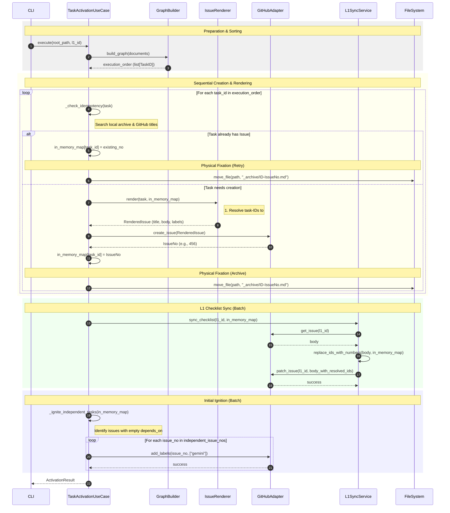

# Task Activation Sequence with Metadata

## Scenario Overview

- **Goal**: ADRドラフト（L1）に紐づく実装タスク（L2/L3）を、依存関係を維持しつつ非破壊的に自動起票し、機械可読なメタデータを埋め込み、親Issueのチェックリストを同期し、証跡を固定する。
- **Trigger**: CLI コマンド（`issue-kit activate` 等）の実行。
- **Type**: `[Batch]` - ローカルのドラフトファイルを一括処理する。
- **Key Changes (ADR-011)**: UseCase から文字列置換ロジックを分離し、`IssueRenderer` による構造化レンダリング（Metadata & Dependencies）を導入する。

## Contracts (Pre/Post)

- **Pre-conditions (前提):**
  - `reqs/tasks/` 内に有効な Markdown 形式のタスクドラフトが存在すること。
  - 各タスクドラフトの Frontmatter に `role`, `phase`, `id`, `depends_on` が定義されていること。
  - 親Issue（L1）が GitHub 上に既に作成されていること。
- **Post-conditions (保証):**
  - 全てのタスクが依存関係順（Topological Order）に起票される。
  - Issue 本文に ID 置換済みの `## Dependencies` チェックリストが含まれる。
  - Issue 本文末尾に JSON 形式の `<!-- metadata:{...} -->` が隠蔽埋め込みされる。
  - 処理済みのファイルが `_archive/` に移動され、ファイル名が `{ID}-{IssueNo}.md` にリネームされる。

## Related Structures

- **TaskActivationUseCase** (see `src/issue_creator_kit/usecase/task_activation_usecase.py`)
- **IssueRenderer** (see `docs/architecture/structure-renderer.md`)
- **GitHubAdapter** (see `src/issue_creator_kit/infrastructure/github_adapter.py`)
- **L1SyncService** (see `src/issue_creator_kit/domain/services/l1_sync.py`)

## Diagram (Sequence)

## Reliability & Failure Handling

- **Consistency Model**: `[Eventual Consistency]`
- **ID Propagation Strategy**: `IssueRenderer` は `in_memory_map` を参照し、依存先タスクの ID を `#IssueNo` に置換する。この際、長い ID から順に置換することで部分一致の誤爆を防ぐ。
- **Initial Ignition (Post-Creation)**:
  - **タイミング**: 全てのタスク起票と L1 同期が正常に完了した直後に実行される。
  - **判定ロジック**: `depends_on` が空（`[]` または `None`）のタスクのみを着火対象とする。
  - **目的**: AI エージェント（Gemini）が、依存関係の構築が不十分な状態で作業を開始することを防ぐ（Race Condition の防止）。
- **Failure Scenarios**:
  - **GitHub API Error**: 起票に失敗した場合、そのタスクをスキップし、ステータスを `PARTIAL_SUCCESS` にする。メモリ上のマップは維持されるため、後続の依存がないタスクは処理を継続可能。
  - **L1 Sync Failure**: L1 の更新に失敗しても、タスク自体の起票とアーカイブは完了しているため、システム全体の整合性は保たれる。
  - **Initial Ignition Failure**: 着火（ラベル付与）に失敗した場合でも、リレーエンジンの次回実行タイミング（例: Issue Close イベント、`sync-relay --execute`、`issue-kit process` の再実行）や、手動でのラベル付与などの回復手段により、再着火が期待できる。ただし、これらのトリガが発火しない場合は、着火が行われない可能性がある。
  - **Archive Failure**: ファイル移動に失敗した場合、次回実行時に「Idempotency Check」によって既に Issue が存在することを検知し、アーカイブ処理のみを再試行する。
