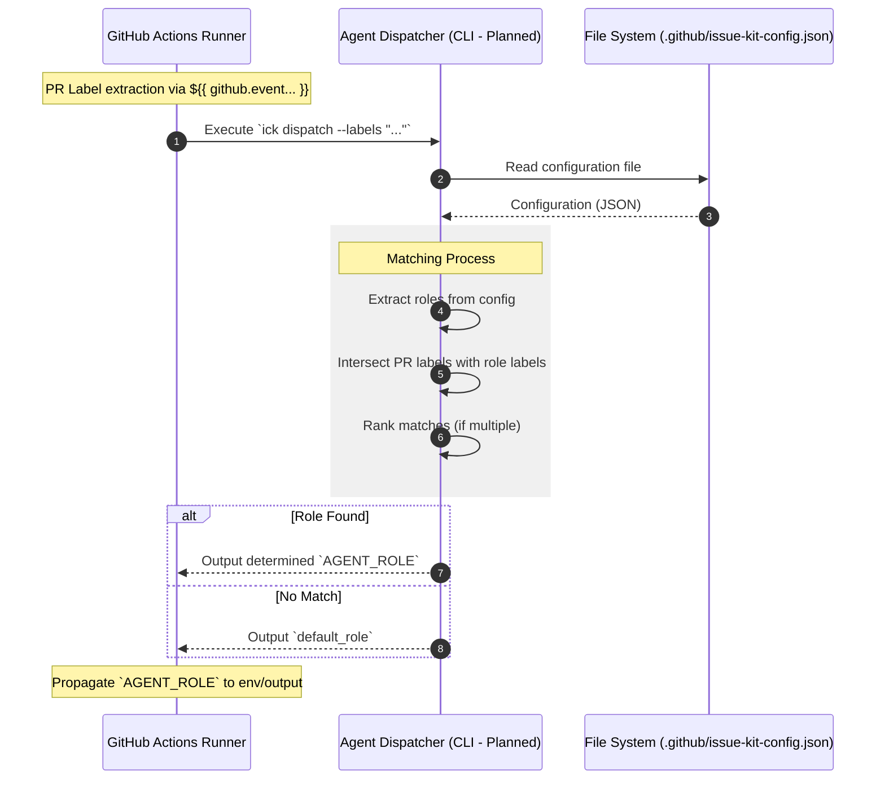

# Dynamic Dispatch Behavior

## Scenario Overview

GitHub Actions ワークフロー実行時に、外部設定ファイル (`issue-kit-config.json`) と PR のラベル情報を照合し、動的にエージェントロール（`AGENT_ROLE`）を決定・出力するプロセスを定義します。

- **Goal:** ハードコードされた役割判定ロジックを排除し、プロジェクトごとの柔軟な役割割当を実現する。
- **Trigger:** GitHub Actions のワークフロー開始（`pull_request_review` 等）。
- **Type:** `[Sync (Real-time)]` - ワークフロー内のセットアップステップとして実行。

## Logic Structure: `issue-kit-config.json`

エージェントロールとトリガーラベルのマッピング、およびワークフローの挙動を制御する設定。

```json
{
  "$schema": "https://json-schema.org/draft/2020-12/schema",
  "title": "Issue Kit Config",
  "type": "object",
  "properties": {
    "roles": {
      "type": "array",
      "description": "Ordered list of role to label mappings. First match wins.",
      "items": {
        "type": "object",
        "properties": {
          "name": { "type": "string", "description": "Agent role name." },
          "labels": {
            "type": "array",
            "items": { "type": "string" },
            "description": "Labels that trigger this role."
          }
        },
        "required": ["name", "labels"]
      }
    },
    "triggers": {
      "type": "object",
      "description": "Event-based label triggers.",
      "additionalProperties": {
        "type": "array",
        "items": { "type": "string" }
      }
    },
    "default_role": {
      "type": "string",
      "description": "Fallback role if no labels match.",
      "default": "SYSTEM_ARCHITECT"
    }
  },
  "required": ["roles"]
}
```

### Example Config

```json
{
  "roles": [
    { "name": "SYSTEM_ARCHITECT", "labels": ["arch", "gemini:arch"] },
    { "name": "TECHNICAL_DESIGNER", "labels": ["spec", "gemini:spec"] }
  ],
  "triggers": {
    "issue_closed": ["completed"],
    "label_added": ["gemini"]
  },
  "default_role": "SYSTEM_ARCHITECT"
}
```

## Contracts (Pre/Post)

- **Pre-conditions (前提):**
  - `.github/issue-kit-config.json` がリポジトリ内に存在すること（またはデフォルトパスが指定されていること）。
  - PR に 1 つ以上のラベルが付与されていること（またはデフォルトロールが定義されていること）。
- **Post-conditions (保証):**
  - 単一の有効な `AGENT_ROLE` が決定され、後続のステップで環境変数として利用可能であること。

## Related Structures

- **Agent Dispatcher (Planned: ADR-014)** (see `src/issue_creator_kit/cli.py`)
- **Reusable Workflow (Planned: ADR-014)** (see `.github/workflows/gemini-reviewer.yml`)

## Diagram (Sequence)



## Reliability & Failure Handling

- **Consistency Model:** `[Deterministic]` - 判定はステートレスかつ冪等に行われ、同一入力に対しては常に同一のロールを返す。
- **Failure Scenarios:**
  - _Config Missing:_ 設定ファイル (`.github/issue-kit-config.json`) が存在しない場合、**Exit Code 1** で異常終了する。エラーメッセージとして「Error: Configuration file not found at .github/issue-kit-config.json. Please see ADR-014 for setup.」を出力し、後続のステップ実行を阻止する。
  - _Syntax Error in JSON:_ パース失敗時は異常終了（Exit Code 1）する Fail-fast ポリシーを採用する。
  - _Ambiguous Labels:_ 複数のロールに合致するラベルがある場合、設定ファイルの `roles` 配列（Array）の定義順に従い、最初に見つかったマッチを採用する（先勝ち）。

## Role Propagation Path

決定された `AGENT_ROLE` は、以下の経路で伝搬されます。

1. **Dispatcher Output:** CLI が標準出力（または GitHub Actions の `$GITHUB_OUTPUT`）にロール名を書き出す。
2. **Workflow Env:** ワークフローの `jobs.<id>.env` または後続ステップの `env` セクションにキャプチャされる。
3. **Execution Context:** `gemini_review_analyzer.sh` 等のスクリプト実行時に環境変数 `AGENT_ROLE` として参照される。
