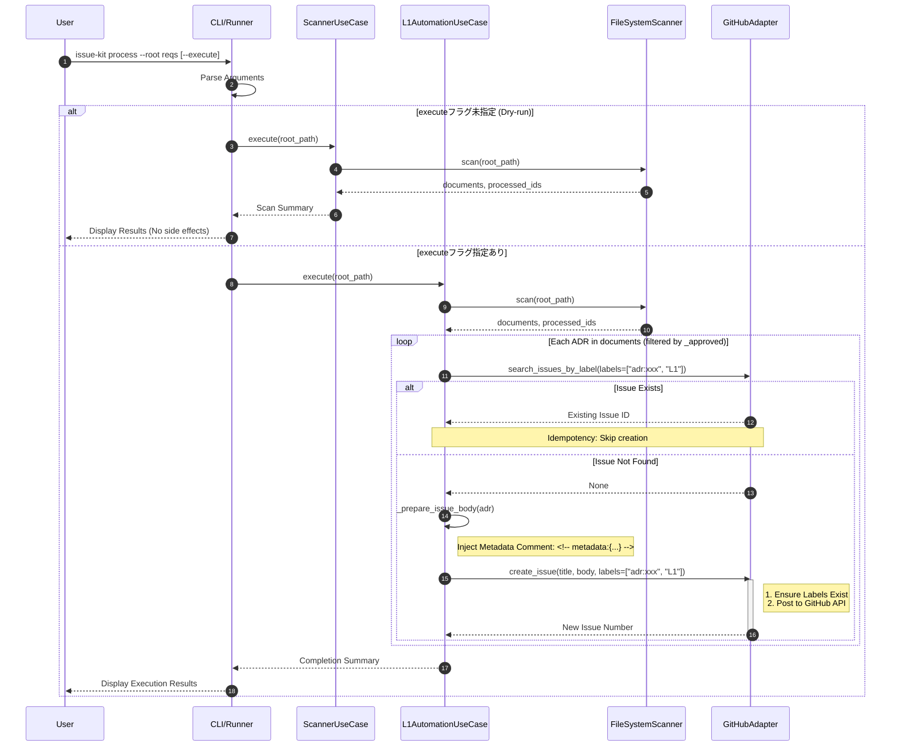

# L1 Automation Flow Sequence

## Scenario Overview

- **Goal:** マージされたADR（設計決定）に対して、GitHub L1 Issueを重複なく自動起票し、接着剤ラベル（Glue Labels）による紐付けを完了する。
- **Trigger:** CLI コマンド実行（`process` コマンド等）によるバッチ処理。
- **Type:** `[Batch]`

## Contracts (Pre/Post)

- **Pre-conditions (前提):**
  - ADRファイルが `reqs/design/_approved/` に配置されている。
  - GitHub アクセストークンおよび対象リポジトリ（環境変数 `GITHUB_REPOSITORY` または引数で指定する `repo`）が設定されている。
- **Post-conditions (保証):**
  - 未起票のADRに対してのみ、L1 Issueが1件作成される。
  - 作成されたIssueには `adr:xxx` および `L1` ラベルが付与されている。
  - Issue本文には、後続タスクとの紐付けに必要なメタデータ（ADR ID等）が非表示コメントとして埋め込まれている。

## Related Structures

- `L1AutomationUseCase` (see `src/issue_creator_kit/usecase/l1_automation_usecase.py`)
- `GitHubAdapter` (see `src/issue_creator_kit/infrastructure/github_adapter.py`)
- `FileSystemScanner` (see `src/issue_creator_kit/domain/services/scanner.py`)

## Diagram (Sequence)

## Reliability & Failure Handling

- **Consistency Model:** `[Eventual Consistency]`
  - GitHub Issueの作成とラベル付与は、検索ベースの冪等性チェックにより整合性を保つ。
- **Failure Scenarios:**
  - _Network Timeout:_ GitHub API 呼び出し失敗時は、UseCase層で例外をキャッチし、リトライまたはエラーログを出力する。
  - _Label Creation Error:_ 権限不足等でラベル作成に失敗した場合は、Issue起票自体を中断し、管理者に通知する。
  - _Search Lag (Eventual Consistency):_ GitHub Search APIの反映遅延により、直前に作成したIssueが検索結果に含まれない可能性がある。これを防ぐため、`L1AutomationUseCase` は同一プロセス内で作成した ADR ID をインメモリキャッシュに保持し、二重起票を防止する。
  - _Pagination Risk:_ ラベル検索が多数ヒットする場合、ページネーションにより一部の既知のIssueを見落とすリスクがある。`GitHubAdapter` はページループ処理を行い、最新の全件を確実に走査するか、十分な件数（Top 100等）を取得して一貫性を担保する。
