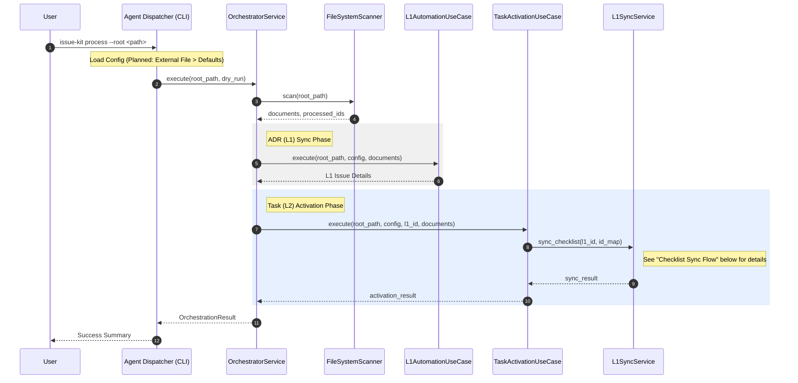
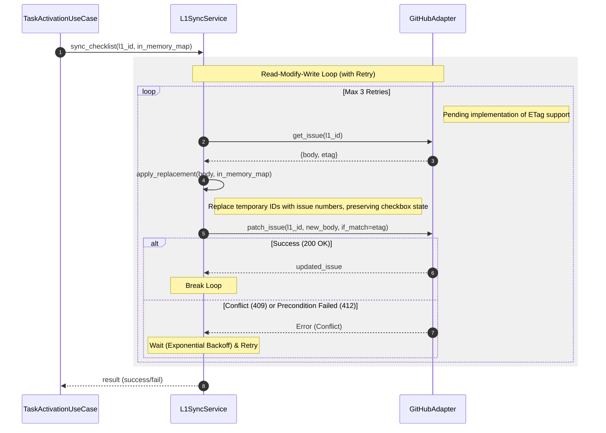

# Orchestrator Flow (Orchestration & L1 Sync)

## Scenario Overview

- **Goal:** ADR-014に基づき、外部プロジェクトからの再利用を可能にするため、任意ディレクトリの走査（将来的にカスタム設定の読み込み）を行い、ドキュメントの同期とタスク起票を統括する。
- **Trigger:** CLI コマンド実行 (`issue-kit process --root <path>`)
- **Type:** `[Batch]`

## Contracts (Pre/Post)

- **Pre-conditions (前提):**
  - 処理対象の `root` ディレクトリが存在し、ADR/Taskファイルが配置されている。
- **Post-conditions (保証):**
  - 指定された `root` 配下の未起票ドキュメントがすべてGitHub Issueとして起票される。
  - L1 Issue のチェックリストが最新の Issue 番号で更新される。

## Related Structures

- `OrchestratorService` (see `src/issue_creator_kit/usecase/orchestrator_service.py`)
- `Agent Dispatcher (Planned: ADR-014)`
- `L1AutomationUseCase` / `TaskActivationUseCase`
- `L1SyncService` (Checklist Sync logic)

## Overall Orchestration Flow



---

## Checklist Sync Flow (Read-Modify-Write)

### Scenario Overview (Sub-flow)

- **Goal:** 親Issue (L1) の本文内にある一時IDチェックリストを、起票された実Issue番号へ一括更新し、進捗状況をGitHub上で可視化する。
- **Trigger:** `TaskActivationUseCase` における全タスクの起票完了。
- **Type:** `Batch (Update)`

### Diagram (Sequence)



## Reliability & Failure Handling

- **Consistency Model:** `Eventual Consistency`. L1の更新は、タスク起票そのものの成功とは独立しており、失敗しても次回実行時にリトライ可能。
- **Failure Scenarios:**
  - **Conflict (409/412):** 他のユーザーやボットが同時にL1を編集した場合に発生。ETagを用いた楽観的ロックにより、データの消失（Lost Update）を防ぐ。失敗時は最新の `body` を再取得してリトライする。
  - **Regex Mismatch:** `task-ID` の前後に予期せぬ文字がある場合、置換がスキップされる可能性がある。そのため、正規表現は `r"- \[\s*\]\s+"` (チェックリスト構文) をプレフィックスとして厳密にマッチングさせる。
  - **API Rate Limit:** 多数のタスクがある場合でも、更新は1回の `PATCH` で一括して行うため、API消費は最小限に抑えられる。

## Replacement Logic Details

Pythonコード片レベルでの置換ロジック案（**冪等性を考慮**）：

```python
import re
from typing import Dict

# in_memory_map: 一時ID ('task-010-01' など) -> 実Issue番号 (int, 例: 123)
def replace_body(body: str, in_memory_map: Dict[str, int]) -> str:
    if not in_memory_map:
        return body

    # 1. 部分的なマッチを避けるため、IDを長さの降順でソート
    sorted_ids = sorted(in_memory_map.keys(), key=len, reverse=True)

    # 2. 置換パターンの構築
    # 既に '#123' 形式に置換されているものはマッチさせない (Negative Lookahead は使わず、
    # プレフィックスとしてチェックリスト構文を厳密にマッチさせる)
    pattern = r"(- \[[ x]\]\s+)(" + "|".join(re.escape(tid) for tid in sorted_ids) + ")"

    def repl(match):
        prefix = match.group(1)  # '- [ ] ' or '- [x] '
        temp_id = match.group(2)
        issue_no = in_memory_map[temp_id]

        # 既に置換済みかどうかの簡易チェック（行全体のコンテキストを確認する場合）
        # ただし re.sub 内では prefix が一致している時点で「一時ID」が残っていることを意味する
        return f"{prefix}#{issue_no}"

    # 3. 単一の正規表現で一括置換
    # すでに '#[0-9]+' になっている箇所は match.group(2) の temp_id に合致しないため、
    # 自然に置換がスキップされ、冪等性が保たれる。
    new_body = re.sub(pattern, repl, body)
    return new_body
```
