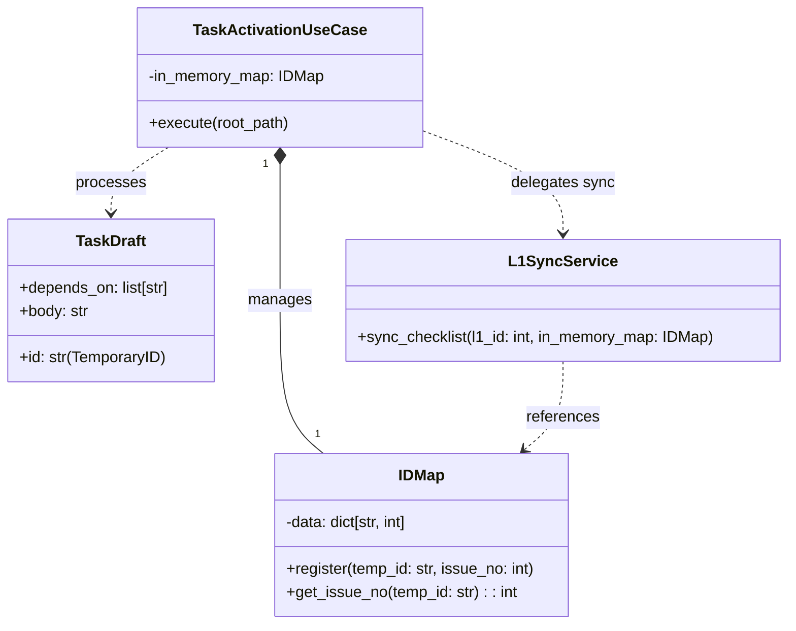

# ID Propagation Model

## Context

- **Bounded Context:** Task Activation
- **System Purpose:** ドラフトファイル（一時ID）とGitHub Issue（実番号）の対応関係をメモリ内で管理し、ローカルファイルを変更することなく依存関係の解決とL1同期を実現する。

## Diagram (Component Structure)



## ID Lifecycle (State)

```mermaid
stateDiagram-v2
    [*] --> Temporary : File System Scan
    note right of Temporary : ID: task-010-01 (In Markdown)

    Temporary --> Resolved : Issue Creation Success
    note right of Resolved : ID: #123 (In Memory Map)

    Resolved --> Persisted : Archive & Rename
    note right of Persisted : File: task-010-01-123.md (Physical Fixation)

    Persisted --> [*]
```

## Element Definitions (SSOT)

### IDMap

- **Type:** `Component`
- **Code Mapping:** `src/issue_creator_kit/usecase/task_activation_usecase.py` (as an internal attribute)
- **Role (Domain-Centric):** 一時IDと実番号の「翻訳辞書」として機能し、実行コンテキスト内での一貫性を保証する。
- **Layer (Clean Arch):** `Use Cases`
- **Dependencies:**
  - **Upstream:** `TaskActivationUseCase`
  - **Downstream:** `L1SyncService`
- **Data Reliability:** `In-Memory`. 実行終了とともに破棄されるが、その前に物理的なリネーム（Physical Fixation）が行われることで、永続的な証跡が残る。
- **Trade-off:** データベース等にマッピングを保存しないことで、システム構成をシンプルに保つ。一方で、途中でプロセスがクラッシュした場合は、アーカイブ状況（ファイル名）を再走査してマップを再構築する必要がある。

### TaskID (Regex & Mapping Scope)

- **Type:** `Value Object`
- **Code Mapping:** `src/issue_creator_kit/domain/models/document.py`
- **Role (Domain-Centric):** タスクを一意に識別する文字列。
- **Constraint (Domain / SSOT):**
  - `TaskID` はローカルドメイン型として `^task-\d{3}-\d{2,}$` のみを許容する（`depends_on: list[TaskID]` もこの制約に従う）。
- **Constraint (GitHub Rendering):**
  - GitHub 上では IssueNo を `^#\d+$` の形式でレンダリングするが、これは `TaskID` 型ではなく、`IDMap` で管理される実番号 (`IssueNo`) を表現するための表示専用フォーマットである。
  - したがって、`#123` はローカルのドメイン型 `TaskID` には含めず、GitHub 送信時のレンダリング専用表現としてのみ扱う。
- **Design Note:**
  - 将来的に `TaskID` 自体で `#\d+` を許容する設計変更を行う場合は、SSOT（`document.py` の型定義および正規表現。アンカーを含む）と `depends_on` の型定義をあわせて変更すること。

## Invariants (不変条件)

- 同一の `TemporaryID` に対して、複数の `IssueNo` が紐付いてはならない（1対1のマッピング）。
- アーカイブ後のファイル名に含まれる `IssueNo` は、`IDMap` に登録されていた値と厳密に一致しなければならない。
