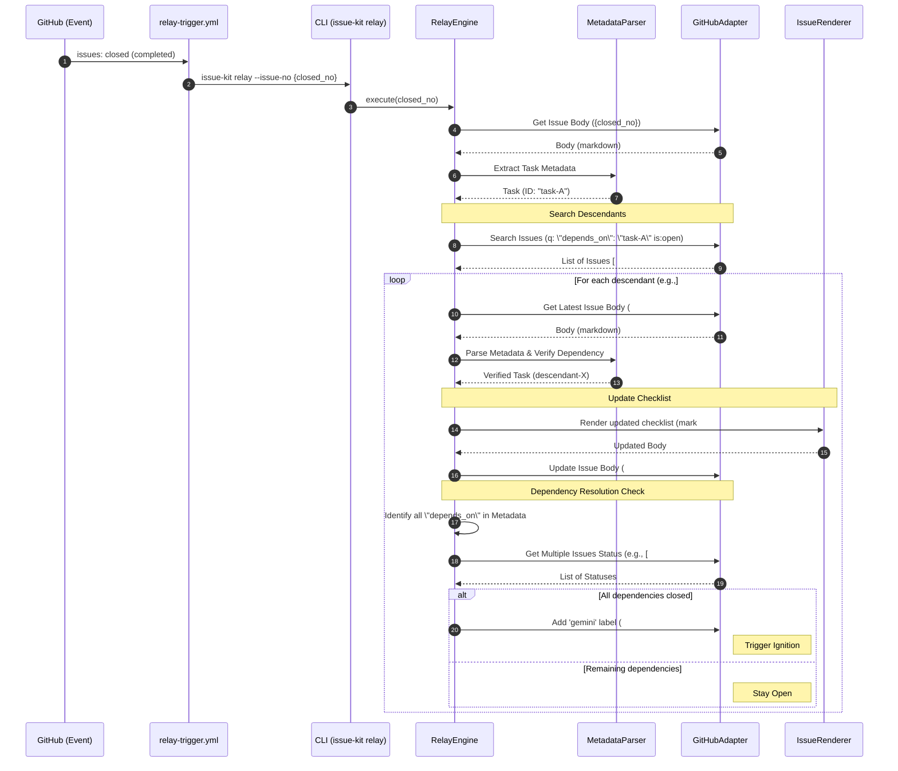

# Relay Sequence

## Scenario Overview

GitHub Actions と CLI の協調により、先行タスクの完了から後続タスクの自動起動（Ignition）をステートレスに実現する。

- **Goal:** 人間の介入なしに、依存関係に基づいたタスクの連鎖実行を完遂する。
- **Trigger:** GitHub Issue `closed` イベント (Status: `completed`)。
- **Type:** `Async (Background / Event-driven)`

## Contracts (Pre/Post)

- **Pre-conditions (前提):**
  - 完了した Issue には有効なメタデータ (`id`) が含まれている。
  - 後続候補となる Issue が GitHub 上で `open` 状態であり、メタデータの `depends_on` に先行タスクの ID が含まれている。
- **Post-conditions (保証):**
  - 該当するすべての後続 Issue の本文内チェックリストが `[x] #IssueNo` (先行タスク) に更新されている。
  - すべての依存が解消された後続 Issue に `gemini` ラベルが付与されている。

## Related Structures

- `RelayEngine` (see `docs/architecture/structure-relay.md`)
- `MetadataParser` (see `docs/architecture/structure-relay.md`)
- `IssueRenderer` (see `docs/architecture/structure-renderer.md`)
- `GitHubAdapter` (see `docs/architecture/interface-cli.md`)

## Diagram (Sequence)

## Reliability & Failure Handling

- **Consistency Model:** `Eventual Consistency`
  - GitHub の検索インデックス反映にはラグがあるため、`Sync-Relay` コマンドによる一括同期で最終的な整合性を担保する。
- **Failure Scenarios:**
  - **Network / API Timeout:** GitHub API 呼び出し失敗時は指数バックオフ (Exponential Backoff) を用いて最大 3 回リトライする。
  - **Rate Limit:** Search API のレート制限に達した場合は、`X-RateLimit-Reset` ヘッダーに基づき待機、または処理を中断して `Sync-Relay` に委ねる。
  - **Search Latency (Zero Hits):** 検索結果が 0 件の場合、後続なしと判断して正常終了する（インデックス遅延でヒットしない場合は、`Sync-Relay` または手動起動で救済）。
  - **Verification Failure:** 検索でヒットした Issue のメタデータが壊れている、または対象 ID を含んでいない（偽陽性）場合は、その Issue の処理をスキップし警告をログ出力する。
  - **Issue Locked:** 対象 Issue がロックされている場合は、本文更新をスキップし、ログに記録する。
