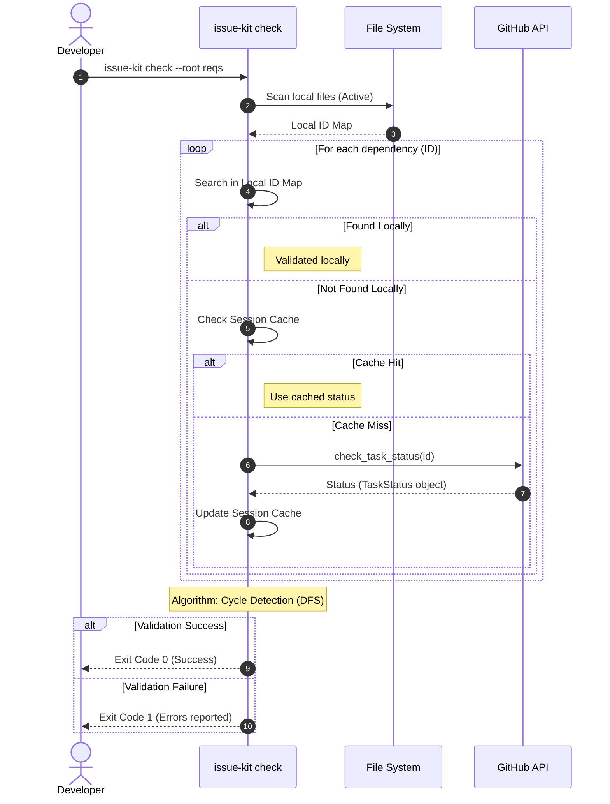

# Validation Flow with Hybrid Dependency Check

## Scenario Overview

このドキュメントは、タスクの循環参照や ID 不整合を起票前に 100% 阻止するための、Static Guardrail（静的ガードレール）の実行プロセスと検証アルゴリズムを定義します。物理アーカイブ削除後も整合性を維持するため、ローカルファイルと GitHub API を組み合わせたハイブリッド検証を行います。

- **Goal:** 不正な依存関係（循環参照、存在しない ID への依存、ID 命名規則違反）を含むタスク案が GitHub に起票されるのを未然に防ぐ。
- **Trigger:** 開発者による `git commit`（Pre-commit フック）または CI パイプラインでのプルリクエスト作成。
- **Type:** `Hybrid (Local Analysis + Remote Lookup)`

## Contracts (Pre/Post)

- **Pre-conditions (前提):**
  - 検証対象のタスクファイル（Markdown）が `reqs/tasks/` または `reqs/design/` 配下に存在している。
  - フロントマターに `id`, `parent`, `depends_on` 等のメタデータが記述されている。
  - GitHub API アクセス用のトークンが設定されている（リモート検証が必要な場合）。
- **Post-conditions (保証):**
  - バリデーションにパスした場合、そのタスク群は有向非巡回グラフ (DAG) であることが保証される。
  - すべての `depends_on` に指定された ID は、以下のいずれかに該当することが保証される。
    - ローカルのスキャン対象内に実在する。
    - GitHub 上に実在し、かつ `closed` 状態である（アーカイブ済みとみなす）。
  - ファイル名とフロントマターの `id` が完全に一致している。

## Related Structures

- `TaskGraphValidator` (see `src/issue_creator_kit/usecase/validator.py`)
- `FileSystemScanner` (see `src/issue_creator_kit/domain/services/scanner.py`)
- `IGitHubAdapter` (see `src/issue_creator_kit/domain/interfaces.py`)
- `GraphBuilder` (see `src/issue_creator_kit/domain/services/builder.py`)

## Diagram (Hybrid Validation Workflow)



## Algorithm: Hybrid Consistency Check

### 1. 識別子の収集 (Collection)

- `FileSystemScanner` を用いてローカルファイルを走査し、`Local ID Map` を構築する。
- 走査対象には `reqs/tasks/`, `reqs/design/` を含む（`_archive` は物理削除されているため対象外）。

### 2. 依存関係の解決 (Dependency Resolution)

各ドキュメントの `depends_on`（および `parent`）に指定された ID に対し、以下の優先順位で実在確認を行う。

1. **Local Search**: `Local ID Map` に存在するか確認。
2. **Session Cache**: メモリ内のキャッシュ（同一実行セッション内）に存在するか確認。
3. **Remote Fallback**: GitHub API を用いて検索を実行。
   - **Primary Query**: `"\"id\": \"task-A\""` `in:body` `repo:{owner}/{repo}` `is:issue`（メタデータ形式）で検索。
   - **Fallback Query**: `task-A` `in:body` `repo:{owner}/{repo}` `is:issue`（単純文字列）で検索。
   - **Verdict**:
     - `closed` 状態の Issue が見つかった場合 -> **Valid (Archived)** と判定。
     - `open` 状態の Issue のみが見つかった場合 -> **Invalid (Premature)** と判定。
     - 見つからない場合 -> **Error (Orphan)** と判定。

### 3. 閉路検知 (Cycle Detection)

- 全ての依存関係が解決された後、DFS アルゴリズムを用いてグラフ全体の循環参照をチェックする。
- リモートで `closed` と判定された ID は「終端ノード（依存先がない、または解決済み）」として扱う。

## Interface Extension: IGitHubAdapter

ハイブリッド検証を支えるため、`IGitHubAdapter` に以下のメソッドを定義する。

```python
from abc import ABC, abstractmethod
from dataclasses import dataclass
from typing import Optional, Literal, Dict, Any

TaskLifecycleState = Literal["open", "closed", "not_found"]

@dataclass
class TaskStatus:
    """
    タスク ID に対応する GitHub Issue の状態およびメタデータ。

    Attributes:
        task_id: 照会対象の論理タスク ID (e.g., 'task-013-01')
        state: 'open', 'closed', または 'not_found'
        issue_number: 対応する GitHub Issue の番号（見つからない場合は None）
        updated_at: Issue の最終更新日時（ISO8601 文字列想定）
        source: 検索戦略の種別（'primary', 'fallback', 'cache' など）
        raw: 必要に応じて保持する GitHub API の生レスポンス
    """
    task_id: str
    state: TaskLifecycleState
    issue_number: Optional[int]
    updated_at: Optional[str]
    source: str
    raw: Optional[Dict[str, Any]] = None

class IGitHubAdapter(ABC):
    @abstractmethod
    def check_task_status(self, task_id: str) -> TaskStatus:
        """
        Task ID に基づいて GitHub 上の Issue 状態を確認する高レベル API。

        Args:
            task_id: 検証対象の論理タスク ID (e.g., 'task-013-01')

        Returns:
            TaskStatus オブジェクト
        """
        pass
```

## Reliability & Failure Handling

- **Consistency Model:** ACID (Validation is atomic per command execution)
- **Failure Scenarios:**
  - _Network Timeout / API Error:_ GitHub API への接続に失敗した場合、安全側に倒すため「検証失敗（Unknown Status）」として扱う。ただし、環境変数等でリモート検証をスキップするオプションを提供することも検討する。
  - _Rate Limit:_ 大規模なリポジトリで多くの ID を検証する場合、GitHub API のレート制限に達する可能性がある。セッションキャッシュの活用により API 呼び出し回数を最小化する。
  - _Offline Mode:_ API トークンが設定されていない場合、リモート検証ステップをスキップし、ローカルにない ID はすべて `ORPHAN` として扱う（従来の挙動を維持）。
  - _Performance Issue:_ ネットワーク通信はローカル走査に比べて低速なため、並列実行や効率的なキャッシュ戦略が重要となる。
