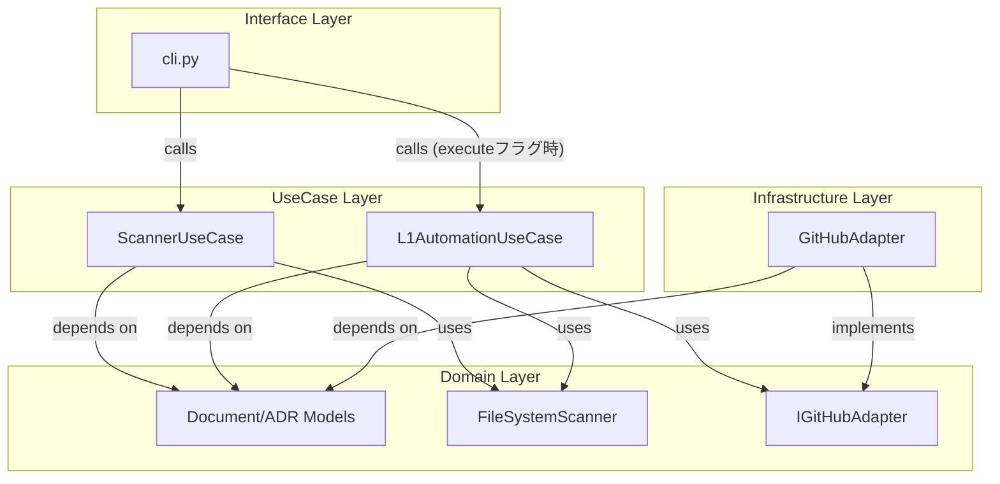

# Integrate L1 Automation into CLI Structure

## Context

- **Bounded Context:** Interface (CLI) Layer
- **System Purpose:** ADR-008（ファイルベースのスキャン）の結果に基づき、ADR-009（L1 Issueの自動起票）をユーザーの明示的な指示（フラグ）によって安全に実行する。

## Diagram (Component)

## Element Definitions (SSOT)

### CLI (Process Command)

- **Type:** `Component`
- **Code Mapping:** `src/issue_creator_kit/cli.py`
- **Role (Domain-Centric):** ユーザーからの「プロセス実行」指示を受け付け、スキャン結果の表示と、必要に応じた自動起票処理のトリガーを行う。
- **Layer (Clean Arch):** `Interface`
- **Dependencies:**
  - **Upstream:** End User (CLI)
  - **Downstream:** `ScannerUseCase`, `L1AutomationUseCase`
- **Tech Stack:** Python, argparse
- **Data Reliability:** 同期的実行。副作用を伴う実行には明示的なフラグを必須とし、誤操作を防ぐ。
- **Trade-off:** 既存の `process` コマンドに機能を統合することで、UXのシンプルさを維持。一方で、フラグ管理が複雑になるリスクがある。

### L1AutomationUseCase

- **Type:** `Component`
- **Code Mapping:** `src/issue_creator_kit/usecase/l1_automation_usecase.py`
- **Role (Domain-Centric):** 未起票の承認済みADRを特定し、GitHubへのIssue起票（および紐付け）をオーケストレートする。
- **Layer (Clean Arch):** `Use Case`
- **Dependencies:**
  - **Upstream:** `CLI`
  - **Downstream:** `FileSystemScanner`, `IGitHubAdapter` (Domain Interface)
- **Tech Stack:** Python
- **Data Reliability:** 検索ベースの冪等性チェックにより、二重起票を防止。
- **Trade-off:** GitHub APIとの連携が必要なため、ネットワーク遅延やレート制限の影響を受ける可能性がある。

### GitHubAdapter

- **Type:** `Adapter`
- **Code Mapping:** `src/issue_creator_kit/infrastructure/github_adapter.py`
- **Role (Domain-Centric):** `IGitHubAdapter` インターフェースを実装し、GitHub API との通信を担当する。
- **Layer (Clean Arch):** `Infrastructure`
- **Dependencies:**
  - **Upstream:** `IGitHubAdapter` (Implementation)
  - **Downstream:** GitHub API
- **Tech Stack:** Python, requests
- **Data Reliability:** APIエラー（レート制限等）の適切なハンドリングと例外送出。
- **Trade-off:** GitHub APIとの連携が必要なため、ネットワーク遅延やレート制限の影響を受ける可能性がある。
