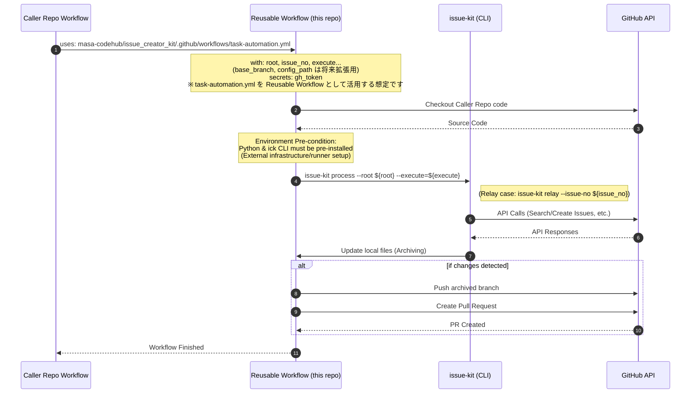

# Reusable Workflow Interface Structure

## Context

このドキュメントは、`issue-creator-kit` が提供する GitHub Actions 再利用可能ワークフロー（Reusable Workflows）のインターフェースを定義します。

- **Bounded Context**: CI/CD Automation & Task Management
- **System Purpose**: 他のリポジトリから `uses:` 指定で `issue-creator-kit` の機能を呼び出せるようにし、自動化ロジックの再利用性とメンテナンス性を向上させる。

## Interface Definitions (SSOT)

外部から呼び出されるワークフローの `on: workflow_call` インターフェースを定義します。

### Inputs

| Parameter     | Type    | Required | Default                         | Description                                                                       |
| :------------ | :------ | :------- | :------------------------------ | :-------------------------------------------------------------------------------- |
| `root`        | string  | No       | `reqs`                          | 処理対象のドキュメントルートディレクトリ。                                        |
| `config_path` | string  | No       | `.github/issue-kit-config.json` | 設定ファイルの配置パス。（※注: 現状の CLI では未サポート。将来の拡張用）          |
| `base_branch` | string  | No       | `main`                          | PR 作成時のベースとなるブランチ。（※注: 現状の CLI では未サポート。将来の拡張用） |
| `issue_no`    | number  | No       | N/A                             | (Relay用) 処理対象の Issue 番号。                                                 |
| `execute`     | boolean | No       | `false`                         | `true` の場合、実際に Issue 作成や PR 作成を実行する。                            |

### Secrets

| Secret Name | Required | Description                                                                              |
| :---------- | :------- | :--------------------------------------------------------------------------------------- |
| `gh_token`  | Yes      | GitHub 操作（Git push, PR作成, Issue更新）に使用するトークン。呼び出し側から注入が必要。 |

### Permissions

再利用可能ワークフローは以下の権限を必要とします。呼び出し側の Job または Workflow レベルで設定が必要です。

- `contents: write`: タスクのアーカイブ（git commit/push）のため。
- `issues: write`: Issue の作成、更新、ラベル付与のため。
- `pull-requests: write`: アーカイブ用 PR の作成のため。

## Quality Policy

- **Dry-run First**: `execute` パラメータを `false`（デフォルト）にすることで、破壊的な変更を伴わずに動作確認が可能。
- **Explicit Auth**: 呼び出し側リポジトリの `GITHUB_TOKEN` または `GH_PAT` として明示的に渡すことで、権限の所在を明確にする。
- **Failure Handling**:
  - セットアップ（依存関係インストール）失敗時は、ワークフロー全体を Failure とする。
  - Git 操作（Conflict 等）失敗時は、エラーメッセージを出力して終了し、PR作成をスキップする。

## Interaction Sequence

## Reliability & Failure Handling

- **Consistency Model**: `Eventual Consistency` (GitHub API 経由の変更反映は即時ではない可能性があるため)
- **Failure Scenarios**:
  - **Auth Failure**: `gh_token` の権限が不足している場合、Git push または PR 作成ステップで失敗する。呼び出し側での適切な Secret 設定が必要。
  - **Runner Mismatch**: 再利用可能ワークフロー内で `runs-on: [self-hosted, CI]` が指定されている場合、呼び出し側リポジトリがそのラベルのランナーを持っていないと実行されない。
  - **Environment Not Ready**: Python や `ick` コマンドがパスに通っていない場合、ワークフローは実行時にコマンド未検出エラーで失敗する。
