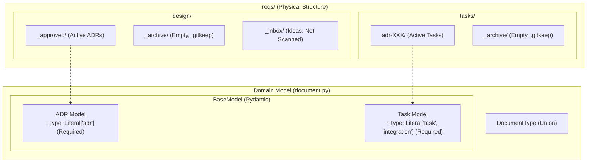

# Architecture Structure: Cleanup & Enforcement

## Context

- **Objective**: ADR-013 に基づくリポジトリの物理クリーンアップとドメインモデルの厳格化。
- **Scope**: `Document` モデルの再定義、`_archive` ディレクトリの空洞化、および現役ドキュメントのメタデータ標準化。

## Diagram (Structural Change)

## Element Definitions

### Document Model Enforcement

- **ADR Model**:
  - `type` フィールドを必須 (`Literal["adr"]`) として追加。
  - **デフォルト値を設定せず**、フロントマターにおける明示的な指定を必須とする（Pydantic のバリデーションによる強制）。
  - 従来の `@property` による推論を廃止し、フロントマターからの入力を必須とする。
- **Task Model**:
  - `type` フィールドを必須 (`Literal["task", "integration"]`) として追加。
  - **デフォルト値を設定せず**、フロントマターにおける明示的な指定を必須とする（Pydantic のバリデーションによる強制）。
  - `integration` 型は、複数のタスクを統合する「まとめ役」として明示的に区別する。

### Physical State Management (Pure Active Git)

- **Archive Policy**:
  - 完了済みのドキュメントは Git 上に保持せず、GitHub Issues を SSOT とする。
  - `_archive/` ディレクトリは構造維持のために **`.gitkeep` を配置し、コミットに含める**。
- **Scanning Logic**:
  - スキャナーは `_approved/` および `adr-XXX/` 配下のファイルを常に「処理すべきアクティブなもの」として扱う。
  - `_inbox/` 配下のファイルはスキャン対象外とする。

## Quality Policy

### Metadata Standardization

- **Mandatory Types**: 全ての Markdown ファイルは `type` フィールドをフロントマターに持たなければならない。
- **Fail-Fast Validation**: `issue-kit check` は `type` が欠落している、あるいは定義外の値を検知した場合、即座にエラーを報告する。

### Data Integrity

- **Discriminator**: Pydantic の Union 判別において、`type` フィールドを Discriminator として使用することを検討し、パースの正確性と速度を向上させる。
