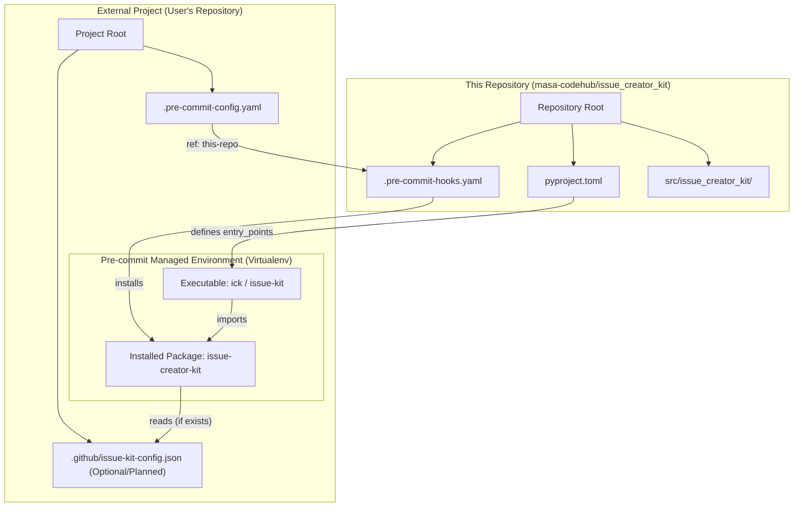
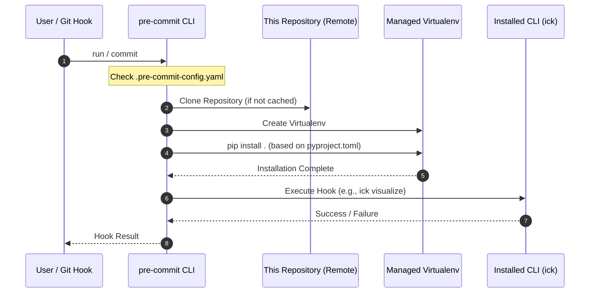

# Distribution Structure Design

## Context

- **Bounded Context:** Packaging & Distribution
- **System Purpose:** 本ツール（Issue Creator Kit）を外部プロジェクトから pre-commit プラグインまたは Python パッケージとして容易に利用可能にするための配布構造を定義する。

## Diagram (Distribution & Installation Mapping)



## Element Definitions (SSOT)

### Distributed Hook Definition

- **Type:** Boundary / Interface
- **Code Mapping:** `.pre-commit-hooks.yaml`
- **Role (Domain-Centric):** 外部プロジェクトの pre-commit から呼び出されるためのインターフェース定義。
- **Layer (Clean Arch):** Interface
- **Implementation Example:**
  ```yaml
  - id: ick-visualize
    name: Issue Kit Visualize
    description: Visualize dependencies of issues and ADRs.
    entry: ick visualize
    language: python
    pass_filenames: false
    always_run: true
  - id: ick-sync-relay
    name: Issue Kit Sync Relay
    description: Synchronize issues and transition states (Dry-run).
    entry: ick sync-relay --dry-run
    language: python
    pass_filenames: false
    always_run: true
  ```
- **Components:**
  - **id: ick-visualize**: 依存関係グラフの可視化。
  - **id: ick-sync-relay**: 全 Issue の同期と状態遷移（リレー）のドライラン実行。
- **Tech Stack:** YAML, pre-commit
- **Dependencies:**
  - **Downstream:** `pyproject.toml` (for installation and entry points)

### Package Entry Point

- **Type:** Component
- **Code Mapping:** `pyproject.toml` (`[project.scripts]`)
- **Role (Domain-Centric):** インストール後にユーザーが実行するコマンド（`ick`, `issue-kit`）の定義。
- **Layer (Clean Arch):** Interface (CLI Entrypoint)
- **Tech Stack:** Setuptools / build-backend
- **Dependencies:**
  - **Downstream:** `src/issue_creator_kit/cli.py`

### External Configuration

- **Type:** Boundary / Data
- **Code Mapping:** `.github/issue-kit-config.json`
- **Role (Domain-Centric):** プロジェクト固有のロールマッピングやトリガー定義。
- **Layer (Clean Arch):** Infrastructure (Config)
- **Status:** **Planned (ADR-014)**. 導入後は本ツールが動作するための必須前提条件 (Fail-fast) となる。
- **Data Reliability:** Strong Consistency.

---

# Environment Construction Sequence

## Scenario Overview

- **Goal:** pre-commit 導入時に、依存関係が解決された実行環境が自動的に構築されること。
- **Trigger:** 外部プロジェクトでの `pre-commit install` または `pre-commit run` の初回実行。
- **Type:** Sync (Environment Setup)

## Diagram (Sequence)



## Reliability & Failure Handling

- **Consistency Model:** Strong (Installation must succeed).
- **Failure Scenarios:**
  - _Dependency Conflict:_ `pip install` 失敗時は hook 実行が中断される。`pyproject.toml` での依存関係指定を最小限に抑えることでリスクを軽減する。
  - _Python Version Mismatch:_ `requires-python` 指定により、条件を満たさない環境ではエラーとなる。
