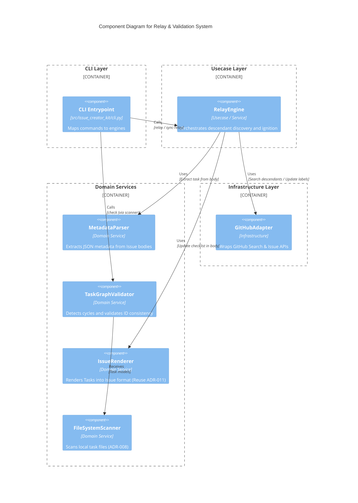
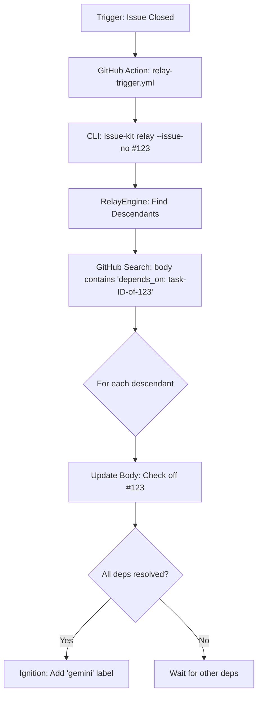

# Relay & Validator Structure

## Context

- **Bounded Context:** Issue Lifecycle & Autonomous Relay
- **System Purpose:** エージェントが人間の介入なしにタスクをリレーし、かつ依存関係の循環を未然に防ぐことで、自律的な開発サイクルの速度と安全性を最大化する。

## Diagram (C4 Component & Relay Flow)

### Component Diagram: Relay & Validation System

### Autonomous Relay Flow (Sequence Concept)

## Element Definitions (SSOT)

### MetadataParser

- **Type:** `Component (Domain Service)`
- **Code Mapping:** `src/issue_creator_kit/domain/services/metadata_parser.py`
- **Role (Domain-Centric):** 非構造な Issue 本文（HTMLコメント）から機械可読なタスク情報を抽出し、`Task` モデルへ再構築する。
- **Layer (Clean Arch):** `Domain Services`
- **Dependencies:**
  - **Upstream:** `RelayEngine`, `TaskActivationUseCase`
  - **Downstream:** `Task` (Model)
- **Tech Stack:** Python 3.12, Regex, JSON
- **Data Reliability:** `IssueRenderer` と同一のメタデータマーカー（`<!-- metadata:... -->`）を使用し、不整合を防ぐ。
- **Trade-off:** `IssueRenderer` にパース機能を持たせる案もあったが、責務の分離（リードとライト）を明確にするため別サービスとした。

### TaskGraphValidator

- **Type:** `Component (Domain Service)`
- **Code Mapping:** `src/issue_creator_kit/domain/services/graph_validator.py`
- **Role (Domain-Centric):** タスク間の依存関係をグラフとして捉え、循環参照（Cycle）や ID の不整合がないことを保証するガードレール。
- **Layer (Clean Arch):** `Domain Services`
- **Dependencies:**
  - **Upstream:** `CLI (check command)`, `Pre-commit Hook`
  - **Downstream:** `Task` (Model)
- **Tech Stack:** Python 3.12 (Graph algorithm: DFS)
- **Data Reliability:** 実装（Implementation）に入る前に、静的なファイル群を対象に検証を行うことで、リモートでの事故を未然に防ぐ。
- **Trade-off:** 実行時（Relay 時）の検証も検討したが、パフォーマンスと「起票前ガード」の原則を優先し、静的検証に特化させた。

### RelayEngine

- **Type:** `Component (Usecase / Service)`
- **Code Mapping:** `src/issue_creator_kit/usecase/relay_engine.py` (Core Logic)
- **Role (Domain-Centric):** 閉じた Issue から後続タスクを特定し、チェックリストの更新と「着火（geminiラベル付与）」を自動で行う司令塔。
- **Layer (Clean Arch):** `Usecase Layer`
- **Dependencies:**
  - **Upstream:** `CLI (relay / sync-relay)`, `GitHub Actions`
  - **Downstream:** `GitHubAdapter`, `MetadataParser`, `IssueRenderer`
- **Tech Stack:** Python 3.12, GitHub Search API
- **Data Reliability:** GitHub Search API のインデックス遅延を考慮し、検索結果のメタデータを `MetadataParser` で再検証してから更新を行う。
- **Trade-off:** ローカルファイルを検索対象に含めないことで、Git の状態に左右されない「現在の GitHub 上の真実」に基づくリレーを実現。

## Quality Policy (Guardrails)

1. **Cycle Detection (DFS)**: 依存関係グラフに対して深さ優先探索を行い、Back-edge が見つかった場合はエラーとして停止する。
2. **Search Robustness**: `depends_on` の検索には、Task ID の完全一致を狙うクエリを使用し、レート制限（Rate Limit）を考慮したリトライロジックを実装する。
3. **Atomic Labeling**: すべての依存が解消されたことの最終判定は、更新対象の Issue メタデータを最新状態で取得・解析した直後に行い、二重起動や着火漏れを防ぐ。
