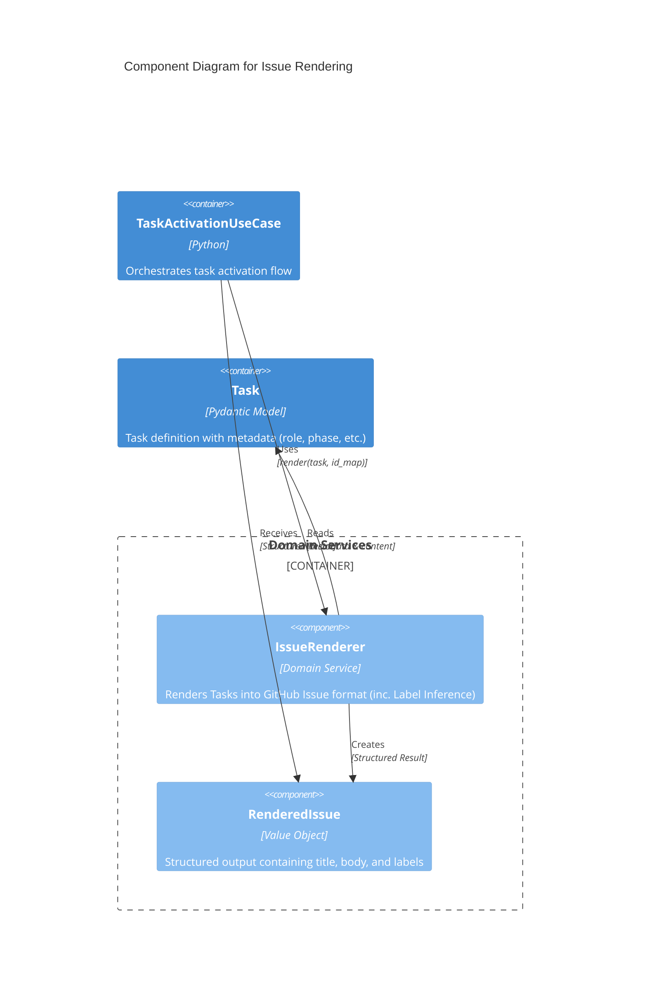
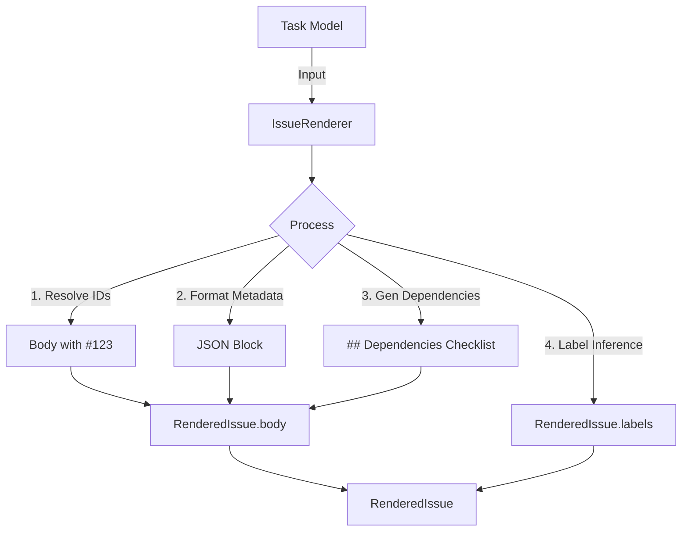

# Issue Renderer Structure & Metadata Schema

## Context

- **Bounded Context:** Issue Lifecycle Management
- **System Purpose:** GitHub Actions が自律的に後続タスクを起動（Autonomous Relay）できるように、機械可読なメタデータを Issue 本文に統合し、レンダリングロジックを独立させる。

## Diagram (C4 Component & Metadata Flow)

### Component Diagram: Issue Rendering Service



### Metadata & Label Synthesis Flow



## Element Definitions (SSOT)

### IssueRenderer

- **Type:** `Component (Domain Service)`
- **Code Mapping:** `src/issue_creator_kit/domain/services/renderer.py`
- **Role (Domain-Centric):** `Task` モデルを GitHub の Issue 形式（タイトル、本文、ラベル）に変換する。ID の解決、メタデータの埋め込み、および **ADR-015 に基づくラベル合成（Inference）** を統制する。
- **Layer (Clean Arch):** `Domain Services`
- **Dependencies:**
  - **Upstream:** `TaskActivationUseCase`
  - **Downstream:** `Task` (Model), `RenderedIssue` (VO)
- **Tech Stack:** Python 3.12, Pydantic
- **Data Reliability:** 冪等な文字列変換および属性抽出。副作用を持たない純粋な関数として振る舞う。
- **Trade-off:** UseCase に直接記述するよりもファイル数は増えるが、レンダリングロジックの単体テストが容易になり、メタデータ形式やラベル推論ルールの変更に対する柔軟性が向上する。

### RenderedIssue

- **Type:** `Component (Value Object)`
- **Code Mapping:** `src/issue_creator_kit/domain/models/renderer.py`
- **Role (Domain-Centric):** レンダリング結果の構造化データ。GitHub API クライアントが必要とする全情報を保持する。
- **Layer (Clean Arch):** `Domain Models`
- **Tech Stack:** Python (Data Class or Pydantic)
- **Fields:**
  - `title`: str (例: "task-011-01: [Arch] ...")
  - `body`: str (Resolved ID + Metadata Block)
  - `labels`: list[str] (Generated based on task type/role/phase via Inference)

## Label Synthesis Rules (Label Inference)

ADR-015 に基づき、`IssueRenderer` は以下のルールに従ってラベルを自動合成する。

1. **属性の直接抽出 (Attribute Mapping):**
   - `type`: 値（例: `task`, `integration`）をそのままラベルとして追加。
   - `role`: 値（例: `arch`, `spec`, `tdd`）が存在する場合、そのままラベルとして追加。
   - `phase`: 値（例: `plan`, `impl`, `audit`）が存在する場合、そのままラベルとして追加。
2. **システムラベル:**
   - `adr:{NNN}`: 親 ADR ID から抽出した 3 桁の番号（例: `adr-015` -> `adr:015`）をラベルとして付与。
3. **重複排除 (Deduplication):**
   - ドキュメントの `labels` フィールドに手動で指定されたラベルがある場合、自動抽出されたラベルと統合し、ユニークなリストを生成する。
4. **ラベルの順序 (Ordering & Sorting):**
   - 実装の解釈によるブレを防ぎ、テストの期待値を固定するため、最終的なラベルリストは以下の優先順位に従って構成する。同一カテゴリ内ではアルファベット順でソートするが、システムラベルカテゴリに限っては固定順（`type` → `adr:{NNN}`）とする。
     1. **システムラベル:** `type` (例: `task`), `adr:{NNN}` (例: `adr:015`)
     2. **属性ラベル:** `role` (例: `arch`), `phase` (例: `plan`)
     3. **手動指定ラベル:** 上記以外
5. **ADR ドキュメントの例外:**
   - ADR ドキュメント（`type: adr`）の場合は、属性抽出を行わず、引き続き `adr` ラベルのみを付与する。

## Task Model Extension (ADR-011/015)

`src/issue_creator_kit/domain/models/document.py` の `Task` モデルに以下のフィールドを定義する。

| Field   | Type      | Description            | Values                      |
| :------ | :-------- | :--------------------- | :-------------------------- |
| `type`  | `Literal` | ドキュメントタイプ     | `task` \| `integration`     |
| `role`  | `Literal` | 担当エージェントの役割 | `arch` \| `spec` \| `tdd`   |
| `phase` | `Literal` | 工程ラベル             | `plan` \| `impl` \| `audit` |

## Metadata Schema Definition

Issue 本文の末尾に埋め込む `<!-- metadata:{...} -->` 形式の JSON オブジェクト定義。

### JSON Schema

| Key          | Type           | Description                                  | Required |
| :----------- | :------------- | :------------------------------------------- | :------- |
| `id`         | `string`       | プロジェクト一意の Task ID                   | Yes      |
| `type`       | `string`       | ドキュメントタイプ (`task` or `integration`) | Yes      |
| `parent`     | `string`       | 親 ADR ID                                    | Yes      |
| `title`      | `string`       | タスクタイトル                               | Yes      |
| `status`     | `string`       | タスクステータス                             | Yes      |
| `role`       | `string`       | 担当ロール: `arch`, `spec`, `tdd` のいずれか | Yes      |
| `phase`      | `string`       | 工程名                                       | Yes      |
| `depends_on` | `list[string]` | 依存先タスク ID リスト                       | Yes      |
| `labels`     | `list[string]` | 追加の静的ラベルリスト                       | No       |
| `issue_id`   | `integer`      | GitHub Issue 番号（未発行時は null）         | No       |

### Implementation Example (Body Content)

```markdown
# Issue Content Title

Actual content here...

## Dependencies

- [ ] #123 (Resolved from task-010-01)
- [ ] #124 (Resolved from task-010-02)

<!-- metadata:{"id": "task-011-01", "type": "task", "parent": "adr-011", "title": "Issue Content Title", "status": "Draft", "role": "arch", "phase": "plan", "depends_on": ["task-010-01", "task-010-02"], "labels": ["P1"], "issue_id": null} -->
```

## Quality Policy (Guardrails)

1. **ID Resolution Strategy:** 部分一致による誤置換を防ぐため、負の前後参照 (`lookaround`) を含む正規表現を使用して、ID の境界を正確に判定し置換を行う。
2. **Metadata Integrity:** JSON メタデータ内の情報は、GitHub API で渡される実データ（Labels 等）と同期していなければならない。
3. **Ignition Strategy (Exclusion):** **起票時（Renderer の処理範囲）においては、`gemini` ラベルをラベルリストに含めてはならない。** 依存関係のないタスクに対する初期着火は、起票後の事後処理（`TaskActivationUseCase` 担当）として行われる。
4. **Invisible Metadata:** メタデータブロックは `<!-- ... -->` で囲み、GitHub のプレビュー上で人間に見えないようにする。
