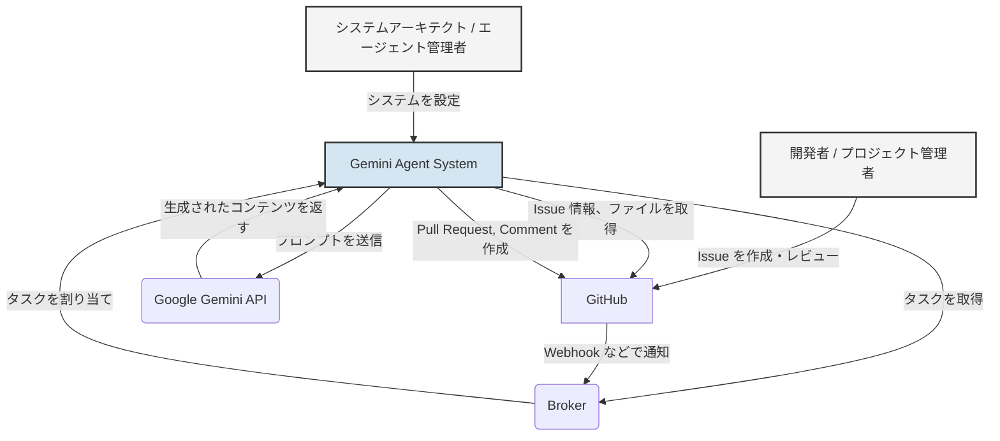

# システムコンテキスト

このドキュメントは、C4モデルのレベル1（システムコンテキスト図）に相当し、このシステムがどのようなもので、誰が利用し、どの外部システムと連携するのかを定義します。

## 1. 概要

このシステムは、GitHub 上の Issue をトリガーとして、Google の大規模言語モデル（Gemini）を活用して自律的にタスクを処理する AI エージェントです。

主な目的は、ソフトウェア開発における定型的なタスク（ドキュメント作成、コード修正、Issue へのコメントなど）を自動化し、開発者の生産性を向上させることです。

## 2. 主要な登場人物（アクター）

| アクター | 説明 |
| :--- | :--- |
| **開発者 / プロジェクト管理者** | GitHub で Issue を作成・管理することで、エージェントにタスクを指示する。エージェントが作成した Pull Request をレビューし、マージする。 |
| **システムアーキテクト / エージェント管理者** | エージェントの役割（ロール）、行動規範、利用可能なツールなどを定義・設定する。システム全体のアーキテクチャを設計・維持する。 |

## 3. 外部システムとの連携（境界）

| 外部システム | 連携内容 |
| :--- | :--- |
| **GitHub** | - タスクの起点となる Issue を管理する。 - エージェントがコードやドキュメントを参照・変更するためのリポジトリを提供する。 - エージェントの成果物（Pull Request, コメント）の提出先となる。 |
| **Broker** | - GitHub からの通知（Webhookなど）を受け取り、タスクをキューイングする。 - 待機しているエージェントにタスクを割り当てる責務を持つ、外部コンポーネント。 |
| **Google Gemini API** | - エージェントからのプロンプトに基づき、自然言語のテキストやコードを生成する。 - システムの核となる AI 機能を提供する。 |