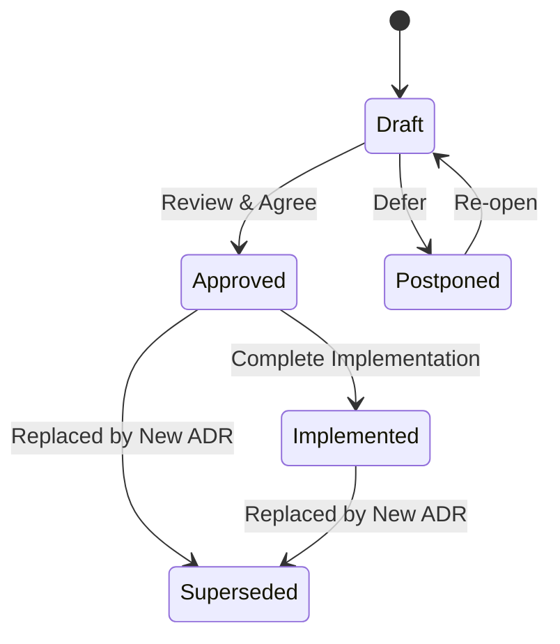
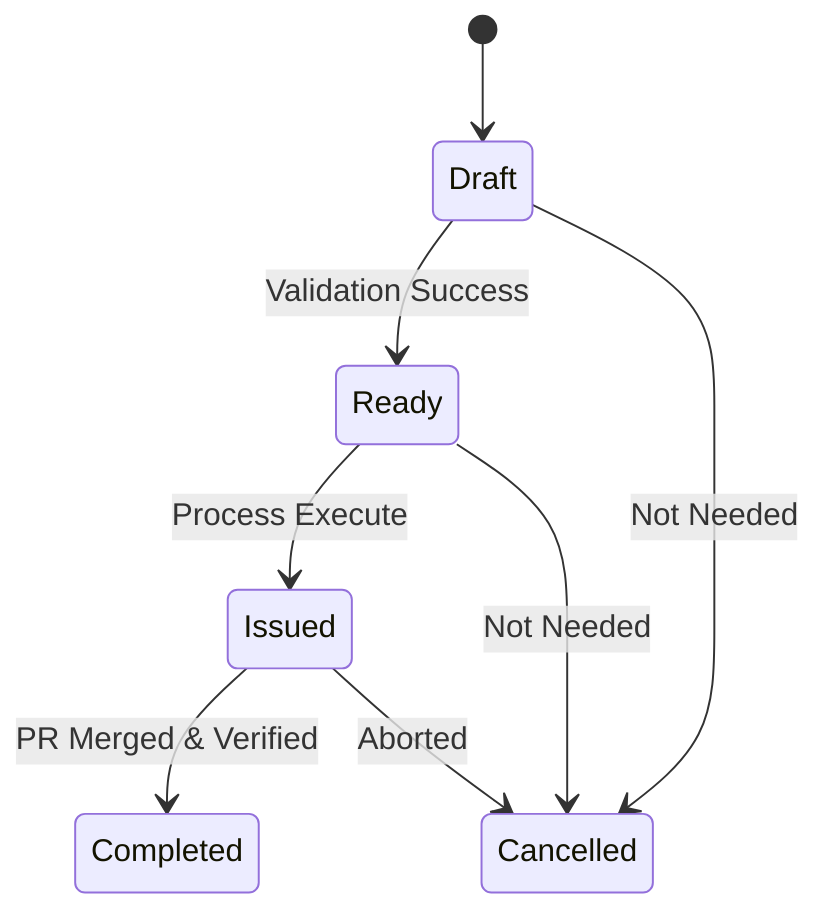

# Project Definitions (SSOT Vocabulary)

> [!IMPORTANT]
> このドキュメントは、プロジェクト全域で使用される語彙とステータスに関する**最優先の SSOT (Single Source of Truth)** です。
> 他の ADR や設計ドキュメントとの間に不整合がある場合、本ドキュメントの定義が優先されます。

このドキュメントは、プロジェクト全域で使用される「語彙」と「ステータス」を定義する Single Source of Truth (SSOT) です。
全ての設計、実装、および自動化スクリプトはこの定義に従わなければなりません。

## 1. Document Types

プロジェクトで管理される主要なドキュメント型。

| Type   | Name                         | Definition                                            |
| :----- | :--------------------------- | :---------------------------------------------------- |
| `adr`  | Architecture Decision Record | 技術的な意思決定とその背景を記録するSSOT。            |
| `task` | Task / Issue Draft           | ADRの実行計画（Plan）から生成される具体的な作業単位。 |

## 2. Status Definitions

各ドキュメントが取り得るライフサイクルステータス。

### 2.1. ADR Status

<!-- guardrail-sync: ADR.status -->

| Status        | Definition                                                  |
| :------------ | :---------------------------------------------------------- |
| `Draft`       | 起草中。まだ正式な合意が得られていない状態。                |
| `Approved`    | 正式に承認され、実行（実装）が許可された状態。              |
| `Postponed`   | 採用が見送られた、または将来の検討課題とされた状態。        |
| `Superseded`  | 新しいADRによって内容が置き換えられ、失効した状態。         |
| `Implemented` | ADRで決定された内容が、システム上に完全に具現化された状態。 |

### 2.2. Task Status

<!-- guardrail-sync: Task.status -->

| Status      | Definition                                                   |
| :---------- | :----------------------------------------------------------- |
| `Draft`     | タスクの起草中。依存関係や内容が確定していない状態。         |
| `Ready`     | バリデーションに合格し、GitHub Issueとして起票可能な状態。   |
| `Issued`    | GitHub Issueが作成され、実行フェーズ（リレー）に入った状態。 |
| `Completed` | 作業が完了し、検証（DoD）をパスしてマージされた状態。        |
| `Cancelled` | 方針変更等により、作業が不要となった状態。                   |

## 3. Engineering Phases & Roles

作業の工程（Phase）と、それを担当する役割（Role）。

### 3.1. Task Phase (ADR-011)

<!-- guardrail-sync: Task.phase -->

| Phase   | Definition                                                           |
| :------ | :------------------------------------------------------------------- |
| `arch`  | 構造設計、境界定義、および品質方針の策定を行う工程。                 |
| `spec`  | 詳細なインターフェース、データ構造、およびロジックの定義を行う工程。 |
| `tdd`   | TDDに基づくコーディング、ユニットテスト、および統合検証を行う工程。  |
| `audit` | 実装成果物の品質監査、SSOT整合性確認を行う工程。                     |
| `plan`  | 次フェーズの実行計画策定、タスク分割を行う工程。                     |
| `impl`  | 実際にコードやドキュメントを「実施」する主たる作業工程。             |

### 3.2. Task Role

<!-- guardrail-sync: Task.role -->

| Role    | Agent / Responsibility | Responsibility Details                                     |
| :------ | :--------------------- | :--------------------------------------------------------- |
| `arch`  | `SYSTEM_ARCHITECT`     | 全体構造의 維持、ADRの執筆、境界の防衛。                   |
| `spec`  | `TECHNICAL_DESIGNER`   | 詳細仕様の策定、スキーマ設計、TDDの前提条件定義。          |
| `tdd`   | `BACKENDCODER`         | 堅牢なコードの実装、テストのパス、リファクタリングの実行。 |
| `audit` | `TECHNICAL_DESIGNER`   | 実装成果物の品質監査、仕様整合性の確認。                   |

---

## 4. 整合性テスト方針 (Guardrail)

本ドキュメントの各テーブルに挿入された `<!-- guardrail-sync: <Model>.<Field> -->` コメントは、後続タスクで作成される予定の `tests/unit/domain/test_ssot_sync.py` によってパースされる予定です。
コード内の Pydantic `Literal` 型とこのテーブルの内容に乖離が生じた場合、CI/CD パイプラインでエラーとして検知されるようにする予定です。
この仕組みにより、ドキュメントの更新忘れを物理的に防止することを目指します。

---

<!-- end of definitions -->
