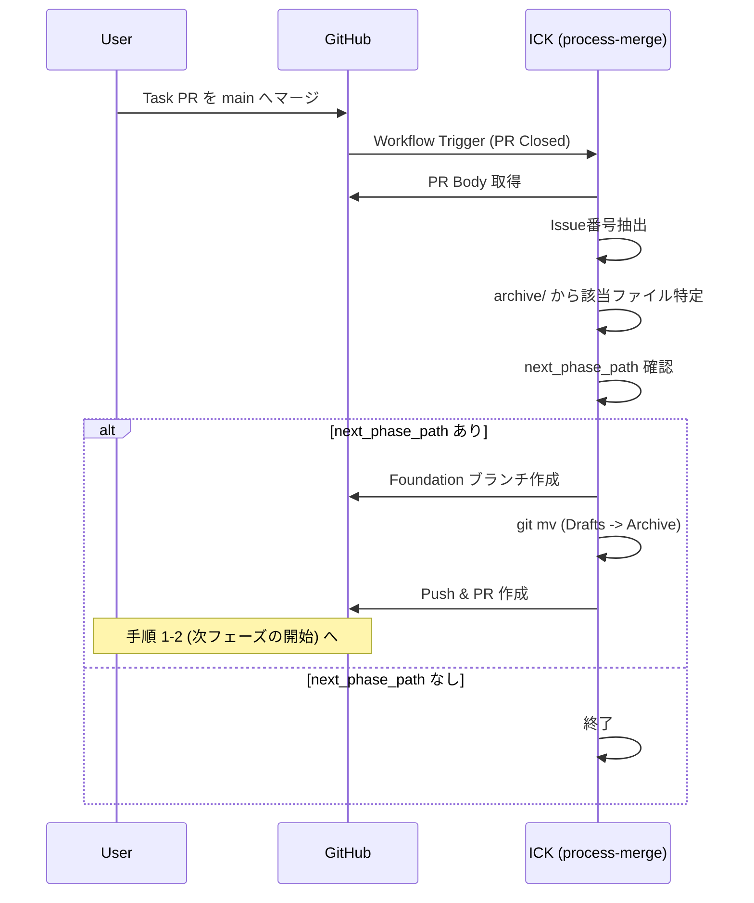

# 自己推進型ワークフロー (Self-Propelling Workflow) 詳細仕様書

## 概要
ADR-003 で定義されたタスクライフサイクルを完全に実現するための、自動化ロジックの詳細仕様を定義する。
本仕様の導入により、タスクの完了（PRマージ）をトリガーとした次フェーズへの自動遷移（Auto-PR）と、保護ブランチ環境下での安全なメタデータ（Issue番号）同期を実現する。

## 関連ドキュメント
- ADR: [adr-003-task-and-roadmap-lifecycle.md](../reqs/design/_approved/adr-003-task-and-roadmap-lifecycle.md)
- Design Doc: [design-003-logic.md](../reqs/design/_approved/design-003-logic.md)
- System Context: [system-context.md](../docs/system-context.md)

## 自己推進型ワークフロー (Self-Propelling Workflow) の定義
本システムは ADR-003 および System Context に基づき、以下のサイクルで進行する。

### 1. タスクの発生（起票フェーズ）
- **[Human/Agent]** `drafts/` から `archive/` へのファイル移動 PR を作成・マージ。
- **[ICK/process-diff]** マージを検知し、GitHub Issue を一括起票。

### 2. タスクの遂行（実装フェーズ）
- **[Human/Agent]** Issue に基づき実装を行い、Foundation Branch へマージ。

### 3. タスクの完了と連鎖（完了フェーズ）
- **[Human]** フェーズ最後のタスク（監査/マージ）を `main` へマージ。
- **[ICK/process-merge]** マージされた PR の内容から完了したタスクを特定し、次フェーズへの Auto-PR を作成。

### 4. 循環（サイクル）
- **[ICK/RoadmapSync]** 起票・完了に合わせてロードマップの WBS リンクを `Draft` から `Archive`、そして Issue 番号付きへと動的に同期（自己更新）する。

## メタデータ同期戦略
### 課題
`main` ブランチが保護されている（Branch Protection Rule）場合、Actions からの直接 `git push` は失敗する。

### 解決策: Metadata Sync PR 方式
起票フェーズにおけるメタデータ更新およびロードマップ同期を以下の手順で行う。

1. **ブランチ作成**: `main` から一時ブランチ `chore/metadata-sync-[timestamp]` を作成。
2. **コミット・プッシュ**: 更新されたファイルとロードマップをコミットし、プッシュ。
3. **PR作成**: `main` へのプルリクエストを作成。
    - Title: `chore: sync metadata for new issues`
    - Label: `metadata`
4. **自動マージ (推奨)**: 
    - リポジトリ設定で `Allow auto-merge` を有効化し、ICK が PR 作成直後に `enableAutoMerge` API を叩く。
    - または、特定のラベルが付いた PR を自動マージする GitHub Actions を利用する。

## Auto-PR ロジック
### トリガー
- イベント: `pull_request` (closed)
- 条件: `github.event.pull_request.merged == true`

### タスク特定アルゴリズム
1. **PR本文解析**: マージされた PR の Body から `Closes #(\d+)` または `Fixes #(\d+)` を正規表現で抽出する。
2. **ファイル検索**: `reqs/tasks/archive/` 以下の全ての `.md` ファイルをスキャンし、Frontmatter の `issue` フィールドが抽出した番号と一致するものを特定する。
3. **連鎖判定**: 特定したファイルの `next_phase_path` が空でない場合、そのパスを次フェーズのソースとして扱う。

### プロモーション実行
1. **基点ブランチ作成**: `main` から `feature/[phase-name]-foundation` を作成。
2. **ファイル移動**: `next_phase_path` (Drafts) 内の全ファイルを、対応する `archive/` フォルダへ移動 (`git mv`)。
3. **PR作成**: 
    - Head: `feature/[phase-name]-foundation`
    - Base: `main`
    - Title: `feat: promote [phase-name] tasks`
    - Body: 完了したタスクからの自動連鎖である旨を記載。

## シーケンス図

### フェーズ連鎖 (Auto-PR) フロー

## 実装詳細 (Implementation Details)

### WorkflowUseCase の拡張
以下のメソッドを追加または改修する。

#### `promote_from_merged_pr(pr_body: str, archive_dir: str = "reqs/tasks/archive") -> None`
- **引数**: 
    - `pr_body`: マージされたプルリクエストの本文。
    - `archive_dir`: タスクファイルが格納されているアーカイブディレクトリのパス。
- **戻り値**: なし
- **ロジック**:
    1. 正規表現 `(?i)(?:close|closes|closed|fix|fixes|fixed|resolve|resolves|resolved)\s*#(\d+)` で Issue 番号を抽出。
    2. `archive_dir` 下を巡回し、メタデータの `issue` が一致するファイルを探す（O(N+M) のルックアップマップを推奨）。
    3. そのファイルの `next_phase_path` を特定し、存在する場合は内部で次フェーズへのプロモーション処理を実行する。

#### `create_promotion_pr(next_phase_path: str)`
- **既存の `promote_next_phase` をベースに詳細化**:
    - ブランチ作成時に `main` から分岐することを保証。
    - `git mv` による物理移動の実行。
    - GitHubAdapter を使用した PR 作成。

### IssueCreationUseCase の改修
#### `create_issues_from_virtual_queue`
- **変更点**: コミット・プッシュ部分を、直接 Push だけでなく「PR作成」を選択可能にする。
- **新パラメータ**: 
    - `use_pr: bool = False`
    - `base_branch: str = "main"`
- **ロジック**: `use_pr` が True の場合、`chore/metadata-sync-...` ブランチを作成して PR を投げる。その際 `metadata` ラベルを付与する。

## 補足・制約事項
- **原子性の確保**: メタデータ同期 PR がマージされるまで、Issue 番号とファイルの状態は不整合となるが、Git を SSOT とする原則に基づき、PR のマージをもって正とする。
- **無限ループ防止**: `WorkflowUseCase` 内で既に実装済みの `MAX_PHASE_CHAIN_DEPTH` を引き続き適用する。
- **エラー通知**: Issue 特定に失敗した場合や、PR 作成に失敗した場合は、GitHub Actions のログに詳細を出力し、必要に応じて管理者に通知（Issue コメント等）を行う。
