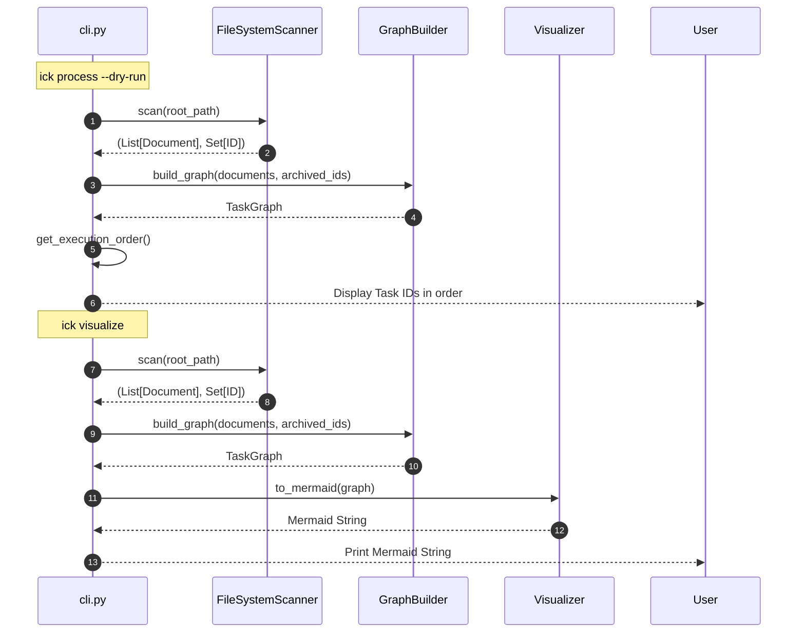

# CLI Integration Specification (ADR-008)

## 概要

ADR-008「Scanner Foundation」によって再構築された走査・依存関係管理機能を、`issue-kit` CLI に統合するための仕様を定義する。
本仕様に基づき実装される新しい CLI は、物理ファイルシステムの状態を正（SSOT）とし、Git 差分に依存しない確実なタスク管理を実現する。

## 関連ドキュメント

- **ADR**: [ADR-008: Cleanup & Scanner Foundation](../../../reqs/design/_approved/adr-008-automation-cleanup.md)
- **Architecture**: [Scanner Foundation Structure (ADR-008)](../../architecture/arch-structure-008-scanner.md)
- **Scanner Logic**: [FileSystemScanner Logic Specification](../logic/scanner_logic.md)
- **Graph Logic**: [Task Graph & Dependency Validation Specification](../logic/graph_and_validators.md)

## コマンド定義 (Command Definition)

### 1. `ick process`

物理ファイルシステムを走査し、未処理のタスクおよび ADR を処理する（現在は Dry-run のみ実装）。

- **引数**:
  - `--root`: 走査対象のベースディレクトリ（デフォルト: `reqs/`）
  - `--dry-run` (Flag): 実際のアクション（GitHub 起票等）を行わず、検出されたファイルと実行順序を表示する。**本タスク（Task-008-05）ではこのフラグが必須（指定がない場合はエラー終了）となる。**
- **振る舞い**:
  1. `FileSystemScanner.scan(root_path)` を呼び出し、未処理ドキュメントリストとアーカイブ済みIDセット (`documents`, `archived_ids`) を取得する。
  2. `GraphBuilder.build_graph(documents, archived_ids)` を呼び出し、依存関係グラフを構築する。
  3. `TaskGraph.get_execution_order()` を呼び出し、トポロジカルソートされた実行順序を取得する。
  4. 標準出力に、検出されたタスク数と、それらの実行順序（ID リスト）を表示する。
- **注意**: 実際の GitHub Issue 起票やファイルの移動（Action 部分）は本タスクのスコープ外であり、将来のタスク（ADR-008 フェーズ後半）で定義・実装される。本タスクでは、新基盤を用いた「検出と順序決定」の正常動作を CLI から確認できることをゴールとする。
- **エラーハンドリング**:
  - `--dry-run` が指定されていない場合、"Error: --dry-run is required for this phase of ADR-008 integration." と表示し、終了コード `1` で終了する。
  - バリデーションエラー（ID 重複、循環参照、存在しない依存先）が発生した場合、適切なエラーメッセージを表示し、終了コード `1` で終了する。

### 2. `ick visualize`

現在のタスク依存関係を Mermaid 形式で可視化する。

- **引数**:
  - `--root`: 走査対象のベースディレクトリ（デフォルト: `reqs/`）
- **振る舞い**:
  1. `FileSystemScanner.scan(root_path)` を呼び出し、未処理ドキュメントリストとアーカイブ済みIDセット (`documents`, `archived_ids`) を取得する。
  2. `GraphBuilder.build_graph(documents, archived_ids)` を呼び出し、依存関係グラフを構築する。
  3. `Visualizer.to_mermaid(graph)` を呼び出し、生成された Mermaid 文字列を標準出力に表示する。
- **エラーハンドリング**:
  - グラフ構築時のバリデーションエラーが発生した場合は、`process` コマンドと同様にエラーを表示し終了する。

## シーケンス図 (Sequence Diagram)

## 既存コマンドの Cleanup (Legacy Deletion)

ADR-008 の「Cleanup」フェーズに基づき、以下の既存コマンドは新基盤への移行に伴い非推奨または削除対象とする。

| コマンド        | 状態           | 理由                                                                                      |
| :-------------- | :------------- | :---------------------------------------------------------------------------------------- |
| `process-diff`  | **Deprecated** | Git 差分ベースのロジックは Physical Scanner に置き換えられるため。                        |
| `process-merge` | **Remove**     | 旧実装（ADR-003）に依存しており、現行ブランチでは既に不要なため。                         |
| `run-workflow`  | **Remove**     | `FileSystemScanner` で包含可能なため、個別のオーケストレーションは不要。                  |
| `approve`       | **Remove**     | ファイルシステム上の移動（`_inbox` -> `_approved`）は手動または単純な `mv` で十分なため。 |
| `approve-all`   | **Remove**     | 同上。                                                                                    |

**実装上の注意**:

- `process-diff` (**Deprecated**) は、**本 ADR-008 に基づく新 CLI リリース以降**、後方互換性のために `cli.py` 上のエントリポイントおよび `--help` の一覧には残しつつ、実行時には常にエラー終了とし、"This command is deprecated and no longer supported. Use `ick process` instead." というメッセージを表示する（終了コード `1`）。成功するコマンドとしてはもはやサポートしない。
- 上記の deprecated 仕様は、`docs/specs/api/cli_commands.md` を含む CLI 仕様ドキュメント群にも反映し、`process-diff` を「現役コマンド」としては記載しないこと（必要であれば「廃止予定／エラー専用コマンド」である旨を明記する）。
- その他 (**Remove**) のコマンドは、本 ADR-008 に基づく新 CLI リリースのタイミングで `cli.py` から完全に削除（または既に存在しなければ定義しない）し、`--help` 等の出力にも表示しない。関連ドキュメントからも削除するか、「廃止済み」であることを明示し、新たな利用を誘導しないものとする。

## 補足・制約事項

- **依存性注入**: `ScannerService` というファサードを導入せず、CLI が直接 `FileSystemScanner`, `GraphBuilder`, `Visualizer` をインスタンス化して利用する（ドメイン層が軽量なため）。
- **パスの扱い**: `--root` 引数は `Path` オブジェクトとして扱い、ディレクトリの存在チェックを行う。
- **出力形式**: `visualize` の出力は Mermaid コードのみ（コードブロックを含まない）とし、他ツールへのパイプ渡しを容易にする。
