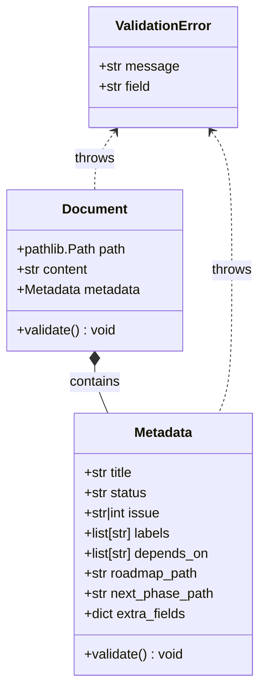

# Document Domain Model Specification

## 1. 概要 (Overview)
ADR-003 に従い、タスクライフサイクルを管理するための SSOT（Single Source of Truth）となる `Document` オブジェクトおよび `Metadata` スキーマを定義する。
本モデルは、正規化、バリデーション、およびステータス遷移のルールをカプセル化する。

### 1.1. 論理ステータスと物理ステータス (Logical States vs. Physical Status)
ADR-003 では 5 つのステータス (`Draft`, `Queued`, `Processing`, `Active`, `Archived`) が定義されているが、Metadata の物理的な `status` フィールドには主要な 3 つの値のみを保持する。`Queued` と `Processing` は、ファイルの物理的な配置場所と Issue 番号の有無に基づいてシステムが判定する **論理ステータス** である。

- **論理 `Queued`**: 非 main ブランチの `archive/` 配下にファイルが存在する状態。物理 `status` は通常 `Draft`。
- **論理 `Processing`**: main ブランチの `archive/` 配下にファイルが存在するが、`issue` フィールドが未採番の状態。物理 `status` は通常 `Draft`。

## 2. ドメインモデル (Domain Model)

### 2.1. クラス図 (Class Diagram)

### 2.2. Document クラス定義
ドキュメントファイル全体を表現する。

| フィールド名 | 型 | 必須 | 説明 |
| :--- | :--- | :--- | :--- |
| `path` | `pathlib.Path` | Yes | ファイルの物理パス。 |
| `content` | `str` | Yes | Markdown 本文（メタデータを除く）。 |
| `metadata` | `Metadata` | Yes | タスク属性を含むメタデータオブジェクト。 |

### 2.3. Metadata スキーマ
タスクの主要な属性を管理する。
厳格な正規化とバリデーションルールを適用する。

#### 正規化ルール (Normalization Rules)
1.  **キーの小文字化**: 全てのキーは小文字に変換される（例: `Status` -> `status`）。
2.  **エイリアスマッピング (日本語対応 & レガシーサポート)**:
    - `タイトル` -> `title`
    - `ラベル` -> `labels`
    - `ステータス` -> `status`
    - `依存` -> `depends_on`
    - `Depends-On` -> `depends_on`
    - `Issue` -> `issue` (大文字キーのサポート)

| フィールド名 | 型 | 必須 | 説明 | 制約 |
| :--- | :--- | :--- | :--- | :--- |
| `title` | `str` | Yes | Issue 作成時のタイトル。 | 空文字不可。 |
| `status` | `str` | Yes | ライフサイクルステータス。 | `Draft`, `Active`, `Archived` のいずれか。 |
| `issue` | `str` \| `int` | No | GitHub Issue 番号（例: `#123`）。 | status が `Active` または `Archived` の場合必須。 |
| `labels` | `list[str]` | No | Issue ラベルのリスト。 | 文字列のリストであること。 |
| `depends_on` | `list[str]` | No | 依存するファイル名のリスト。 | 文字列のリストであること。 |
| `roadmap_path`| `str` | No | WBS 同期用ロードマップファイルのパス。 | 任意。 |
| `next_phase_path`| `str` | No | 次フェーズのドラフト格納パス。 | フェーズ連鎖トリガーとして使用。 |
| `extra_fields`| `dict` | No | 未知のフィールドを格納する辞書。 | |

### 2.4. バリデーションルール (Validation Rules)
`validate()` メソッドは以下のルールを強制する：

1.  **必須フィールド**: `title` と `status` が存在すること。
2.  **ステータス整合性**:
    - `status` が `Active` または `Archived` の場合、`issue` フィールドは有効な Issue 番号（`#` 始まりまたは数字）でなければならない。
    - `path` が `archive/` ディレクトリにあり、かつ `issue` フィールドが存在する場合、`status` は `Active` または `Archived` でなければならない。
3.  **型の一貫性**: `depends_on` と `labels` はリスト型でなければならない。

## 3. 解析とシリアライズ (Parsing & Serialization)

### 3.1. 解析ロジック (Parsing Logic)
ハイブリッド解析をサポートする（YAML Frontmatter 優先）。

1.  **YAML Frontmatter**:
    - ファイルが `---` で始まる場合、区切り文字の間のコンテンツを YAML として解析する。
2.  **Markdown List (フォールバック)**:
    - 正規表現 `^- \*\*([^*]+)\*\*: (.*)$` にマッチする行をスキャンする。
    - メタデータ以外の行、または空行以外の行に遭遇するまでスキャンを続ける。パフォーマンスのため、最大行数（例: 100行）の制限を設けてもよい。

### 3.2. シリアライズロジック (Serialization Logic)
- 保存時は常に **YAML Frontmatter** 形式でシリアライズする。
- 元のファイルが Markdown List 形式であった場合、YAML Frontmatter に変換して保存し、コードベースを標準化する。

## 4. エッジケースとエラーハンドリング (Edge Cases & Error Handling)

| シナリオ | 挙動 |
| :--- | :--- |
| **ステータス欠落** | `ValidationError(field="status")` を送出する。 |
| **不正なステータス値** | `ValidationError("Invalid status: {value}. Must be Draft, Active, or Archived")` を送出する。 |
| **Active だが Issue 番号なし** | `ValidationError("Active tasks must have an issue number")` を送出する。 |
| **YAML 構文エラー** | YAML 解析を中断し、ドキュメント全体に対して Markdown List 形式での解析を試みる（フォールバック）。 |
| **日本語キー** | 内部的に英語キーに正規化する。`metadata["title"]` で `タイトル` の値を取得可能にする。 |
