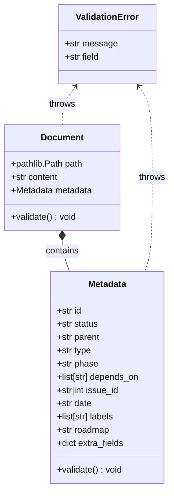

# Document Domain Model Specification

## 1. 概要 (Overview)
ADR-007 に従い、タスクライフサイクルを管理するための SSOT（Single Source of Truth）となる `Document` オブジェクトおよび `Metadata` スキーマを定義する。
本モデルは、物理フォルダ階層に依存せず、メタデータ（YAML Frontmatter）に基づいて正規化、バリデーション、およびステータス遷移のルールをカプセル化する。

### 1.1. メタデータ駆動ライフサイクル (Metadata-Driven Lifecycle)
ADR-007 では、物理的なフォルダ移動（`_inbox` から `_approved` 等）を最小限に抑え、メタデータの `status` フィールドによってドキュメントの状態を管理する。
特にタスク（Issue Draft）においては、依存関係（`depends_on`）の解消状況に基づき、システムが自動的に `Ready` 判定を行う。

## 2. ドメインモデル (Domain Model)

### 2.1. クラス図 (Class Diagram)

### 2.2. Document クラス定義
ドキュメントファイル全体を表現する。

| フィールド名 | 型 | 必須 | 説明 |
| :--- | :--- | :--- | :--- |
| `path` | `pathlib.Path` | Yes | ファイルの物理パス。 |
| `content` | `str` | Yes | Markdown 本文（メタデータを除く）。 |
| `metadata` | `Metadata` | Yes | タスク属性を含むメタデータオブジェクト。 |

### 2.3. Metadata スキーマ
タスクおよび設計ドキュメントの主要な属性を管理する。
ADR-007 に基づき、メタデータ駆動のライフサイクル管理を実現するための厳密なバリデーションルールを適用する。

#### 共通フィールド (Common Fields)
| フィールド名 | 型 | 必須 | 説明 | 制約 |
| :--- | :--- | :--- | :--- | :--- |
| `id` | `str` | Yes | ユニーク識別子。 | `^[a-z0-9-]+$` (例: `adr-007`, `007-T1`) |
| `status` | `str` | Yes | ライフサイクルステータス。 | 後述のステータス定義参照。 |
| `date` | `str` | No | 作成日または更新日。 | ISO 8601 形式 (`YYYY-MM-DD`) |

#### タスク固有フィールド (Task Specific Fields)
| フィールド名 | 型 | 必須 | 説明 | 制約 |
| :--- | :--- | :--- | :--- | :--- |
| `parent` | `str` | Yes | 親 ADR/Design Doc の ID。 | 存在する ADR ID であること。 |
| `type` | `str` | Yes | タスクの種別。 | `task` (L3) または `integration` (L2)。 |
| `phase` | `str` | Yes | 工程フェーズ。 | `domain`, `infra`, `usecase`, `interface`, `arch`, `spec`, `tdd` のいずれか。 |
| `depends_on` | `list[str]` | Yes | 依存するタスク ID のリスト。 | 依存がない場合は空配列 `[]`。 |
| `issue_id` | `str` \| `int` | No | GitHub Issue 番号。 | `status` が `Issued` 以降の場合に自動追記される。 |
| `labels` | `list[str]` | No | Issue ラベル의 リスト。 | |
| `roadmap` | `str` | No | 同期対象のロードマップ ID。 | |
| `extra_fields`| `dict` | No | 未知のフィールドを格納する辞書。 | |

#### ステータス定義 (Status Definitions)
ドキュメントの種類に応じて、以下の Enum 値を許容する。

**ADR / Design Doc:**
- `Draft`: 起草中。
- `Approved`: 承認済み。
- `Postponed`: 先送り。
- `Superseded`: 廃止（新しい ADR に置き換えられた）。

**Task (Issue Draft):**
- `Draft`: 起草中。
- `Ready`: 起票待ち（すべての依存タスクが完了または起票済み）。
- `Issued`: 起票済み（GitHub Issue が作成された）。
- `Completed`: 完了。
- `Cancelled`: 中止。

#### 正規化ルール (Normalization Rules)
1.  **キーの小文字化**: 全てのキーは小文字に変換される。
2.  **エイリアスマッピング (日本語対応 & レガシーサポート)**:
    - `ID` -> `id`
    - `タイトル` -> `title` (レガシー)
    - `ステータス` -> `status`
    - `日付` -> `date`
    - `親` -> `parent`
    - `型` -> `type`
    - `フェーズ` \| `工程` -> `phase`
    - `依存` -> `depends_on`
    - `Depends-On` -> `depends_on`
    - `Issue` -> `issue_id` (レガシー)
    - `ラベル` -> `labels`

### 2.4. バリデーションルール (Validation Rules)
`validate()` メソッドは以下のルールを強制する：

1.  **共通必須フィールド**: `id` と `status` が存在すること。`id` は規定のフォーマットに準拠すること。
2.  **タスク固有必須フィールド**: `parent`, `type`, `phase`, `depends_on` が存在すること（タスクドキュメントの場合）。
3.  **ステータス整合性**:
    - `status` が `Issued` または `Completed` の場合、`issue_id` フィールドは必須であり、有効な Issue 番号でなければならない。
    - `status` が `Ready` の場合、すべての `depends_on` にリストされた ID が `Issued` または `Completed` 状態でなければならない（この検証は `usecase` レイヤーで行われる場合があるが、ドメインモデルとしても不整合を許容しない）。
4.  **型の一貫性**: `depends_on` と `labels` はリスト型でなければならない。

## 3. 解析とシリアライズ (Parsing & Serialization)

### 3.1. 解析ロジック (Parsing Logic)
ハイブリッド解析をサポートする（YAML Frontmatter 優先）。

1.  **YAML Frontmatter**:
    - ファイルが `---` で始まる場合、区切り文字の間のコンテンツを YAML として解析する。
2.  **Markdown List (フォールバック)**:
    - 正規表現 `^- \*\*([^*]+)\*\*: (.*)$` にマッチする行をスキャンする。
    - メタデータ以外の行、または空行以外の行に遭遇するまでスキャンを続ける。パフォーマンスのため、最大行数（例: 100行）の制限を設けてもよい。

### 3.2. シリアライズロジック (Serialization Logic)
- 保存時は常に **YAML Frontmatter** 形式でシリアライズする。
- 元のファイルが Markdown List 形式であった場合、YAML Frontmatter に変換して保存し、コードベースを標準化する。

## 4. エッジケースとエラーハンドリング (Edge Cases & Error Handling)

| シナリオ | 挙動 |
| :--- | :--- |
| **必須フィールド欠落** | `ValidationError(field="<field_name>")` を送出する。 |
| **不正なステータス値** | `ValidationError("Invalid status: {value}")` を送出する。 |
| **Issued だが Issue ID なし** | `ValidationError("Issued tasks must have an issue_id")` を送出する。 |
| **YAML 構文エラー** | YAML 解析を中断し、ドキュメント全体に対して Markdown List 形式での解析を試みる（フォールバック）。 |
| **日本語キー** | 内部的に英語キーに正規化する。`metadata["id"]` で `ID` の値を取得可能にする。 |
