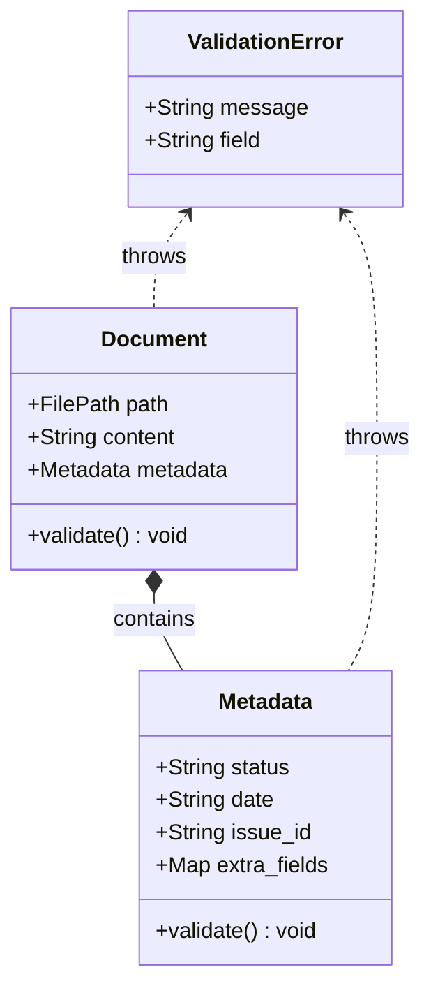

# Document Domain Model Specification

## 1. 概要
ドキュメントおよびそのメタデータを表現するドメインモデルの仕様を定義する。
本モデルは、SSOT（真実の単一ソース）としてドキュメントの状態を厳密に管理し、不正な状態のドキュメントがシステム内で流通することを防ぐ。

## 2. 関連ドキュメント
- ADR: `reqs/design/_archive/adr-002-document-approval-flow.md`
- Architecture: `docs/architecture/arch-structure-issue-kit.md`

## 3. ドメインモデル (Domain Model)

### 3.1. クラス構造 (Mermaid Class Diagram)


### 3.2. Metadata クラス定義
ドキュメントの属性情報を保持する。
**正規化ルール**: メタデータのキーは大文字小文字を区別せず、全て小文字に正規化して保持される（例: `Status` -> `status`）。

| フィールド名 | 型 | 必須 | 説明 |
| :--- | :--- | :--- | :--- |
| `status` | String | Yes | ドキュメントの承認状態（例: `承認済み`, `提案中`） |
| `date` | String | No | 最終更新日または承認日（YYYY-MM-DD形式を推奨） |
| `issue_id` | String | No | 関連するGitHub Issue ID（例: `#123`） |
| `extra_fields`| Map[String, Any] | No | 上記以外の任意のフィールド。解析時に未知のキーがあった場合ここに格納される。 |

#### バリデーションルール
- **必須チェック**: `status` フィールドが欠落している、または値が `None` や空文字列 `""` の場合は `ValidationError` を送出する。
- **型チェック**: `status`, `date`, `issue_id` は文字列型であることを期待する。

### 3.3. Document クラス定義
ドキュメント全体（ファイルパス、本文、メタデータ）を表現する。

| フィールド名 | 型 | 必須 | 説明 |
| :--- | :--- | :--- | :--- |
| `path` | FilePath | Yes | ドキュメントファイルの物理パス |
| `content` | String | Yes | Markdown形式の本文（メタデータ部分を除く）。空文字列を許容する。 |
| `metadata` | Metadata | Yes | メタデータオブジェクト |

#### バリデーションルール
- 生成時および `validate()` 呼び出し時に `metadata.validate()` を実行する。
- `path` は有効なファイルシステムパスであることを要求する。

### 3.4. ValidationError クラス定義
バリデーション失敗時に送出される例外クラス。

| 属性名 | 型 | 説明 |
| :--- | :--- | :--- |
| `message` | str | エラー詳細メッセージ |
| `field` | str (optional) | エラーが発生したフィールド名 |

## 4. 解析ルール (Parsing Rules)

ドキュメントは以下の2種類の形式からのパースをサポートする。

### 4.1. YAML Frontmatter 形式
ファイル先頭が `---` で始まり、次の `---` までの間を YAML としてパースする。

**例:**
```markdown
---
status: 承認済み
date: 2026-01-20
issue_id: "#123"
---
# 本文
...
```

### 4.2. Markdown List 形式 (埋め込みメタデータ)
ファイル内の特定のパターン（`- **Key**: Value`）をメタデータとして抽出する。

**解析ルール:**
- 行が `- **([^*]+)**: (.*)` の正規表現にマッチする場合、メタデータとして扱う。
- メタデータキー（`status` 等）は大文字小文字を区別せず、正規化して扱う（例: `Status` -> `status`）。
- 最初のメタデータ行から、メタデータ以外の行（空行を除く）が出現するまでをメタデータブロックとみなす。
- メタデータブロック以降を本文 (`content`) とする。本文冒頭の空行は削除する。

## 5. 異常系ハンドリング (Error Handling)

| ケース | 挙動 |
| :--- | :--- |
| メタデータに `status` が存在しない | `ValidationError` (field="status") を送出する。 |
| YAML 形式が不正（文法エラー等） | YAMLとしての解析を中断し、全文を対象に Markdown List 形式としての解析を試みる。 |
| YAML/Markdown List 両方で解析不能 | `metadata` を空の状態で生成し、その後の `validate()` により `ValidationError` を送出する。 |
| ファイルが空 | `content=""`, `metadata={}` で生成を試み、`ValidationError` を送出する。 |
