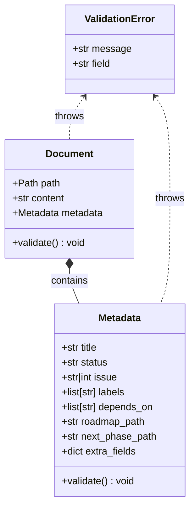

# Document Domain Model Specification

## 1. Overview
Defines the `Document` object and its `Metadata` schema, which serve as the Single Source of Truth (SSOT) for managing task lifecycle as per ADR-003.
This model encapsulates normalization, validation, and status transition rules.

### 1.1. Logical States vs. Physical Status
While ADR-003 defines 5 states (`Draft`, `Queued`, `Processing`, `Active`, `Archived`), the physical `status` field in Metadata only stores three primary values. `Queued` and `Processing` are **logical states** determined by the system based on the file's physical location and the absence of an issue number.

- **Logical `Queued`**: File is in `archive/` on a non-main branch. Physical `status` is typically `Draft`.
- **Logical `Processing`**: File is in `archive/` on `main` branch but has no `issue` field. Physical `status` is typically `Draft`.

## 2. Domain Model (Classes)

### 2.1. Class Diagram

### 2.2. Document Class Definition
Represents the entire document file.

| Field | Type | Required | Description |
| :--- | :--- | :--- | :--- |
| `path` | `pathlib.Path` | Yes | Physical path of the file. |
| `content` | `str` | Yes | Markdown body content (excluding metadata). |
| `metadata` | `Metadata` | Yes | Metadata object containing task attributes. |

### 2.3. Metadata Schema
Metadata manages key attributes of a task.
It enforces strict normalization and validation rules.

#### Normalization Rules
1.  **Lowercase Keys**: All keys are converted to lowercase (e.g., `Status` -> `status`).
2.  **Alias Mapping (Japanese & Legacy Support)**:
    - `タイトル` -> `title`
    - `ラベル` -> `labels`
    - `ステータス` -> `status`
    - `依存` -> `depends_on`
    - `Depends-On` -> `depends_on`
    - `Issue` -> `issue` (legacy capitalized key)

| Field | Type | Required | Description | Constraints |
| :--- | :--- | :--- | :--- | :--- |
| `title` | `str` | Yes | Task title for Issue creation. | Must not be empty. |
| `status` | `str` | Yes | Lifecycle status. | Must be one of `Draft`, `Active`, `Archived`. |
| `issue` | `str` \| `int` | No | GitHub Issue number (e.g., `#123`). | Required if status is `Active` or `Archived`. |
| `labels` | `list[str]` | No | List of labels for the issue. | Must be a list of strings. |
| `depends_on` | `list[str]` | No | List of dependent filenames. | Must be a list of strings. |
| `roadmap_path`| `str` | No | Path to roadmap file for WBS sync. | Optional. |
| `next_phase_path`| `str` | No | Path to next phase drafts. | Required for phase promotion trigger. |
| `extra_fields`| `dict` | No | Catch-all for unknown fields. | |

### 2.4. Validation Rules
The `validate()` method enforces the following rules:

1.  **Required Fields**: `title` and `status` must exist.
2.  **Status Integrity**:
    - If `status` is `Active` or `Archived`, the `issue` field must represent a valid issue number (starting with `#` or pure digits).
    - If `path` is in `archive/` directory and the `issue` field exists, `status` must be `Active` or `Archived`.
3.  **Type Consistency**: `depends_on` must be a list, `labels` must be a list.

## 3. Parsing & Serialization

### 3.1. Parsing Logic
Supports hybrid parsing (YAML Frontmatter priority).

1.  **YAML Frontmatter**:
    - If file starts with `---`, parse content between delimiters as YAML.
2.  **Markdown List (Fallback)**:
    - Scan lines matching `^- \*\*([^*]+)\*\*: (.*).
    - Scan until a non-metadata, non-empty line is encountered. Implementations MAY impose a documented maximum number of lines (e.g., 100) for performance reasons.

### 3.2. Serialization Logic
- Always serialize as **YAML Frontmatter** when saving.
- If the original file used Markdown List format, convert it to YAML Frontmatter to standardize the codebase.

## 4. Edge Cases & Error Handling

| Scenario | Behavior |
| :--- | :--- |
| **Missing Status** | Raise `ValidationError(field="status")`. |
| **Invalid Status Value** | Raise `ValidationError("Invalid status: {value}. Must be Draft, Active, or Archived")`. |
| **Active but No Issue** | Raise `ValidationError("Active tasks must have an issue number")`. |
| **YAML Syntax Error** | Abort YAML parsing and attempt to parse the entire document using the Markdown List format (fallback strategy). |
| **Japanese Key** | Normalize to English key internally. `metadata["title"]` returns value for `タイトル`. |