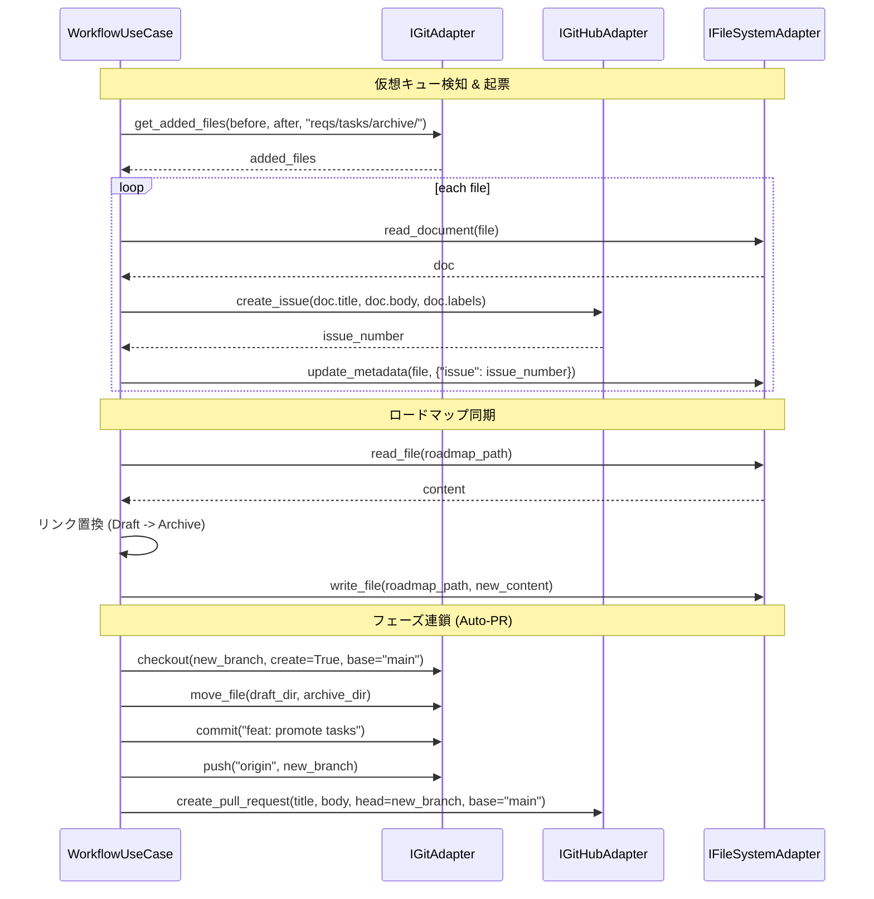

# インフラ層 インターフェース定義 (Infrastructure Interface Spec)

- **Author(s)**: TECHNICAL_DESIGNER
- **Status**: 下書き
- **Last Updated**: 2026-01-04

## 概要
ADR-003 で定義された「仮想キュー」および「フェーズ連鎖」を実現するために、ドメイン層（UseCase）がインフラ層に対して要求する操作を抽象化したインターフェース定義である。
これにより、ドメインロジックが具体的な Git コマンドや GitHub API の実装詳細から分離され、テスト容易性と保守性が向上する。

## 関連ドキュメント
- ADR: [ADR-003: 仮想キューと自己推進型ワークフロー](../../reqs/design/_approved/adr-003-task-and-roadmap-lifecycle.md)
- Design Doc: [仮想キューとフェーズ連鎖の論理フロー詳細設計](../../reqs/design/_inbox/design-003-logic.md)

## インターフェース定義 (Interface Definition)

Python の `abc.ABC` または `typing.Protocol` を用いた実装を想定したシグネチャを定義する。

### 1. IGitAdapter
Git リポジトリに対する物理的な操作を担当する。

| メソッド名 | 引数 | 戻り値 | 説明 |
| :--- | :--- | :--- | :--- |
| `get_added_files` | `base_ref: str, head_ref: str, path: str` | `list[str]` | `git diff-tree` を使用し、指定パス配下で追加（Added）されたファイルリストを取得する。 |
| `checkout` | `branch: str, create: bool, base: str | None` | `None` | 指定したブランチに切り替える。`create=True` の場合は `base` を起点に新規作成する。`base` はブランチ作成時にのみ使用される。 |
| `add` | `paths: list[str]` | `None` | 指定したファイルをステージングエリアに追加する。 |
| `commit` | `message: str` | `None` | ステージングされた変更をコミットする。 |
| `push` | `remote: str, branch: str, set_upstream: bool` | `None` | 指定したリモート・ブランチへプッシュする。 |
| `move_file` | `src: str, dst: str` | `None` | `git mv` を使用してファイルまたはディレクトリを移動する。 |

### 2. IGitHubAdapter
GitHub REST API を介した操作を担当する。

| メソッド名 | 引数 | 戻り値 | 説明 |
| :--- | :--- | :--- | :--- |
| `create_issue` | `title: str, body: str, labels: list[str]` | `int` | 指定したリポジトリに Issue を作成し、Issue 番号を返す。 |
| `create_pull_request` | `title: str, body: str, head: str, base: str` | `str` | プルリクエストを作成し、PR の URL を返す。 |
| `add_comment` | `issue_number: int, body: str` | `None` | 指定した Issue または PR にコメントを投稿する（エラー通知等に利用）。 |

### 3. IFileSystemAdapter
ローカルファイルシステム上の Markdown ファイルのパースと書き換えを担当する。

| メソッド名 | 引数 | 戻り値 | 説明 |
| :--- | :--- | :--- | :--- |
| `read_document` | `path: str` | `Document` | 指定された Markdown ファイルを読み込み、YAML Frontmatter と Content を持つドメインオブジェクトを返す。 |
| `update_metadata` | `path: str, metadata: dict` | `None` | 指定されたファイルの Frontmatter を指定された辞書の内容で更新（マージ）する。 |
| `safe_move_file` | `src: str, dst_dir: str, overwrite: bool` | `None` | ファイルを指定ディレクトリへ移動する。ディレクトリが存在しない場合は作成する。 |
| `read_file` | `path: str` | `str` | ファイルを文字列として読み込む（ロードマップ更新等に利用）。 |
| `write_file` | `path: str, content: str` | `None` | 文字列をファイルに書き込む。 |

## シーケンス図 (Sequence Diagram)
UseCase がこれらのインターフェースを介してどのように協調するかを示す。

## 補足・制約事項
- **エラーハンドリング**: 各インターフェースの実装（アダプター）は、基盤層のエラー（ネットワークエラー、Git コンフリクト等）を捕捉し、ドメイン層が解釈可能な例外（例: `InfrastructureError`）として再送出することが期待される。
- **レートリミット**: `IGitHubAdapter` の実装は、GitHub API のレート制限を考慮し、内部的にリトライロジックを持つべきである。詳細は Logic Design Doc を参照。
