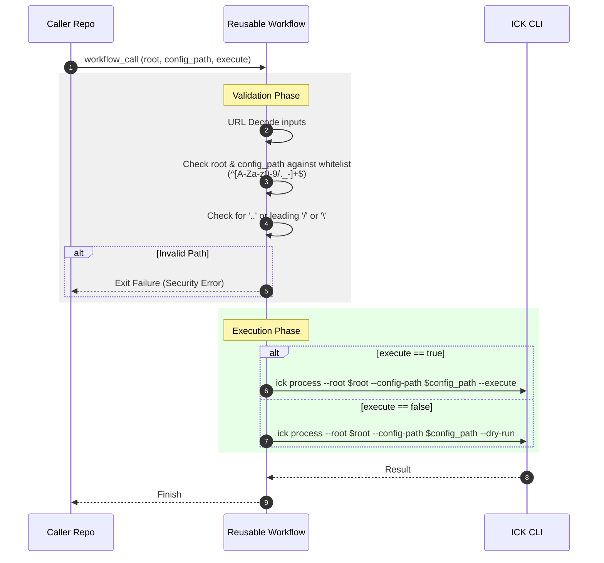

# [Spec] Reusable Workflow Interface

## 1. 概要 (Overview)

本ドキュメントは、`issue-creator-kit` を外部のリポジトリから GitHub Actions の Reusable Workflow（再利用可能ワークフロー）として呼び出すためのインターフェース仕様を定義します。

### 1.1. 目的 (Goals)

- 他のリポジトリから `uses:` を用いて呼び出し可能な共通 CI ロジックの提供。
- パス・トラバーサル等のセキュリティリスクの排除。
- 実行フラグ（`execute`）に応じた安全な CLI 呼び出し（dry-run 制御）の実現。

### 1.2. 関連ドキュメント

- Common Definitions: [../plans/adr-014-modular-reusability/definitions.md](../plans/adr-014-modular-reusability/definitions.md)
- Architecture: [interface-reusable-workflows.md](../../architecture/interface-reusable-workflows.md)

---

## 2. インターフェース定義 (Interface Definitions)

### 2.1. Inputs (`on: workflow_call: inputs`)

| Parameter     | Required | Type    | Default                         | Description                                                    |
| :------------ | :------- | :------ | :------------------------------ | :------------------------------------------------------------- |
| `root`        | No       | string  | `reqs`                          | 処理対象のドキュメントルートディレクトリ。                     |
| `execute`     | No       | boolean | `false`                         | `true` の場合のみ副作用（Issue作成・PR作成）を伴う実行を行う。 |
| `config_path` | No       | string  | `.github/issue-kit-config.json` | 外部設定ファイルのパス。                                       |

### 2.2. Secrets (`on: workflow_call: secrets`)

| Secret Name | Required | Description                         |
| :---------- | :------- | :---------------------------------- |
| `gh_token`  | **Yes**  | GitHub API 操作に使用するトークン。 |

### 2.3. Permissions

呼び出し側で以下の権限を付与することが必須。

```yaml
permissions:
  contents: write
  issues: write
  pull-requests: write
```

---

## 3. 処理ロジックとバリデーション (Processing Logic)

### 3.1. 入力バリデーション (Constraint 1: Security)

`root` および `config_path` パラメータに対するパス・トラバーサル攻撃を防ぐため、以下のバリデーションを適用する。

- **検証方針**:
  - 入力値は一度 URL デコードした上で評価すること（`%2e%2e/`, `..%2f` などのエンコードを考慮する）。
  - `root` および `config_path` は「リポジトリルートからの相対パス」であることを前提とし、実装側ではパスを正規化（`resolved path`）した上で、必ずリポジトリの境界内に収まることを確認すること。
  - 許可する文字セットはホワイトリスト方式とし、英数字 (`A-Za-z0-9`)、ドット `.`、スラッシュ `/`、ハイフン `-`、アンダースコア `_` のみを許可する（例: 正規表現 `^[A-Za-z0-9/._-]+$`）。
- **禁止パターン**:
  - 文字列に `..`（親ディレクトリへの参照）が含まれている場合。
  - 文字列が `/` または `\`（ルートディレクトリや Windows ルート）で始まる場合。
  - 文字列にバックスラッシュ `\` が含まれている場合（Windows スタイルのパスを禁止）。
  - 文字列に連続するスラッシュ `//` が含まれている場合。
  - URL エンコードされたドットやスラッシュ／バックスラッシュ（例: `%2e`, `%2e%2e`, `%2f`, `%5c` など）を含む場合。
  - 正規化後のパスがリポジトリの外を指している場合（例: `reqs/../../../etc/passwd` のようなパス）。
  - 文字列が空、または空白のみの場合。
- **許容される例**:
  - `root`: `reqs`, `docs/tasks`, `custom/path`
  - `config_path`: `.github/issue-kit-config.json`, `config/settings.json`
- **エラー時の挙動**: ワークフローを Failure 状態とし、適切なエラーメッセージを表示して終了する。

### 3.2. CLI フラグマッピング (Constraint 6: Dry-run logic)

ワークフローの `execute` 入力（boolean）を、ICK CLI の必須フラグ（`--execute` / `--dry-run`）に変換する。

- **Logic**:
  - `execute == true` -> `ick process --root "${root}" --execute`
  - `execute == false` (Default) -> `ick process --root "${root}" --dry-run`

### 3.3. 環境前提 (Infrastructure)

- ワークフロー内では `run.sh` や `setup_venv.sh` を使用せず、呼び出し側の Runner で以下の環境が構築済みであることを前提とする。
  - Python 3.13+
  - `ick` コマンドが `PATH` に通っていること（`pip install .` 済み）。

---

## 4. 呼び出しサンプル (Usage Sample)

外部プロジェクトの `.github/workflows/task-automation.yml` での記述例：

```yaml
jobs:
  automation:
    uses: masa-codehub/issue_creator_kit/.github/workflows/task-automation.yml@v1.0.0
    with:
      root: "reqs"
      execute: ${{ github.event_name == 'push' && github.ref == 'refs/heads/main' }}
    secrets:
      gh_token: ${{ secrets.GH_PAT_OR_TOKEN }}
```

---

## 5. シーケンス (Sequence)



---

## 6. エラーハンドリング (Error Handling)

| 発生箇所           | エラー条件                       | 期待される挙動                                                                  |
| :----------------- | :------------------------------- | :------------------------------------------------------------------------------ |
| 入力バリデーション | パスに `..` や不正文字が含まれる | `[SECURITY FAIL] Invalid path: <parameter> contains invalid characters or '..'` |
| 入力バリデーション | パスが `/` または `\` で始まる   | `[SECURITY FAIL] Invalid path: absolute path not allowed`                       |
| 入力バリデーション | 正規化後のパスが境界外を指す     | `[SECURITY FAIL] Invalid path: path must stay within repository boundaries`     |
| 実行フェーズ       | `gh_token` が未設定              | `[FAIL] Secret 'gh_token' is missing.` を表示して停止                           |
| CLI実行            | `ick` コマンド不在               | `ick: command not found` (Shell Error)                                          |
