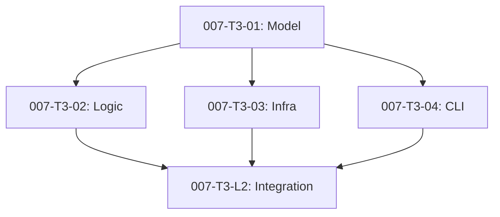

# Metadata-Driven Lifecycle Specification Plan

## 1. SSOT Audit Log
- **Source Design Doc:** `reqs/design/_approved/adr-007-metadata-driven-lifecycle.md`
- **Architecture Plan:** `docs/architecture/plans/adr-007-metadata-driven-lifecycle/arch-to-spec.md`
- **System Context:** `docs/system-context.md`

## 2. Common Definitions & Standards (Critical)

### 2.1. Ubiquitous Language (Naming)
- **ADR / Design Doc:** システムの設計決定を記述したドキュメント。`reqs/design/` に配置。
- **Task (Issue Draft):** 実装タスクの定義書。`reqs/tasks/<ADR-ID>/` に配置される。
- **Integration Issue (L2):** フェーズ（Arch, Spec, TDD）ごとの完了責任を持つIssue。`type: integration` として物理ファイル（Draft）で管理される。
- **DAG (Directed Acyclic Graph):** `depends_on` メタデータによって構築されるタスク間の依存関係グラフ。
- **Invisible SSOT:** ファイルシステム（Passive）とGitHub Issues（Active）の二重管理状態。GitHub Issueが正（Active）となる。

### 2.2. Metadata Schema Definitions
すべての Markdown ドキュメントの Frontmatter に適用される共通スキーマ。

#### Common Fields
| Field Name | Type | Required | Description | Constraints |
| :--- | :--- | :--- | :--- | :--- |
| `id` | `String` | Yes | ユニーク識別子 | `^[a-z0-9-]+$` (例: `adr-007`, `007-T1`) |
| `status` | `Enum` | Yes | ライフサイクル状態 | 後述の Status Definitions 参照 |
| `date` | `Date` | Yes | 作成日/更新日 | ISO 8601 (`YYYY-MM-DD`) |

#### Task Specific Fields
| Field Name | Type | Required | Description | Constraints |
| :--- | :--- | :--- | :--- | :--- |
| `parent` | `String` | Yes | 親ADRのID | 既存のADR IDと一致すること |
| `parent_issue` | `String` | No | 親IssueのID | `#123` 形式 |
| `type` | `Enum` | Yes | タスク種別 | `task` (L3), `integration` (L2) |
| `phase` | `Enum` | Yes | 工程フェーズ | `domain`, `infra`, `usecase`, `interface`, `arch`, `spec`, `tdd` |
| `depends_on` | `List[String]` | Yes | 依存タスクIDのリスト | リスト形式。依存なしは `[]` |
| `roadmap` | `String` | No | 同期対象ロードマップID | 任意 |
| `issue_id` | `Integer` | Auto | GitHub Issue番号 | 自動追記のみ。手動編集禁止 |

### 2.3. Status Definitions (Enum)

#### ADR / Design Doc
- `Draft`: 起草中 (`_inbox/`)
- `Approved`: 承認済み (`_approved/`)
- `Postponed`: 先送り (`_archive/`)
- `Superseded`: 廃止 (`_archive/`)

#### Task (Issue Draft)
- `Draft`: 起草中
- `Ready`: 起票待ち（全依存タスクが `Issued` または `Completed`）
- `Issued`: 起票済み（GitHub Issueが存在）
- `Completed`: 完了（GitHub IssueがClosed）
- `Cancelled`: 中止

### 2.4. Logic Standards
#### DAG Analysis Logic
- **Dependency Resolution:**
    - タスクの `depends_on` ID を解析し、対象タスクの `status` を確認する。
    - 対象タスクが物理ファイルとして存在しない場合、GitHub API経由で Issue を検索し、ステータス（Open/Closed）を確認する。
- **Ready Criteria:**
    - すべての依存先（`depends_on`）が `Completed` または `Issued` 状態であること。

#### Idempotency (冪等性)
- `ick create` コマンドは、対象タスクが既に `issue_id` を持っている場合、新規起票を行わずに既存Issue情報を返す。
- `reqs/tasks/_archive/` に同名ファイルが存在する場合、ハッシュ比較等により同一性を確認する。

## 3. Directory Structure & Naming
- **Task Dir:** `reqs/tasks/<ADR-ID>/<Task-ID>.md`
- **Archive Dir:** `reqs/tasks/_archive/<Task-ID>.md` (フラット構造)

## 4. Issue Slicing Strategy
並列開発を最大化するため、共通モデルを先行させ、その後各レイヤーの仕様を並列に策定する。

1.  **Document Model Spec (007-T3-01):** [CORE] メタデータスキーマとステータス定義。すべての基礎。
2.  **Logic Spec (007-T3-02):** [PARALLEL] DAG解析、状態遷移、Ready判定のアルゴリズム。 (Depends on T3-01)
3.  **Infrastructure Spec (007-T3-03):** [PARALLEL] 物理移動（Atomic Move）と GitHub API 連携のインターフェース。 (Depends on T3-01)
4.  **CLI Spec (007-T3-04):** [PARALLEL] コマンド体系、引数、ヘルプメッセージ。 (Depends on T3-01)

## 5. Dependency & Parallelization Strategy (Critical)
- **Core Tasks:** `007-T3-01` (Document Model)
- **Parallel Tasks:** `007-T3-02`, `007-T3-03`, `007-T3-04`
- **DAG Diagram:**

