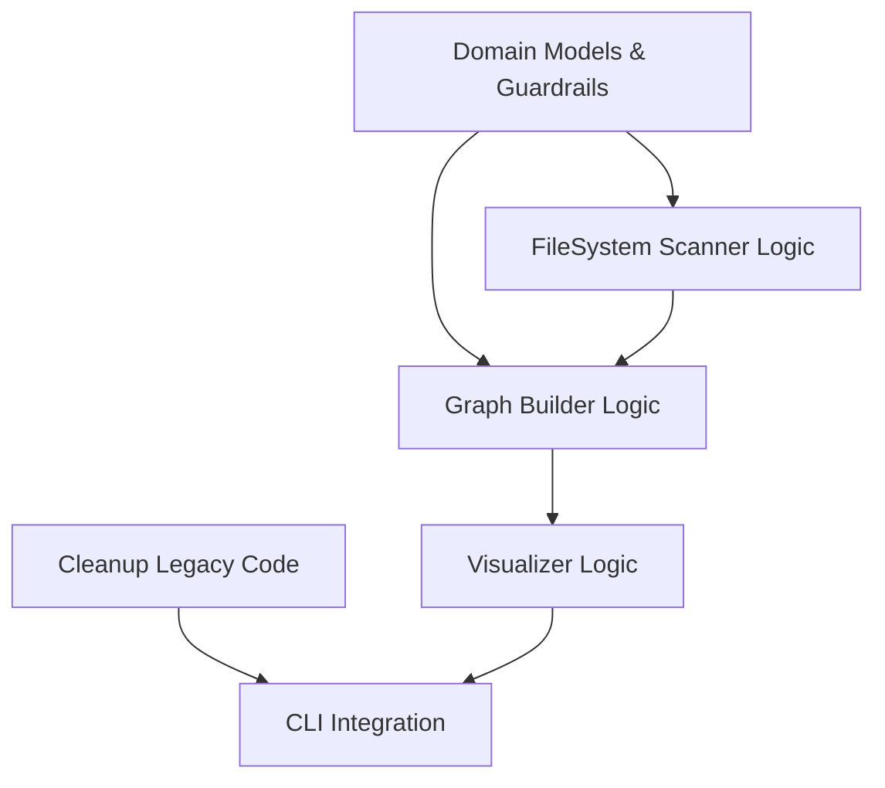

# [Specification Plan] ADR-008 Scanner Foundation

## 1. SSOT Audit Log
- **Source Design Doc:** `reqs/design/_approved/adr-008-automation-cleanup.md`
- **System Context:** `docs/system-context.md`
- **Common Definitions (Arch):** `docs/architecture/plans/adr-008-automation-cleanup/definitions.md`
- **Architecture Handover:** `docs/architecture/plans/adr-008-automation-cleanup/arch-to-spec.md`

## 2. Common Definitions & Standards (Critical)

### 2.1. Ubiquitous Language (Naming)
- **Physical State Scanner:** Git差分ではなくファイルシステム上の位置（`_inbox`, `_approved`, `_archive`）で状態を判定する機構。
- **Domain Guardrails:** Pydanticモデルで実装される不変条件（ID形式、依存関係の健全性）。
- **DAG Visualization:** 依存関係を有向非巡回グラフとして可視化すること。

### 2.2. Common Data Types
| Type Name | Base Type | Constraints (Min, Max, Regex) |
| :--- | :--- | :--- |
| *TaskID* | *String* | `task-\d{3}-\d{2,}` (e.g., `task-008-01`) |
| *ADRID* | *String* | `adr-\d{3}-.*` (e.g., `adr-008-cleanup`) |
| *PathLike* | *Path* | Absolute or Relative path to `reqs/` |

### 2.3. Error Handling Policy
| Error Code | Exception Class | Description |
| :--- | :--- | :--- |
| *INVALID_METADATA* | *ValidationError* | ID format or required fields missing |
| *CYCLE_DETECTED* | *GraphError* | Circular dependency found in DAG |
| *ORPHAN_DEPENDENCY* | *GraphError* | `depends_on` ID not found in scan scope |

### 2.4. Cleanup Targets (Legacy Code)
- `src/issue_creator_kit/usecase/workflow.py`
- `src/issue_creator_kit/usecase/approval.py`
- `.github/workflows/auto-approve-docs.yml`

## 3. Directory Structure & Naming
- **Specs Directory:** `docs/specs/plans/adr-008-automation-cleanup/`
- **File Naming:** `008-T3-{XX}-{slug}.md`

## 4. Issue Slicing Strategy
- **Policy:** 1 Spec File per Component / Core Feature.

## 5. Dependency & Parallelization Strategy (Critical)
- **Core Tasks:**
    1. **Domain Models (Guardrails):** 全ての基礎となるため最優先。
    2. **Cleanup:** 既存の干渉を防ぐため早期に実施。
- **Parallel Tasks:**
    - **Scanner Implementation:** Domain Model 完成後に着手。
    - **Graph Builder:** Domain Model 完成後に着手。
- **DAG Diagram:**

