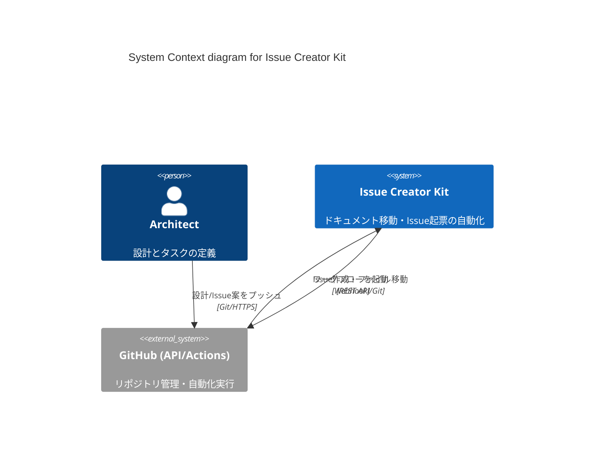

# システムコンテキスト: Issue Creator Kit

このドキュメントは、システムの全体像、境界、および主要な依存関係を定義する、プロジェクトの Single Source of Truth (SSOT) です。

- **Status**: 承認済み
- **Last Updated**: 2026-01-02

## 1. ビジネスコンテキストとアウトカム
GitHubを用いたソフトウェア開発において、アーキテクチャ設計（ADR/Design Doc）から実装タスク（Issue）への落とし込みは、手動作業によるコストと「設計と実装の乖離」を生む主要な要因となっている。

本システム（Issue Creator Kit）は、これらのプロセスを「Markdownファイルベース」で自動化するツールキットを提供することで、以下の価値を実現する。
- **一貫性の保証**: 承認された設計のみが実装タスク化されるフローを強制する。
- **管理コストの削減**: Issueの起票、親子関係の設定、ドキュメントのステータス更新を自動化する。
- **導入の迅速化**: 複雑なGitHub Actionsワークフローを、コマンド一つで既存リポジトリに展開可能にする。

## 2. 主要なユビキタス言語 (Ubiquitous Language Core)
| 用語 | 定義 | 備考 |
| :--- | :--- | :--- |
| **Design (設計)** | ADR や Design Doc。システムの「あるべき姿」を決定するドキュメント。 | `reqs/design/` |
| **Roadmap (計画)** | 設計を実現するための工程と進捗。承認後も更新され続ける。 | `reqs/roadmap/` |
| **Task (タスク)** | 実装レベルの作業単位。Draft Issue ファイルから生成される。 | `reqs/tasks/` |
| **Inbox (インボックス)** | 各役割における「提案・策定中」のドキュメントが配置される場所。 | `_inbox/` |
| **Queue (キュー)** | 自動 Issue 起票を待機しているタスクの配置場所。 | `reqs/tasks/_queue/` |
| **Approved (承認済み)** | 合意形成され、SSOT として確定した設計ドキュメント。 | `reqs/design/_approved/` |
| **Usecase (ユースケース)** | アプリケーション固有のビジネスルール（承認フロー、Issue作成ロジック）。 | `src/issue_creator_kit/usecase/` |
| **Infrastructure Adapter** | 外部システム（GitHub, Git, Filesystem）との入出力を担う実装。 | `src/issue_creator_kit/infrastructure/` |
| **Kit (キット)** | CLI、Usecase、Adapter、ワークフロー定義の総称。 | |

## 3. システムの境界と責務 (System Boundary)

### 3.1 スコープ内 (In-Scope)
- **ワークフローの展開**: 役割別に整理されたディレクトリ構造 (`reqs/{design,roadmap,tasks}`) と GitHub Actions 設定をデプロイする。
- **ドキュメント承認管理**: `design/_inbox/` へのマージを検知し、`_approved/` への移動とトラッキング Issue 起票を自動化する。
- **タスク起票の自動化**: `tasks/_queue/` への配置をトリガーに、依存関係を解決して GitHub Issue を起票し、完了後に `archive/` へ移動する。
- **トレーサビリティの維持**: 設計、計画、タスク間のファイルリンクと GitHub 上の親子関係を同期する。

### 3.2 内部構造と責務 (Internal Structure - Clean Architecture Lite)
本システムは Clean Architecture Lite に基づき、関心事を分離している。

- **Interface Layer (CLI)**:
    - ユーザー入力を受け付け、適切な Usecase を選択・実行する。
    - 入出力の詳細（標準出力、引数解析）のみに関心を持つ。
- **Usecase Layer (Business Rules)**:
    - `ApprovalUseCase`, `WorkflowUseCase` 等、システムの中核となるロジックを実装する。
    - 外部システム（GitHub等）の実装詳細を知らず、抽象化されたインターフェースに依存する。
- **Infrastructure Layer (Adapters)**:
    - `GitHubAdapter`, `GitAdapter` 等、Usecase が必要とする外部連携の実装を提供する。
    - APIの変更や詳細なプロトコルを隠蔽する。

### 3.3 スコープ外 (Out-of-Scope)
- **コード生成**: 設計ドキュメントから直接ソースコードのボイラープレートを生成する機能は現時点では含まない。
- **エディタ機能**: ドキュメントの執筆そのものは外部ツール（VS Code等）に依存する。

## 4. アクターと外部システム (Actors & External Systems)

### 4.1 アクター (ユーザー・エージェント)
| アクター名 | 役割 / 目的 |
| :--- | :--- |
| **Architect (Human)** | 高レベルな設計（ADR/Design Doc）を作成・承認し、ビジネス価値を定義する。 |
| **AI Agent** | 承認された設計を解析し、依存関係（`Depends-On`）を含む Draft Issue へ分解・作成する。 |
| **Developer (Human/Agent)** | 自動起票されたIssueと紐づいた設計ドキュメントを参照して実装を行う。 |

### 4.2 外部システム
| システム名 | 連携内容 / プロトコル |
| :--- | :--- |
| **GitHub Actions** | 本システムを実行するオートメーションランタイム。 |
| **GitHub REST API** | Issue作成、PR操作のための公式インターフェース。 |

## 5. アーキテクチャ図 (C4 Model - System Context)

## 6. 戦略的トレードオフと 4 大リスク
- **[標準化 vs 柔軟性]**: 本システムは特定のディレクトリ構造（`reqs/`）を前提とすることで、複雑な設定なしに高度な自動化を実現する。ユーザーには構造への適応を求める。
- **[ファイルベースのSSOT]**: GitHub上のファイルが常に真実であり、Issueはそこから派生する。Issueを直接編集してもファイルには反映されないという制約を、開発プロセスの「一方通行性（一貫性）」として受け入れる。
- **[最大のリスク]**: GitHub APIのレート制限や認証トークンの権限不足。これを防ぐため、最小権限（Least Privilege）での運用ガイドラインを確立する。

## 7. 設計原則とデータ信頼性 (Design Principles & Kleppmann's View)
- **Zero Configuration**: `init` コマンドで即座に動作環境が整い、ユーザーにYAMLの記述を強いない。
- **Idempotency (冪等性)**: 同じ処理が複数回実行されても、同じ結果（重複Issueの回避など）が得られるよう設計する。
- **Fail-Fast Reliability**: APIレート制限の不足や依存関係の不整合（循環参照）を検知した場合、中途半端な状態更新を避け、処理を1件も実行せずに安全に停止する。
- **Dependency First**: タスクは依存先が解決されない限り起票されない。これにより、不完全なタスクがバックログに溢れるのを防ぐ。
- **Human in the Loop**: 自動化は常にプルリクエストやブランチ移動という「人間によるマージ」の後に発生し、意図しない破壊的な変更を防ぐ。
