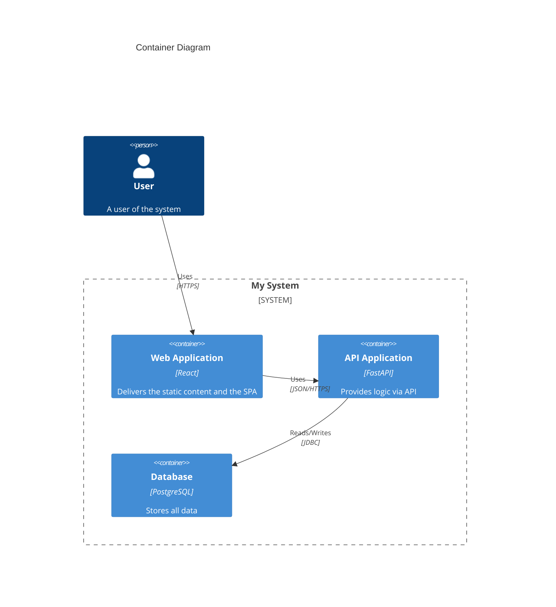
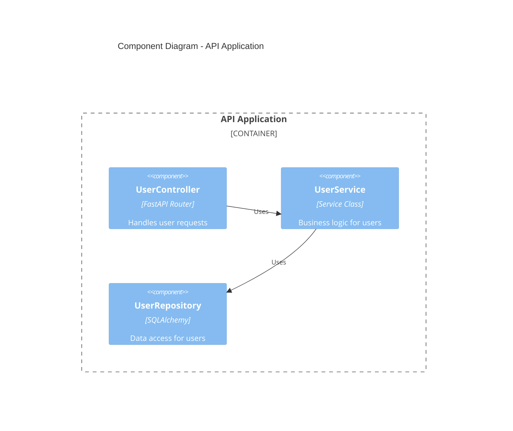

# C4 Model 詳細設計 (Container & Component)

<!-- 
【概要】
本ドキュメントは、システムの詳細な構造（L2: Container, L3: Component）を定義するものです。
コードベースの実態を正確に反映させ、開発者のメンタルモデルとして機能させることを目的としています。
-->

## 概要 (L1: System Context Summary)
<!-- 
最上位のシステムコンテキストの要約を記述します。
詳細な図は `docs/system-context.md` を参照してください。
-->
- **System Name:** My System
- **Description:** (システムの目的と主要な価値)
- **Primary Users:** User A, User B
- **Key External Systems:** Stripe, AWS S3

## コンテナ図 (L2: Container Diagram)
<!-- 
【記述レベル】
システムの主要な「実行単位」や「デプロイ単位」を定義します。
内部のクラス構造ではなく、「サーバー」「DB」「SPA」といった粒度で記述してください。
-->

### 主要コンテナ一覧
| コンテナ名 | 技術スタック | 責務 |
| :--- | :--- | :--- |
| API Application | Python, FastAPI | ビジネスロジックの提供、認証、認可 |
| Database | PostgreSQL | 永続化データの保存 |

## コンポーネント図 (L3: Component Diagram)
<!-- 
【記述レベル】
各コンテナ内部の「主要な構成要素」を定義します。
全てのクラスを網羅する必要はありません。「Controller」「Service」「Repository」といった
アーキテクチャ的に意味のある論理グループ（コンポーネント）を記述してください。
-->

### [コンテナ名] のコンポーネント

### 主要コンポーネント一覧
| コンポーネント | 種類 | 責務 |
| :--- | :--- | :--- |
| UserController | Controller | HTTPリクエストのハンドリング |
| UserService | Service | ユーザードメインのビジネスロジック |