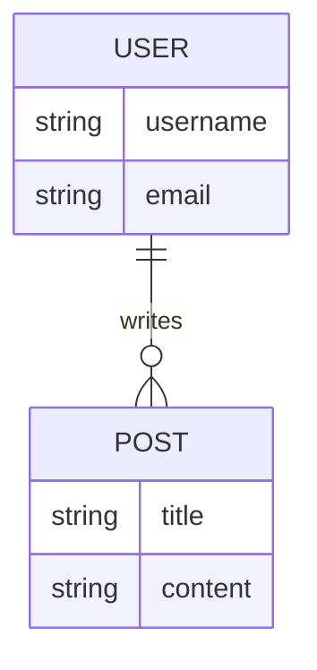
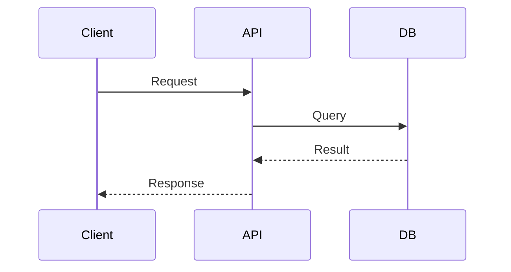

# [機能名] 詳細仕様書

<!-- 
【概要】
このドキュメントは、SYSTEM_ARCHITECTが決定したADR/Design Docに基づき、
開発者が迷いなく実装できるレベルの具体的な仕様を定義するものです。
-->

## 概要
<!-- 機能の全体像と、なぜこの設計が必要なのかを簡潔に記述してください。 -->
(機能の概要と目的)

## 関連ドキュメント
<!-- 根拠となる意思決定ドキュメントへのリンクを必ず含めてください。 -->
- ADR: [リンク]
- Design Doc: [リンク]

## データモデル (Data Model)
<!-- データベースの変更がない場合は、このセクションを「該当なし」として省略可能です。 -->

### DB Schema (Mermaid ER Diagram)
<!-- 
Mermaid記法を用いて、テーブル間のリレーションシップを視覚化してください。
既存テーブルとの関係がある場合は、それらも図に含めてください。
-->

### テーブル定義
<!-- 型、制約（PK/FK/Not Null）、デフォルト値を明記してください。 -->
| テーブル名 | カラム名 | 型 | 制約 | 説明 |
| :--- | :--- | :--- | :--- | :--- |
| users | id | UUID | PK | ユーザーID |
| ... | ... | ... | ... | ... |

## API 仕様 (API Specification)
<!-- APIの追加・変更がない場合は省略可能です。エンドポイントごとに作成してください。 -->

### [METHOD] /path/to/endpoint
- **概要:** (何をするエンドポイントか)
- **Request:**
    - Headers: (認証が必要な場合など)
    - Query Params: (オプション/必須の区別を明記)
    - Body: (JSON形式のサンプルと型定義)
- **Response:**
    - 200 OK: (成功時のJSONサンプル)
    - 400 Bad Request: (バリデーションエラー等のケース)
    - 404 Not Found: (リソースが存在しないケース)

## シーケンス図 (Sequence Diagram)
<!-- 
コンポーネント間の動的な相互作用を可視化してください。
正常系だけでなく、主要な例外系（エラーハンドリング）のフローも記述することを推奨します。
-->

## 補足・制約事項
<!-- 
実装時に特に注意すべき点、パフォーマンス上の懸念、
移行（マイグレーション）時の注意点などを記述してください。
-->
(実装上の注意点など)